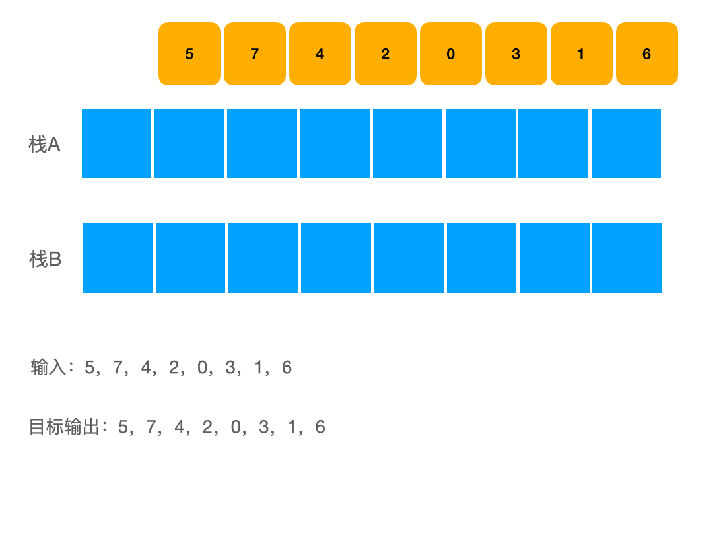
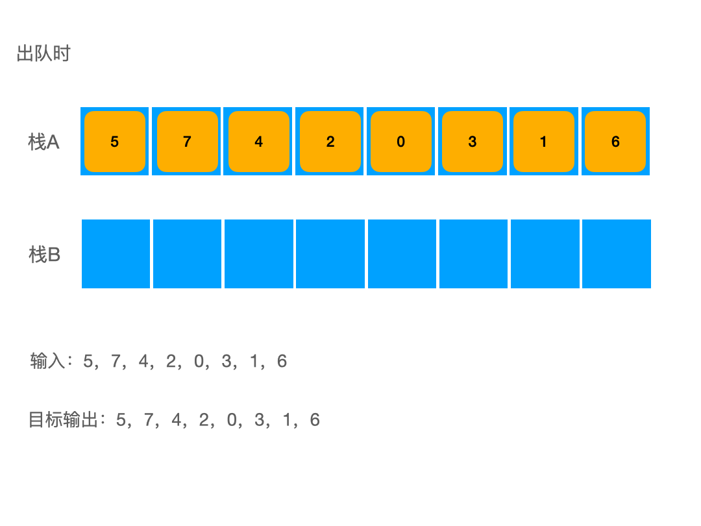

# 3 列表
## 3-F 循环节
* 由选择排序引入
## 3-G 插入排序
## 3-H 归并排序
## 3-I 逆序对
	统计逆序对个数
## 3-J 游标
* data：记录数据链头
* free：记录空闲链头
# 4 栈和队列
## 4-B 递归相关
### 4-B3 消除递归
* 递归函数的空间复杂度：
	* 主要取决于最大递归深度
	* 而非递归实例总数
### 4-B4 尾递归
* 容易改写为迭代形式（例如 goto 模拟递归返回）
* 空间复杂度可能会有渐进改进
* 时间复杂度可能有常系数改进
## 4-C 进制转换
* 栈：迭代版
* 递归版
## 4-D 括号匹配
* 消除一对紧邻的左右括号，不影响全局的匹配判断
* 顺序扫描，遇到左括号进栈，遇到右括号出栈
## 4-E 栈混洗
* 栈混洗总数：$$SP(n) = \sum^{n}_{k=1}SP(k-1)\cdot SP(n-k)=\frac{(2n)!}{n!(n+1)!}$$
* 禁形："312"
* n 个元素的栈混洗 = n 对括号的匹配
## 4-F 中缀表达式
## 4-G 逆波兰表达式
### 4-G1 求值

| 24  |
| --- |
| 8   |
| 2   |
2 8 24 - + = (8 - 24) + 2 **栈底减（除）栈顶**
### 4-G2 转换
* 手工转化
后缀转中缀

中缀转后缀
    加括号，运算符代替右括号，清除左括号

* 自动转化
	中缀表达式求值算法附带完成
## 4-H 队列
* 基于向量派生
* 基于列表派生
## 4-J 双栈当队

栈 B 为空时，需先将栈 A 元素转入 B 中，再对栈 B 做 pop

## 4-K Steap + Queap
Steap = Stack + Heap = push + pop + getmax

* getmax()：return P.top(); // O(1)
* pop()：P.pop(); return S.pop();  //O(1)
* push(): P.push(max(elem, P.top())); S.push(elem);

Queap = Queue + Heap = enqueue + dequeue + getMax

* getmax()：return P.front();  // O(1)
* dequeue()：P.dequeue();  return Q.dequeue();  // O(1)
* enqueue()：
  最坏情况需要 O(n)
## 4-L 直方图内最大矩形
[[912 DSA复习笔记##04-L 直方图内最大矩形]]
# 5 二叉树
## 5-A 树
* 节点深度（边数）
	  根节点深度为 0
* 树高度（所有叶子深度中的最大值）
	 空树高度为-1
## 5-B 树的表示
1. 父节点表示法(vector)
2. 孩子节点表示法(vector + list)
3. 父节点+孩子节点(2 * vector + list)
4. 长子+兄弟(2 * pointer)
## 5-C 有根有序树=二叉树
- 深度为 k 的节点，至多有 $2^k$ 个
- 边数 $e = n - 1 = 出度和 = n_{1} + 2n_{2}$
- 节点数 $n = n_{0} + n_{1} + n_{2} = 1 + n_{1} + 2n_{2}$
	$n_{1}+2n_{2} = n-1 = n_{0}+n_{1}+n_{2}-1$
	即叶节点数 $n_{0}=n_{2}+1$
- n 个节点，高度 h 的二叉树满足：$$h + 1 \leq n \leq 2^{h+1} - 1$$
* 满二叉树：$n = 2^{h+1} - 1$
* 真二叉树：引入 $n_{1}+2n_{0}$ 个外部节点，其边数必为偶数，节点数必为奇数
* 完全二叉树：叶节点不少于内部节点，不多于内部节点+1
	满足 $2^h \leq n \leq 2^(h+1)-1$
## 5-D 二叉树实现
* 高度更新
## 5-E 先序遍历
## 5-F 中序遍历
* 直接后继
## 5-G 后序遍历
* 表达式树~后序遍历~RPN
## 5-H 层序遍历
* 完全二叉树做层序遍历，辅助队列最大规模 ($\lceil  \frac{n}{2}  \rceil$，前 $\lceil  \frac{n}{2}  \rceil-1$ 次都出 1 进 2) 可能出现 2 次
## 5-I 重构
- 先序|后序 + 中序
- 先序 + 后序 + 真二叉树
- 增强序列：假想认为树中每个 NULL 也是“真实节点”，并在遍历时一并输出
  1. 任一子树依然对应一个子序列
  2. NULL 节点恰比非 NULL 节点多一个（由此得到左子树根和右子树根）
	则通过先序或后序的增强序列可以重构原树
	无法通过中序的增强序列重构
## 5-J Huffman 树
* PFC 编码（前缀无歧义编码）
  不考虑字符频率，真完全二叉树即最优编码树
- Huffman 树
  频率最低的字符 x、y，必在某棵最优编码树中处于最底层，且互为兄弟
# 6 图
## 6-A 概述
- v-v：邻接    v-e：关联
- 简单图、无向图、有向图、混合图、DAG、MST
- 简单路径：不含重复节点
- 欧拉环路：各边恰好出现一次
- 哈密尔顿环路：各顶点恰好出现一次
## 6-B 邻接矩阵
- 适用于稠密图
- 判边：O(1)
- 获取顶点度数：O(1)
- 添加、删除边后更新度数：O(1)
- 空间：$\Theta(n^2)$
* 平面图：$e \leq 3n-6$
- 压缩存储技术
## 6-C 邻接表
将邻接矩阵的各行组织为列表，只记录存在的边
- 适用于稀疏图
- 空间复杂度：
	有向图：O(n+e)
	无向图：O(n+2e)
	平面图：O(n + 3n) = O(n)
* 时间复杂度：
	建立邻接表：O(n+e)
	遍历所有邻接表：O(n+e)，建立逆邻接表可改进为 O(1+deg(v))
	计算 v 的度数：增加度数记录域：O(n)附加空间
		增加/删除边时更新度数：O(1)
		每次查询：O(1)
	判边：
		有向图：搜索 u 的邻接表 O(deg(u))
		无向图：搜索 u 或 v 的邻接表 O(max(deg(u), deg(v)))
		通过散列：O(1)，增加 O(n+e)的空间
## 6-D BFS
- 时间复杂度：O(n+e)
- 有向图/无向图都会出现 TREE 和 CROSS
UNDISCOVERED：未入队
DISCOVERED：在队列中
VISITED：已出队列
- TREE：v(DISCOVERED)->u(UNDISCOVERED)
- CROSS：v(DISCOVERED)->u(DISCOVERED/VISITED)
对图做 BFS 会生成一个 BFS 森林，包含 c 棵树，n-c 条 TREE（n 个点，如果只有一棵树则有n-1 条边），e-n+c 条 CROSS
- 最短路径：无向图中，顶点 v 到 u 的(最近)距离记作 dist(v, u)
  TREE 联接的顶点：dist(source)恰好差 1
  CROSS 联接的顶点：dist(source)至多差 1
## 6-E DFS
- 时间复杂度：O(n+e)
- 有向图会出现 CROSS ，无向图不会出现
UNDISCOVERED：未入栈
DISCOVERED：在栈中
VISITED：已出栈
- TREE：v(DISCOVERE)->u(UNDISCOVERED)
- BACKWARD: v(DISCOVERED)->u(DISCOVERED) （后代指向祖先，且说明至少有一个回路）
- FORWARD: v(DISCOVERED)->u(VISITED) && dTime(v) < dTime(u) （祖先指向后代）
- CROSS: v(DISCOVERED)->u(VISITED) && dTime(v) > dTime(u) （表亲，MST 中除根节点没有公共祖先或后代）
括号引理
## 6-F 拓扑排序
- 零入度算法 O(n+e)
- 零出度算法（对图做 DFS，当节点标记为 VISITED，入栈，DFS 结束后弹出栈内元素）O(n+e)
# 7 图应用
## 7-A 优先级搜索
- 通过优先级数越大，优先级越低
## 7-B MST
### 7-B1 Prim
- 合成数消歧
- 完全图：无向图，其中每一对不同的顶点都只有一条边相连
- Cayley 公式：联接 n 个互异顶点的树共有 $n^{n-2}$ 棵，完全图 Kn 有 $n^{n-2}$ 棵支撑树
假设有连通图 $G=\{V,E\}$，e 是其中一条边（即 $e \in E$），如果 $G-e$ 是不连通的，则边 e 是图 G 的一条割边（桥）
- 对于极短割边（跨边）uv，必存在一棵包含 uv 的 MST
- 由极短割边（跨边）构成的支撑树，未必就是一棵 MST
### 7-E Kruskal 算法
- 利用并查集判断新加入的边会不会形成回路
## 7-C 最短路径
### 7-C1 Dijkstra
- 任意最短路径前缀，也是一条最短路径
- 需要保证各边权重为正
### 7-F Floyd-Warshall 算法
- 所有点对之间的最短距离
- 允许负权边，但不能有负权环路
- DP
## 7-D （点）双连通分量
无向图的关节点：删除后原图的连通分量增多
没有关节点的图称作双连通图（即删除图中任意节点，图的连通分量数保持不变）
双连通分量：极大的双连通子图
- DFS 树的叶节点一定不是关节点
- 根节点：如果有 2 棵子树，必定是关节点
- 内部节点 v：有某个孩子 u，且 subtree(u)无法由 BACKWARD 边联接到 v 的任何真祖先，则 v 对 u 而言是关节点
- O(n+e)
- 空间复杂度：除了原图本身，还需要一个O(e)的栈存放已访问的边，和 O(n)的运行栈
# 8 BST
## 8-A~C 概念
- 任意一节点均不小于/不大于左/右后代
- 中序遍历序列单调非降
- n 个节点的 BST 查找最坏时间 O(n)
- 新节点作为叶子插入
- 删除分为单分支和双分支
假设各排列出现的概率均等 $\frac{1}{n!}$，则按随机排列依次插入生成的 BST 平均高度为 $\Theta(\log n)$
n 个互异节点随机组成的 BST 共有 Catalan(n) 棵
假设所有 BST 等概率出现，则平均高度为 $\Theta(\sqrt{ n })$
- 等价 BST：中序遍历次序保持，上下联接关系变化
- 经过不超过 O(n) 次旋转，等价的 BST 均可相互转化
## 8-D AVL
- 平衡因子：balFac(v) = height(lc(v)) - height(rc(v))，$\mid balFac(v)\mid \leq 1$
- 高度为 h 的 AVL 树，至少包含 $S(h) = fib(h+3) - 1$ 个节点（S(0) = 1）
- 插入：从祖父开始，每个祖先都有可能失衡，其可能同时失衡，但修正不会引发失衡传播
- 删除：从父亲开始，每个祖先都有可能失衡，但至多一个，修正会引发失衡传播，且无论是否做过调整，全树高度都有可能下降
- 3+4 重构
优点：
- 无论查找、插入或删除，最坏情况下的复杂度均是 O(log n)，O(n)的存储空间
缺点：
- 需要引入平衡因子
- 删除操作后，最多需要旋转 $\Omega(\log n)$ 次（平均仅 0.21 次）
- 单次动态调整后，全树拓扑结构的变化量可能高达 $\Omega(\log n)$
# 9 BST 应用
## 9-A 范围查询
用于引入 kd 树
KD 树就是把数据所在的空间划分为特定的几个部分，然后在特定空间的部分内进行相关搜索操作
## 9-B kd 树
数据(2, 3), (5, 4), (9, 6), (4, 7), (8, 1), (7, 2)在二维平面表示如下：

- 第一轮：找到数据第一维度的中位数进行划分
  数据按第一维度排序为：(2, 3), (4, 7), (5, 4), (7, 2), (8, 1), (9, 6)，数据集大小 k=6，选取第 k/2+1=4 个点作为中位数点->(7, 2)进行划分，将平面划分为左右两个部分，并将该点加入KD树的二叉树结构中作为根节点

划分完后，左右区域均有未划分节点，先划分左区域
- 第二轮：找到左区域数据第二维度的中位数进行划分，排序得 (2, 3), (5, 4), (4, 7)。数据集大小 k = 3，选取第 k/2+1=2 个点即“中位数”点->（5, 4）作为分界线进行划分，将平面划分为上下两个部分，并将该点加入KD树的二叉树结构中作为根节点的左儿子节点

划分完后，上下区域均有未划分节点，先划分下区域
- 第三轮：找到下区域数据第一维度的中位数进行划分，当前区域仅有点(2,3)，将平面划分为左右两个部分，并将该点加入KD树的二叉树结构中作为第二轮划分的节点的左儿子节点

划分完后，左右区域均无未划分节点，直接递归回溯处理第二轮划分产生的上区域

划分完后，左右区域均无未划分节点，回溯发现第二轮的上下划分区域均处理完毕，直接递归回溯处理第一轮划分产生的右区域

查询
如果当前子树对应的矩形（范围）与所求矩形（范围）没有交点，则不继续搜索其子树；如果当前子树对应的矩形完全包含在所求矩形内，返回当前子树内所有点的权值和；否则，判断当前点是否在所求矩形内，更新答案并递归在左右子树中查找答案。
## 9-C~XC 其他树
# 10 高级搜索树
## 10-A 伸展树
- 逐层伸展：最坏情况：分摊 $\Omega(n)$
- 双层伸展：zig-zag/zag-zig 没有区别
  zi(a)g-zi(a)g 先从祖父节点开始旋转，节点访问后，对应路径长度折半，分摊 O(log n)，不能避免最坏情况发生，但可以保证不会持续发生
- 任意一颗伸展树，按节点值的大小升序依次访问完所有节点，最后树将变为一条左单链
查找：无论查找是否成功，都将最后访问的节点伸展到根
插入：找到待插入位置时，\_hot 会被伸展到根，沿根断开并接入新节点做新根
删除：找到待删除节点 x 时，待删除节点 x 会被伸展到根，找到其前驱后继，分别是其左子树中的最靠右的节点和其右子树中最靠左的节点，假设其前驱节点为 y，其后继节点为 z，把节点 y 伸展成根节点，再把节点 z 伸展成根节点的右儿子，这样节点 z 的左子树必然只有一个节点 x，把它删掉
- 越平衡的树，势能越小，单链势能=log n! =  O(n log n)，满树势能=O(n)
优点：
- 分摊复杂度 O(log n)
- 局部性强，缓存命中率极高时：任意连续的 m 次查找，查找范围 k，总数据范围 n（k << n << m），仅需 O(m log k + n log n)时间
- 反复顺序访问任一子集，分摊成本仅为常数
缺点：
- 不能杜绝单次最坏情况，不适用于对效率敏感场合
## 10-B B-树
- B-树每一层代表一级存储结构
- m 阶 B-树，内部节点关键码：$\left\lceil  \frac{m}{2} \right\rceil - 1 \leq n \leq m-1$
		  内部节点分支数：$\left\lceil  \frac{m}{2} \right\rceil \leq n \leq m$
		  树根节点关键码：$1\leq n\leq m-1$
		  树根节点分支数：$2\leq n\leq m$
- B-树叶节点深度=高度-1，外部节点深度=高度
- BTNode 用一组向量存储关键码，一组向量存储分支指针
- N 个内部节点，N+1 个外部节点
- B 树高度：$\log_{m}(N+1) \leq h \leq 1 + \log_{\left\lceil  \frac{m}{2}  \right\rceil} \lfloor \frac{N+1}{2} \rfloor$
- 有多少次外存操作就有多少次内存操作
查找：
- 约定：根节点常驻内存
- 查找是由一系列在内存中的顺序查找和 I/O 操作间隔完成
- 忽略内存中的查找，运行时间主要取决于 I/O 次数
插入：
- 发生上溢，取中位数 $s= \lfloor \frac{m}{2} \rceil$，分为 $\{k_{0},\dots,k_{s-1}\}、\{k_{s}\}、\{k_{s+1},\dots,k_{m-1}\}$
删除：
- 非叶节点找到其后继节点，后继节点必定是最底层某超级节点的第一个节点，交换位置，转为删除叶节点
- 若下溢：先找左右兄弟借（旋转），都借不了则合并
插入和删除操作不对称：牺牲一点效率换取实现简明
B\*树联合分裂：
- 由 k 个兄弟共同均摊溢出的关键码
- 空间利用率相比于 B 树（50%）提高至 $\frac{k}{k+1}$
##  10-C 红黑树
统一增设外部节点 NULL，使之成为真二叉树
1. 黑根
2. 黑外部节点
3. 不能双红
4. 外部节点：黑深度（黑的真祖先数目）= 根（全树）的黑高度 相等
- 所有的 AVL 树都可以染成红黑树，AVL 树对于左右子树的高度平衡要求比红黑树更严格
- 包含 n 个内部节点的红黑树高度：$\log_{2}(n+1)\leq h\leq 2*\log_{2}(n+1)$
- 树高 h，黑高 H，红高 R，$H\leq h\leq R+H\leq 2*H$
[如何记忆红黑树的操作](https://martinlwx.github.io/zh-cn/how-to-memorize-insertion-and-deletion-in-rb-tree/)

特别注意：第二种节点映射意味着可以做等价结构变化
**插入：**
插入位置必定是叶节点
插入红节点，如果为根，则染黑
只可能出现双红问题
- 插入节点的父节点为黑，不存在双红问题，不必调整
- 插入节点的父节点为红，且不存在 uncle 节点

- 插入节点的父节点为红，且存在 uncle 节点（RBTree拓扑结构未变）

复杂度：最多 O(log n)次重染色，O(1)次结构调整

**删除：**
找到待删除节点的后继节点并交换节点内容，待删除节点至多只有一个右孩子
- 待删除节点没有孩子
	- 待删除节点为红，直接删除
	- 待删除节点为黑，将两个外部 NULL 节点视作两个黑色孩子
- 待删除节点有红色右孩子，直接替代并染黑

- 待删除节点有黑色右孩子"double black"是指需要这里有 2 个黑色节点，删除 “z” 缺少了一个黑节点
	- (BB-1)如果兄弟节点是黑色且至少有一个红色孩子（对应 B 树下溢借节点）
	- (BB-2)如果兄弟节点是黑色且有两个黑色孩子（对应 B 树下溢合并节点）
		- (BB-2R)如果节点 5 是红色，则将 5 染黑就可以解决 double black
		- (BB-2B)如果节点 5 是黑色，则 double black 从 4 转移到 5 处继续调整
	- (BB-3)如果兄弟节点是红色（等价变化为兄弟节点是黑节点，转为情况BB-2 R 或者 BB-1）
复杂度：至多 O(log n)次重染色，1 次 “3+4” 重构，一次单旋
红黑树结构调整复杂度 O(1)
# 11 散列
- 装填因子：散列表中元素的数量 N/ 散列表大小 M
- 完美散列：数据集已知且固定可以实现
## 11-B 散列函数
越是随机，越是没有规律越好
- 除余法：hash(key) = key%M
  缺陷：
	  1. 不动点，hash(0) = 0
	  2. 相关性，相邻关键码的散列地址必定相邻
- MAD：hash(key) = (a * key + b) % M （M 是素数）
- 数字分析：抽取 key 中某几位，构成地址
- 平方取中：取 ${key}^2$ 的中间若干位，构成地址
- 折叠法：将 key 分割成等宽的若干段，取其总和作为地址
- 位异或法：将 Key 分割成等宽的二进制段，经异或运算得到地址
- 伪随机数法：$hash(key) = rand(key) = [rand(0) * a^{key}] \% M$
  缺陷：
	  伪随机数发生器在不同环境可能不同，创建的散列表可移植性差
- 多项式法：$hashCode('X_{n-1}\dots X_{0}') = \sum{X_{n-i}a^{n-i}}$
## 11-C 排解冲突
开放散列：用散列表以外的开放地址
- 多槽位：将桶单元细分成若干槽位存放（与同一单元）冲突的词条
- 独立链：每个桶拥有一个列表，存放一组同义词
  主要缺陷：空间未必连续分布，系统缓存难以生效
- 公共溢出区：单独开辟出一块连续空间
封闭散列：只用散列表的空闲封闭地址
开放定址：任何散列桶都可以接纳任何词条（开放散列中如独立链，对应列表只能存放与此桶单元冲突的词条）
**封闭散列必定对应于开放定址**
- 线性试探：$[hash(key)+i]\%M$（i 是冲突次数）一旦发生冲突，则试探紧邻的下一个桶
	  优势：可用充分利用系统缓存
	  缺陷：数据堆积现象严重，可能出现连续冲突
	- 懒惰删除：懒惰标记被删除的桶
	  查找：看作是不匹配的非空桶
	  插入：看作是匹配的空闲桶
- 平方试探：$[hash(key)+i^2]\%M$ 以平方数为距离，确定下一试探桶单元
	  优势：缓解数据聚集现象
	  缺陷：一定程度上破坏局部性
	  若 M 是素数，且装填因子≤0.5，只要有空桶就必然能找出来
- 双向平方试探法：$\left[ hash(key)+(-1)^i * \lceil\frac{i}{2}\rceil^2 \right] \%M$，间或地沿两个方向试探
	  表长取作素数 $M=4*k+3$
	  $M = 4*k+1$ 必然不能使用
- 再散列：预先约定第二散列函数：$hash_{2}(key, i)$ 或者 $hash_{2}(key)$，冲突时确定偏移增量得到下一试探位置：$[hash(key)+\sum^{k}_{i=1}hash_{2}(key,i)]\%M$ 或者 $[hash(key)+i*hash_{2}(key)]\%M$
	  线性试探：$hash_{2}(key, i)=1$
	  平方试探：$hash_{2}(key,i)=2i-1$
- 重散列：将词条重新散列到更大容量的新散列表中
	  插入：若装填因子＞50%，重散列
	  删除：若懒惰删除标记过多，重散列
## 11-D 桶排序
[[912 DSA复习笔记##11-D 桶排序]]
## 11-E 基数排序
[[912 DSA复习笔记##11-E 基数排序]]
## 11-F 计数排序
[[912 DSA复习笔记##11-F 计数排序]]
## 11-G 跳转表
[[912 DSA复习笔记##11-G 跳转表]]
# 12 优先级队列
## 12-B 完全二叉堆
