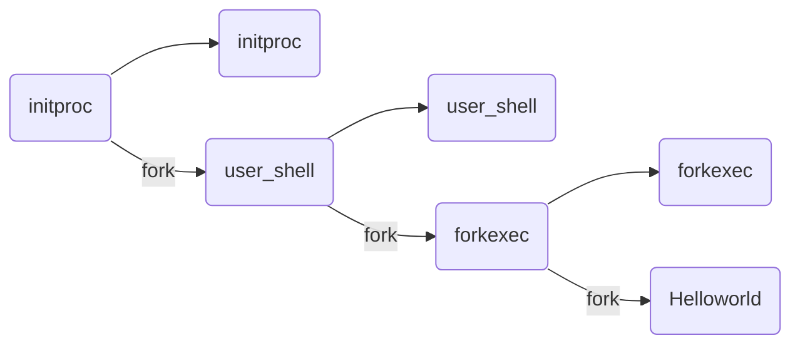
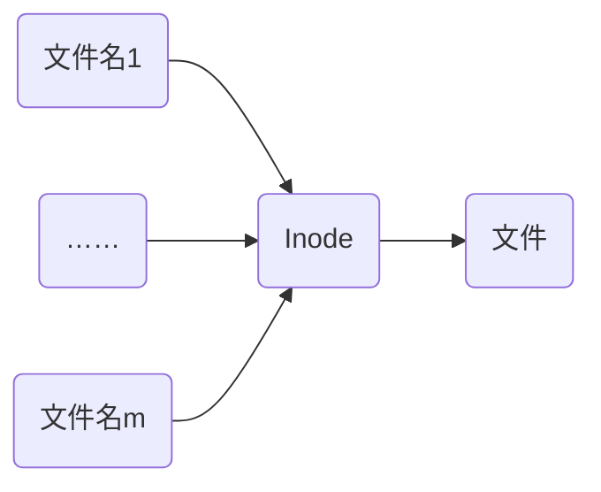

# 绪论
OS 内核特征
- 并发：计算机系统中同时存在多个运行的程序
- 共享：程序间“同时”访问，互斥共享各种资源
- 虚拟：每个程序“独占”一台完整计算机
- 异步：服务的完成时间不确定，也可能失败
微内核结构
- 尽可能把内核功能移到用户空间
- 用户模块间通信使用消息传递
外核结构
- 让内核分配物理资源给多个应用程序，并让每个程序决定如何处理这些资源
虚拟机
- 多 OS 共享硬件资源
Linux 是宏内核，Ucore 是微内核
## 习题
1. 下列关于操作系统的描述中错误的是？
A.支持多核处理器的操作系统中允许多个执行程序并行执行
B.支持多核处理器的操作系统中允许多个执行程序并发执行 
C.仅支持单核处理器的操作系统中允许多个执行程序并行执行
D.仅支持单核处理器的操作系统中允许多个执行程序并发执行
并发：分时占用，并行：同时占用
单核处理器无法允许程序并行执行，C 错
2. 在多核处理器中，采用用户线程实现多线程时，同一进程的多个线程可以并行执行（×）
   按进程分配处理器
# 进程
进程是指一个具有一定<font color="#ff0000">独立功能</font>的程序在一个<font color="#ff0000">数据集合</font>上的一次<font color="#ff0000">动态执行</font>过程
进程包含了正在运行的一个程序的所有状态信息
- 代码
- 数据
- 状态寄存器
	- CPU 寄存器 CR0，指令指针 IP
- 通用寄存器
- 进程占用系统资源
	- 打开文件、已分配内存

程序 = 文件(静态的可执行文件)
进程 = 执行中的程序(暂时) = 程序 + 执行状态 = 程序 + 数据 + PCB
同一个程序的多次执行过程对应为不同进程
## PCB
PCB：OS 管理控制进程运行所用的信息集合
PCB 是进程存在的唯一标志


进程控制信息：
- 调度和状态信息
	- 调度进程和处理机使用情况
- 进程间通信信息
	- 进程间通信相关的各种标识
- 存储管理信息
	- 指向进程映像存储空间数据结构
- 进程所用资源
	- 进程使用的系统资源，如打开文件等
- 有关数据结构连接信息
	- 与 PCB 相关的进程队列
## 进程的生命周期划分
- 运行状态：进程正在处理机上运行
- 就绪状态：进程获得了除处理机之外的所需资源，得到处理机即可运⾏
- 等待状态（阻塞状态）：进程正在等待某个事件的出现而暂停运行
- 创建状态：一个进程正在被创建，还没被转到就绪状态之前的状态（分配资源和相应的数据结构，<font color="#ff0000">每个进程在整个生命周期中，只会进来一次创建</font>）
- 结束状态：一个进程正在从系统中消失时的状态，这是因为进程结束或由于其他原因所导致


sleep()系统调用没有从运行->就绪状态

状态队列：OS 维护一组(PCB)队列，表示 OS 中所有进程的当前状态
进程状态变化时，它所在的 PCB 会从一个队列换到另一个队列

shell 执行用户输入命令过程：
1. OS 初始化
2. 找到 initproc 执行程序并创建 initproc 的 PCB
3. 执行 initproc APP
4. initproc 执行 fork + exec(user_shell)，执行 waitpid 等待子进程
5. user_shell 在得到字符串输入"forkexec"后，执行 fork+exec(forkexec)，执行 waitpid 等待子进程
6. forkexec 执行 fork+exec(helloworld)，执行 waitpid 等待子进程
7. helloworld 执行完毕并退出
8. forkexec 执行 waitpid 返回并退出
9. user_shell 执行 waitpid 返回，回到第 5 步继续等待字符串输入

## 进程切换

切换前，保存当前进程在 PCB 中的执行上下文(CPU 状态)，切换后，恢复下一个进程的执行上下文
`idle task`：空闲任务，这个任务在没有其它任务进入就绪态时进入运行。永远设为最低优先级，只是在不停地给一个32位的名叫OSIdleCtr的计数器加1
### 优先级反置
高优先级进程长时间等待低优先级进程所占用资源的现象

### 优先级继承
- 占用资源低优先级进程<font color="#ff0000">继承</font>申请资源的高优先级进程的优先级(T3 继承 T1，抢占 T2)
- 只有想占有资源的高优先级进程<font color="#ff0000">被阻塞时</font>，才提高占用资源的低优先级进程的优先级

### 优先级天花板协议
- 占用资源进程的优先级和<font color="#ff0000">所有</font>可能申请该资源的进程的<font color="#ff0000">最高</font>优先级<font color="#ff0000">相同</font>
	- 不管是否发生等待，都提升占用资源进程的优先级
	- 优先级高于 OS 中所有被锁定的资源的优先级上限，线程执行临界区时不会被阻塞
## 进程管理的系统调用
### fork
创建一个继承的子进程
- 复制父进程的所有变量和<font color="#ff0000">内存</font>
- 复制父进程(除区分父子进程 PID 外的)所有 CPU 寄存器
返回值：
- 子进程的 fork()返回 0，其PID可通过 getpid()获取
- 父进程的 fork()返回子进程 PID
```c
for(i=0;i<loop;i++)
{
	pid = fork();
	if(pid==0){
	    printf("i=%d, pid=%d, parent pid=%d\n",i,getpid(),getppid());
	}
}
```
fork 后，不同进程之间的 `i` 独立

（填空）请阅读以下代码，分析程序的输出 A 的数量：（已知&&的优先级比||高）
```c++
int main(){
	fork()&&fork()&&fork()||fork()&&fork()||fork()&&fork();
	printf("A");
	return 0;
}
```
将 `fork()&&fork()&&fork()||fork()&&fork()||fork()&&fork();` 记作 `fork1()&&fork2()&&fork3()||fork4()&&fork5()||fork6()&&fork7();`
开始的主进程为 P1，P1 执行 `fork1()` 后，产生 $P_{11}$，P1返回值是 $PID_{P_{11}}\neq 0$，所以 P1 继续执行 `fork2()`，而 $P_{11}$ 返回值是 0，逻辑运算符短路，不用执行&&后面的 fork2()和 fork3()，而是执行||后后面的 fork……当 P1 执行完 `fork1()&&fork2()&&fork3()` 发现为 true，逻辑短路，不会继续执行后续的fork，故 P1 执行完会产生 $P_{11}、P_{12}、P_{13}$
由此可知：总共会有 $1+1*3+3*2+3*2*2=22$ 个进程
#### COW
1. 当父进程调用fork()创建子进程时,内核会将父进程的所有内存页都标记为只读(即共享页面)，并增加每个页面的引用计数。在这个过程中，父子进程共享同一份内存页面
2. 一旦其中一个进程(父进程或子进程)尝试写入某个内存页，就会触发一个保护故障(缺页异常)，此时会陷入内核，内核将拦截这个写入操作，检查该页面的引用数：
- 如果引用数大于 1，则会创建该页面的副本，并将引用数减 1，同时恢复这个页面的可写权限，然后重新执行这个写操作；
- 如果页面的引用数只有 1，也就是说该页面只被当前进程引用，那么内核就可以跳过分配新页面的步骤，直接修改该页面，将其标记为可写。（注意没有触发异常的页还是共享父进程的）

使用 COW 技术，fork 的实际开销是复制父进程的页表(write 操作时)以及给子进程创建 PID
注意：read 系统调用也可以使用 COW 来优化读取性能
#### vfork
调用 vfork()之后，父进程会一直阻塞，直到子进程调用 exec 函数
fork()会复制父进程的页表，而 vfork()不会复制，直接让子进程<font color="#ff0000">共用</font>父进程的页表
fork()使用了写时复制技术，而 vfork()没有，它任何时候都不会复制父进程地址空间
vfork()产生的子进程跟父进程完全共同使用同一个地址空间，子进程中对任何数据变量的修改，不管是局部的还是全局的，都会影响到父进程
### exec
加载文件并从 `main` 执行，仅当出错时返回
调用成功时，是相同的进程但是运行了不同的程序
- 代码段、堆栈和堆等完全重写
### wait
父进程等待子进程的结束
- 子进程结束时通过 exit() 向父进程返回状态值
- 父进程通过 wait() 接受并处理返回值
功能：
- 有<font color="#ff0000">子进程存活</font>时，父进程已经执行了 wait 并进入等待状态，等待子进程的返回结果
- 当某子进程调用 exit() 时，唤醒父进程，将 exit() 返回值作为父进程中 wait 的返回值
- 若没有子进程存活，wait() 立即返回
#### 僵尸进程(有危害)
子进程<font color="#ff0000">已经退出</font>（并不会马上消失，会在进程表中留下进程项），但父进程<font color="#ff0000">还没执行到</font> wait 回收 PCB。如果将僵尸进程的父进程被 kill，则僵尸进程转为孤儿进程
- 有僵尸子进程等待时，wait() 立即返回其中一个值
#### 孤儿进程(无危害)
父进程退出，但子进程还在运行，孤儿进程会被 init/root 进程(pid=1)等待并回收
### exit
进程结束执行 exit()，完成进程资源回收
功能：
- 将调用参数作为进程的“结果”
- 关闭所有打开的文件等占用资源
- 释放内存
- 释放大部分进程相关的内核数据结构
- 检查父进程是否存活
	- 如果存活，保留结果的值直到父进程需要它，<font color="#ff0000">进入僵尸状态</font>
	- 如果没有，设置父进程为 Root 进程 (孤儿进程)
- (对父进程)清理所有等待的僵尸进程
### 其他系统调用
优先级控制
- nice()指定进程的初始优先级
- Unix 系统中进程优先级会随执行时间而衰减
进程调试
- ptrace()运行一个进程控制另一个进程执行
- 设置断点和查看寄存器等
定时
- sleep()可以让进程在定时器的<font color="#ff0000">等待队列</font>中等待指定时间
## 单处理机调度
调度程序：从就绪队列中挑选下一个占用 CPU 运行进程的<font color="#ff0000">内核函数</font>
调度时机：
- 内核运行调度程序的条件：
	- 进程从运行状态切换到等待/就绪状态
	- 进程被终结了
- 非抢占系统
	- 当前进程主动放弃 CPU 时
- 可抢占系统
	- 中断请求被服务例程响应完成时
	- 当前进程被抢占
		- 进程时间片用完
		- 进程从等待切换到就绪
进程在 CPU 计算和 I/O 操作间交替
### 相关指标
CPU 使用率：CPU 处于忙状态的<font color="#ff0000">时间百分比</font>
吞吐率：单位时间内完成的<font color="#ff0000">进程数量</font>——OS 的计算带宽
周转时间：进程从初始化到结束(包括等待)的<font color="#ff0000">总时间</font>
等待时间：进程在<font color="#ff0000">就绪队列</font>中的总时间
响应时间：从提交请求到<font color="#ff0000">产生响应</font>所花费的总时间——OS 的计算延迟
公平：进程占用相同的资源，如 CPU 时间
减少平均响应时间的波动
增加吞吐量：
- 减少开销(OS 开销，上下文切换)
- OS 资源的高效利用(CPU，I/O 设备)
- 减少进程的等待时间
OS 需要保证吞吐量不受用户交互的影响
公平：
- 保证每个进程占用相同的 CPU 时间
- 保证每个进程的就绪等待时间相同
公平通常会增加平均响应时间
### FCFS
依据进程<font color="#ff0000">进入就绪状态</font>的先后顺序排列
当进程进入等待或结束状态时，就绪队列中的下一个进程占用 CPU

优点：简单
缺点：
- 平均等待时间波动较大
	- 短进程可能排在长进程后面
- I/O 资源和 CPU 资源的利用率较低
	- CPU 密集型进程会导致 I/O 设备闲置时I/O 密集型进程等待
### SPN/SJF
选择就绪队列中执行时间最短进程占用 CPU 进入运行状态
- 按预期的执行时间来排序
优点：具有<font color="#ff0000">最优</font>平均周转时间
缺点：
- 可能导致饥饿(连续的短进程会使长进程无法获得 CPU 资源)
- 需要预知未来
用历史的执行时间来预估未来的执行时间
$\tau_{n+1} = \alpha t_n + (1-\alpha)\tau_n \ , 0\leq\alpha\leq1$
$t_n$：第 n 次 CPU 计算时间
$\tau_{n+1}$：第 n+1 次 CPU 计算时间预估
$\tau_{n+1} = \alpha t_n + (1-\alpha)\alpha t_{n-1} + (1-\alpha)(1-\alpha)\alpha t_{n-2}+...$
### SRT
SRT 支持<font color="#ff0000">抢占</font>调度机制，当有新的进程就绪，且新进程的服务时间小于当前进程的<font color="#ff0000">剩余时间</font>，则转到新的进程执行
### HRRN
是对 FCFS 和 SJF 的综合平衡
选择就绪队列中响应比 R 值最高的进程
$R = \frac{w+s}{s}$，w：等待时间，S：执行时间
不可抢占，防止无限期推迟
### RR
时间片：分配处理机资源的基本时间单元
时间片结束时，按 <font color="#ff0000">FCFS</font> 算法切换到下一个就绪进程，属于抢占式
每隔(n-1)个时间片进程执行下一个时间片 q

有额外的上下文切换开销，平均等待时间较差
时间片太大：
- 等待时间过长
- 极限情况退化成 FCFS
时间片太小：
+ 反应迅速，但产生大量上下文切换
+ 大量上下文切换开销影响到系统吞吐量
通常选择维持上下文切换开销处于 1%以内大小
### MQ 多级队列
就绪队列被划分成多个独立的子队列
- 每个队列拥有自己的调度策略
- 同一优先级的进程属于某个队列，且<font color="#ff0000">不能跨越队列</font>
规则：
1. 如果 $A_{priority}>B$，运行 A 不运行 B
2. 如果 $A_{priority}=B$，轮转运行 A 和 B
队列间的调度：
- 固定优先级
	- 先处理前台(交互)进程，然后处理后台进程
	- 可能导致饥饿
- 时间片轮转
	- <font color="#ff0000">每个队列</font>都得到一个确定的能够调度其进程的 CPU <font color="#ff0000">总时间</font>
### MLFQ
进程可以在不同队列之间移动
规则：
1. 如果 $A_{priority}>B$，运行 A 不运行 B
2. 如果 $A_{priority}=B$，轮转/FIFO运行 A 和 B
3. 进程进入系统时，放在最高优先级(最上层队列)
4. 如果进程在当前的时间片没有完成(无论中间主动放弃了多少次 CPU)，降到下一个优先级
5. 如果进程在其时间片内主动释放 CPU，优先级不变
6. 经过一段时间S后，就将系统中所有工作重新加入最高优先级队列
7. 时间片大小随优先级增加而减少

特征：
- CPU 密集型进程的优先级下降很快
- I/O 密集型进程将停留在高优先级
潜在问题：
- CPU 密集型进程会饥饿
### FSS 公平共享
控制用户对 OS 资源的访问
- 不同用户拥有多个进程
- 按用户优先级分配资源
- 保证不重要的用户无法垄断资源
- 未使用的资源按比例分配
### Stride

优先级与 pass 成反比
stride 溢出处理：
- $stride_{max} - stride_{min} \leq pass_\max$
- stride，pass 无符号整数
- 判断 stride 大小改为 signed int(A.stride - B.stride) ? 0
初始：A.stride = 125，A.pass = 6；B.stride = 124, B.pass = 5
若无符号整数范围是 0~127，124<125，此时调度 B
B.Stride = 124 + 5 = 129 = 1(溢出)<A.stride，则之后会一直调度 B
而(A.stride - B.stride) = (125 - 1) = 124，有符号数范围是 -64~63，所以 124->-4，则 strideA - strideB = -4 < 0，调度进程 A

## 实时调度
实时操作系统的定义
- 正确性依赖于其<font color="#ff0000">时间</font>和<font color="#ff0000">功能</font>两方面
性能指标
- 时间约束的<font color="#ff0000">及时性</font>(必须在约定时间内完成约定的工作)
- 速度和平均性能相对不重要
特性：
- 时间约束的<font color="#ff0000">可预测性</font>
分类：
- 强实时 OS：要求在指定的时间内<font color="#ff0000">必须</font>完成重要的工作
- 弱实时 OS：重要进程有高优先级，要求<font color="#ff0000">尽量但非必须</font>完成
实时任务：

周期实时任务：一系列相似的任务
- 任务有规律的重复
- 周期 p = 任务请求时间间隔
- 执行时间 e = 最大执行时间(0<e<p)(从所有执行时间中选择 max)
- 使用率 U= e/p

可调度的必要条件：$\Sigma_i \frac{e_i}{p_i}\leq1$，对于 RM 算法满足必要条件仍可能不可调度；$\Sigma_i \frac{e_i}{p_i}>1$ 必定不可调度
硬时限：
- 错过任务时限会导致严重后果
- 必须验证在最坏情况下能满足时限
软时限：
- 通常能满足任务时限
	- 如果有时不能满足，则降低要求
- 尽力保证满足任务时限

可调度：表示一个实时 OS 能够满足任务时限要求
- 需要确定实时任务的执行顺序
- 静态优先级调度：任务执行过程中不会改变任务的优先级
- 动态优先级调度：任务执行过程中会改变任务的优先级
### 静态优先级调度算法
RM(速率单调) 算法
- 通过周期安排优先级
- <font color="#ff0000">周期越短优先级越高</font>
- 执行周期最短的任务


RM可认为是<font color="#ff0000">最优的</font>，如果一组进程不能由此算法调度，它不能由任何其他分配<font color="#d83931">静态优先级</font>的算法调度
RM 算法调度 N 个进程的最坏情况 CPU 利用率为 $N(2^{\frac{1}{N}}-1)$
只要满足 $\Sigma_i \frac{e_i}{p_i}\leq n(2^{\frac{1}{n}}-1)$ 则所有任务均能得到成功调度
### 动态优先级调度算法
固定优先级的问题：有的任务可能错过期限

**EDF**(最早截止时间优先)算法
- 截止时间越早优先级越高
- 执行截止时间最早的任务
- 可抢占
- 不要求进程是周期性的
- 不要求进程的 CPU 执行的长度是固定的
- 理论上 CPU 利用率最优

**LLF**(最低松弛度优先)算法
松弛度 = 必须完成时间 - 本身还需要运行时间 - 当前时间
- 根据任务紧急或者松弛程度，来确定任务优先级
- 任务松弛度越高，优先级越低

## 多处理器调度
并发："同时"是经过上下文快速切换，使得看上去多个进程同时运行，实际只有一个进程运行(单核)
并行：同一时刻可以多个进程同时运行(多核)
SMP (对称多处理器)调度
- 每个处理器运行自己的调度程序
- 调度程序对共享资源的访问需要进行<font color="#ff0000">同步</font>
SMP 的进程分配：
- 静态进程分配
	- 进程从开始到结束都被分配到<font color="#ff0000">固定</font>的处理器上执行(不会切换，转为单处理器上的调度算法)
	- 每个处理器有自己的就绪队列
	- 调度开销小
	- 各处理器可能忙闲不均
- 动态进程分配
	- 进程在执行中可分配到<font color="#ff0000">任意空闲</font>处理器执行
	- 所有处理器共享<font color="#ff0000">一个公共</font>的就绪队列
	- 调度开销大
	- 各处理器的负载均衡
### SQMS
单队列多处理器调度，将所有需要调度的进程放入一个队列中(SMP 动态进程分配)，公共的调度队列可以直接复用单处理器调度的基本架构
例如有 5 个进程和 4 个处理器：

假设每个处理器依次执行一个时间片，然后从全局共享的队列中选择下一个进程执行，可能的调度序列：

即初始时，A~D 分配给 CPU0~3，E 还在队列中等待
缺点：
1. 缺乏可扩展性，为了保证在多 CPU 上正常运行，需要在代码中加锁保证原子性，例如寻找下个运行的进程。但这样会造成巨大的性能损失
2. 缓存亲和性差，当一个进程在某个 CPU 上执行时，会在该 CPU 的缓存中维护许多状态，如果切换 CPU 需要重新加载数据而很慢
改进：让进程保持在同一个 CPU 上

### MQMS
包含多个调度队列，例如每个 CPU 一个队列，每个队列可以使用不同的调度规则，OS 会依照设定的规则将进程放入某个调度队列
每个 CPU 调度之间相互独立，避免了单独列方式中数据同步和共享的问题

CPU0 从 Q0 中选择进程运行，CPU1 从 Q1 中选择

优点：
- 更具有可扩展性，队列的数列会随着 CPU 增加而增加，锁和缓存争用的开销影响小
- 具有良好的缓存亲和性
缺点：
- 负载不均

改进：让进程可以跨 CPU 迁移

通过<font color="#ff0000">工作窃取</font>决定发起迁移：工作量较少的(源)队列不定期“偷看”其他(目标)队列是否比自己的工作多，需要找到合适的“偷看”间隔
## Linux 多处理器调度
### O(n)
字母n在这里代表 OS 中的活跃进程数量
- 把时间分成大量的微小时间片（Epoch）
- 每个时间片开始时
    - 计算进程的**动态优先级**
    - 将进程优先级映射成**缺省时间片**
    - 然后选择**优先级最高**的进程来执行
- 进程被调度器切换执行后，可不被打扰地**用尽这个时间片**
- 如进程没有用尽时间片，则**剩余时间**增加到进程的下一个时间片中
每次使用时间片前都要**检查所有就绪进程的优先级**
**检查时间**和进程中进程数目n成正比

多处理器竞争访问同一个 runqueue 里的任务
### O(1)
进程有 140 种优先级，可用长度为 140 的数组去记录优先级
用位图为每种优先级分配一个 bit，如果这个优先级队列下面有进程，那么就对相应的 bit 置为 1，否则置为 0
每个优先级下面用一个FIFO 队列管理这个优先级下的进程
### CFS
CFS 实现了所谓的“完全公平”调度算法，将 CPU 资源均匀地分配给各进程（在内核代码中称为“任务”，task）简单来说，如果一台机器有一个 CPU 多个（计算密集型）进程，那采用 CFS 调度器时

- 两个进程：每个进程会各占 50% CPU 时间
- 四个进程：每个进程会各占 25% CPU 时间
权重值由 nice 值确定，nice 值越大，权重越低，nice 的取值范围是\[-20, 19\]
nice 值和权重之间的转换关系为：

数组值计算公式：$weight = 1024 / 1.25nice$
公式中的1.25取值依据是：进程每降低一个nice值，将多获得10% cpu的时间。公式中以1024权重为基准值计算得来，1024权重对应nice值为0，其权重被称为NICE_0_LOAD
假如一个CPU的调度周期是6ms，进程A和B的权重分别是1024和820（nice值分别是0和1），那么进程A获得的运行时间是6x1024/(1024+820)=3.3ms，进程B获得的执行时间是6x820/(1024+820)=2.7ms。进程A的cpu使用比例是3.3/6x100%=55%，进程B的cpu使用比例是2.7/6x100%=45%（`符合上面说的“进程每降低一个nice值，将多获得10% CPU的时间`”）
### BFS
遍历任务队列(双头链表)，从中取出预估deadline最小的任务进行处理
### 小结
O(1)、CFS 采用多队列，而 BFS 采用单队列
O(1) 调度程序基于优先级（类似于 MLFQ）
BFS、CFS是确定的比例调度方法（类似步长调度）
## 进程通信 IPC

直接通信：两个进程间不需要通过内核的中转，就可以相互传递信息
- 一条链路对应一对通信进程
- 每对进程之间只有一个链路存在
间接通信：两个进程间通过系统调用和内核的中转来相互通信
- 通过 OS 维护的消息队列实现信息接收和发送
- 每个消息队列都有唯一标识
- 只有共享了相同消息队列的进程，才能够通信
- 消息队列可以和<font color="#ff0000">多个</font>进程相关联
- 每对进程可以共享<font color="#ff0000">多个</font>消息队列

阻塞(同步)通信：

非阻塞(异步)通信

IPC 缓冲方式：

无限容量：发送方无需等待
有限容量：通信链路缓冲队列满时，发送方必须等待
0 容量：发送方必须等待接收方
### 信号
信号是<font color="#ff0000">中断</font>正在运行的进程的异步消息或事件
信号机制是一种进程间<font color="#ff0000">异步通知</font>机制
缺点：传送的信息量小，只有一个信号类型

1. 进程通过内核向另一个进程发出信号
   - shell 通过 kill 命令向某个进程发送一个信号将其终止
2. 内核直接发出信号
   - 某进程从管道读取数据，但管道的读权限被关闭了，内核给进程发送信号提示出错
3. 外设通过内核发出
   - Ctrl+C 按键时，内核收到包含 Ctrl+C 按键的外设中断，会向正在运行的进程发送信号使其异常终止

信号接收进程的处理方式
1. 忽略：信号没有发生过
2. 捕获：进程会调用相应的处理函数进行处理
3. 默认：按内核默认的处理方式(大多数情况下杀死进程或忽略)
kill -l 查看所有信号，一般当进程收到某个信号时，就表示该信号所代表的事件发生了

|  信号宏名   | 信号编号 |         说明          | OS 默认处理方式 |
| :-----: | :--: | :-----------------: | :-------: |
| SIGINT  |  2   |     Ctrl+C 终止进程     |    终止     |
| SIGKILL |  9   | 无条件终止一个进程，不可以被捕获或忽略 |    终止     |
| SIGSEGV |  11  |    无效存储访问（指针错误）     |    终止     |
信号实现方式：

### 管道
一种特殊的文件系统，在<font color="#ff0000">内存中</font>建立临时文件存放通信数据
子进程从父进程继承文件描述符
进程不知道管道的另一端
- 可能从键盘、文件、程序读取
- 可能写入到终端、文件、程序
读端：只能从管道中读取
写端：只能用来将数据写入管道
读写端通过<font color="#ff0000">不同文件描述符</font>表示

shell
1. 创建管道（命令行用“|”表示）
2. 为 ls 创建一个进程，设置 stdout 为管道写端
3. 为 more 创建一个进程，设置 stdin 为管道读端
父子进程通信：
父进程创建管道(两个文件描述符->读、写)，子进程会继承文件描述符，然后各自关闭管道的一个文件描述符

在 shell 中可以用 `mkfifo` 创建命名管道，也称 FIFO
匿名管道和命名管道都属于单向通信机制，但
- 命名管道可以支持<font color="#ff0000">任意</font>两个进程间通信
- 匿名管道只支持<font color="#ff0000">父进程</font>和<font color="#ff0000">兄弟进程</font>间通信
命名管道是阻塞式的<font color="#ff0000">单向</font>通信管道：
- 任意一方都可以读、写(双向、半双工)
- 只有读、写端同时打开了命名管道时，数据才会写入并被读取
管道内部保证同步机制，从而保证访问数据的一致性
管道随进程，进程在管道在，进程消失管道对应的端口也关闭，两个进程都消失管道也消失
### 消息队列
由 OS 维护的以<font color="#ff0000">字节序列</font>为基本单位的<font color="#ff0000">间接通信</font>机制
- 每个消息是一个字节序列，有自己的类型标识
- <font color="#ff0000">相同类型标识</font>的消息组成按 FIFO 顺序组成消息队列

消息队列独立于创建它的进程(随内核)，进程结束消息队列依然可以存在，后续创建的进程可以去读取消息队列的内容，实现不同生命周期不同进程的通信


不同消息类型
- 优先级排序
- 选择性接受
- 安全和隔离
### 共享内存
将同一个物理内存区域同时映射到多个进程的内存地址空间
进程：
- 每个进程都有<font color="#ff0000">私有</font>内存地址空间
- 每个进程的内存地址空间需要明确设置共享内存段
线程：
- 同一进程中的线程<font color="#ff0000">总是共享相同</font>的内存地址空间
优点：
- 一个进程写另一个进程立即可见
- 没有系统调用干预，没有数据复制
缺点：必须用额外的同步机制来协调数据访问

### 习题
1. (912-2021)对于信号、信号量、管道、消息队列，以下情况用哪个方式更为合适？
	A）一个进程 kill 掉另一个进程.
	B）linux 命令行下运行命令 cat txtfile.txt | grep exam
	C）A 进程完成 2MB 结构化数据的输入，再传给 B，并基于此数据的一个关键域进行排序
>[!faq]-
> A 信号
> B 管道
> C 消息队列
2. (912-2022)在 shell 中输入“ls | more”,shell 会建立两个子进程,并在这两个进程之间建立管道（ ）
>[!faq]-
>√
3. (408-2014)下列关于管道（Pipe）通信的叙述中，正确的是( )
   A. 一个管道可实现双向数据传输
   B. 管道的容量仅受磁盘容量大小限制
   C. 进程对管道进行读操作和写操作都可能被阻塞
   D. 一个管道只能有一个读进程或一个写进程对其操作
>[!faq]-
> Pipe 说明是匿名管道
> 
> A 匿名管道只能单向通信
> 
> B 管道在内存中
> 
> C 管道满时，写操作被阻塞；管道空时，读操作被阻塞
> 
> D 父进程创建一个管道后，由于管道是一种特殊的文件，因此所有子进程也继承了父进程的管道，并使用它来与父进程进行通信，可以多个进程写，也可以多个进程读
> 
> 选 C

4. 如果用户强制使用任务管理器 kill 一个进程，那么即使它处于就绪状态/阻塞状态，操作系统也要把它变成运行状态（×）
   就绪/阻塞态可以直接到退出态，虽然状态图中没有表示这种转换，但在某些 OS 中，父进程可以在任意时刻终止一个子进程，如果父进程终止，那么和该父进程相关的所有子进程都将被终止
5. PCB 是操作系统内核为进程设置的管理数据结构，每个进程有且仅有一个（√）
6. 如果操作系统中有 M 个进程，则就绪队列中最多有 M-1 个进程（倾向于√）
   单处理器时，如果 M 个进程全部是就绪态，则必然会进程调度，多处理器时，有 n 个处理器，则就绪队列最多有 M-n 个进程
7. 下面有关进程切换错误的是（）
   A.进程切换是来自两个不同进程在内核态中控制流之间的切换
   B.进程切换的过程可以在内核态执行也可以在用户态执行
   C.外设产生的中断会发生进程切换
   D.进程切换的过程涉及到处理器中寄存器的保存与恢复
   A,D 选项说法正确 
   B 进程切换<font color="#c0504d">一定</font>在内核态执行 
   C 选项 IO 中断可能只触发相应的中断处理程序，处理完可能又回到原来进程，而不会导致进程切换，所以可能不会发生进程切换
8. `exec()`系统调用会改变以下哪些参数？
   (A)进程 ID 
   (B)父进程 ID 
   (C)文件打开指针 
   (D)没回忆起来
   `exec()` 使相同的进程执行了不同的程序，所以打开文件指针会更改，但 PID 不会变化，C 正确
9. 操作系统采用 copy on write 机制时，fork()函数不会复制进程的页目录表 (×)
   页目录表以及各级页表都会被复制，但不会复制页
10. 下列关于 fork()系统调用实现的说法错误的是？
    A. 父子进程在返回到用户态的瞬间，都处于刚刚从一次系统调用返回的状态，但二者的返回值不同
    B. fork()系统调用会创造一个不同于父进程的子进程的内核栈
    C. fork()系统调用会给子进程创造一个进程块，其中 TrapContext 部分的内容和父进程相同
    D. 父进程创建的子进程后，二者的进程 ID 一定不同
    A对，fork()系统调用执行成功，对父进程返回子进程的 pid，对子进程返回 0 
    B 对，父进程和子进程的内核栈内容不同
    C 错，子进程 TrapContext 部分内容与父进程不相同，代码第 11 行，trap_cx.x.\[10\]=0 子进程对应的 a0 寄存器的值设置成 0(来自 rCore-tutorial)
    D 对，父进程和子进程的进程 ID 一定不同
11. 最短作业优先调度算法（SJF）可以保证作业的平均等待时间最短（×）
    <font color="#c0504d">不同时到达</font>的情况下无法保证的，比如进程 A 执行 3s，0s 到达，进程 B 执行 1s，1s 到达。对于 SJF，执行 A 3s 之后执行 B 1s，等待时间 0s+2s=2s 对于 RR（假设时间片大小是 1s）进程 A 执行 1s，然后执行 B 1s，然后执行 A 2s，等待时间 1s+0s=1s
# 线程
- 线程是进程中指令执行流最小单元，只独享指令流执行的必要资源，如寄存器和栈
- 进程是资源分配的单位，线程是 CPU 调度的单位
- 线程同样具有就绪、阻塞、执行三种基本状态和状态间的转换关系
- 各线程之间可以并发执行，当进程中的一个线程崩溃，会导致其所属进程的所有线程崩溃(这里针对 C/C++，Java 中不会)
- 线程崩溃会导致进程崩溃
- 线程能减少并发执行的时间和空间开销
	- 线程的创建/终止/切换时间比进程短
	- 同一进程的各线程间共享内存和文件资源，可不通过内核进行直接通信
## 内核不可见的用户线程
用户态管理且用户态运行，OS 无法感知存在
也称纤程、绿色线程，POSIX，Solaris 使用
由一组用户级的线程库函数完成管理

优点：
- 线程管理的代价比内核线程少的多
- 允许每个进程定制自己的调度算法
缺点：
- 同一进程中只能同时有一个线程在运行
- 只能按进程分配 CPU 时间
- 如果有一个线程发起系统调用而阻塞，那么整个进程进入等待
- 不支持基于线程的处理器抢占
- 多处理器时，同一个进程中的线程只能在<font color="#ff0000">同一个处理机</font>下分时复用
## 内核可见的用户线程

内核态管理且用户态运行
由内核通过系统调用实现的线程管理
由内核维护 TCB，在内核实现
以线程为单位进行 CPU 时间分配，多线程的进程可以获得更多 CPU 时间
线程执行系统调用而被阻塞不影响其他线程
- 一个进程包含多个线程
  Windows 内核设计
  rCore/uCore 内核设计
- 一个进程只含一个线程
  Linux 内核设计
缺点：
- 通常线程切换开销和进程切换开销相差不大
- 与传统的进程管理机制会产生一些矛盾，一些系统调用的实现功能/语义上会不协调，如 fork()、signal()...

## 内核线程

内核态管理且内核态运行的线程
如：Linux 的内核线程
内核线程可分时/并行处理一件内核任务
一个内核线程处于阻塞状态时不影响其他的内核线程
## 混合线程
LWP 轻量级进程/轻权进程：是内核支持的用户线程
一个内核线程对应一个 LWP

程序员决定 KT 和 UT 对应关系
UT 由用户线程管理库管理
内核只识别 KT/LWP，并对其调度
内核和用户态线程管理库交互
如果 LWP：UT
- 1：1 用户态管理取消，内核管理线程
	- Linux，JVM
- 1：N 内核态仅管理包含多个线程的进程
	- 与 OS 无关的绿色线程
- M：N 用户态线程运行时和内核协同进行管理
	- Solaris OS，Go runtime
## 协程
[初识协程](https://chuquan.me/2021/05/05/getting-to-know-coroutine/)
不同进程中的线程切换：进程上下文切换
相同进程中的线程切换：虚拟内存等<font color="#ff0000">进程资源</font>保持不动，只需要切换<font color="#ff0000">线程的私有数据、寄存器</font>等不共享的数据
不足：大规模并发 I/O 操作情景
- 大量线程占内存总量大
- 管理线程开销大
- 访问共享数据易错
协程采用<font color="#ff0000">同步</font>编程方式支持大规模并发 I/O 异步操作
相比于函数，协程最大的特点是支持挂起/恢复

线程在切换时，它的中断状态会保存在调用栈中。协程的中断状态也可以通过开辟相应的调用栈来保存。**按照是否开辟相应的调用栈**，可以将协程分为两类：
- **有栈协程**：每个协程都有自己的调用栈，类似于线程的调用栈
- **无栈协程**：协程没有自己的调用栈，挂起点的状态通过状态机或闭包等语法来实现。(PPT 默认协程是无栈协程)
调度过程中，根据协程调度权的目标，又可以将协程分为以下两种：
- **对称协程**：任何一个协程都是相互独立且平等的，调度权可以在任意协程之间转移。
- **非对称协程**：协程出让调度权的目标只能是它的<font color="#ff0000">调用者</font>，即协程之间存在调用和被调用关系。

|     |   协程    |  线程   |     进程     |
| :-: | :-----: | :---: | :--------: |
| 切换  | 寄存器、不换栈 | 栈、寄存器 | 页表、堆、栈、寄存器 |
## 习题
1. 在多核处理器中，采用用户线程实现多线程时，同一进程的多个线程可以并行执行(×)
2. 8 位 CPU 不能进行线程切换（×）
   线程切换和 CPU 位数没有关系
3. 只有一个 main 函数的程序没有线程（×）
   所有的进程都有至少一个线程，ucore 支持线程
4. 在支持多线程的操作系统中，可以通过进程控制块访问该进程的线程执行状态（×）
   通过 TCB 而不是 PCB
# 同步与互斥
原子操作：一次不存在任何中断或失败的操作
## 临界区
- 临界区：线程中访问临界资源的一段需要<font color="#ff0000">互斥执行</font>的代码
- 进入区：检查是否进⼊临界区的一段代码，如可进入，设置相应“正在访问临界区”标志
- 退出区：清除“正在访问临界区”标志
- 剩余区：代码中的剩余部分(与同步互斥无关的代码)
临界区访问规则：
- 空闲则入
- 忙则等待
- 有限等待
- 让权等待(可选)：不能进入临界区的线程应释放 CPU
### 硬件实现
- 禁用硬件中断：没有中断，没有上下文切换，因此没有并发
	- 硬件将中断处理<font color="#ff0000">延迟</font>到中断被启用后(会导致无法及时响应)
	- 进入临界区：禁止所有中断，保持标志
	- 离开临界区：使能所有中断，恢复标志
缺点：
- 禁用中断后，线程无法被停止，可能导致其他线程饥饿
- 临界区可能很长，无法确定响应中断所需时间
- <font color="#d83931">不适合多核</font>
### 软件实现
#### Peterson 算法
设置两个全局共享变量 turn、flag
```c
// 全局共享变量
int turn; // 表示让哪个进程进入临界区
boolean flag[]; // 表示哪个进程想进入临界区

// i进程的代码
while(true) {
	// 进入区代码
	flag[i] = true; // 对于i进程来说，它想进入临界区
	turn = j; // 孔融让梨，i进程愿意让j进程先进入
	while(flag[j] && turn == j); // 如果此时j进程也想进入，i进程谦让给了j进程，则i进程在while处循环等待
	// 进入临界区执行代码
	// 退出临界区
    flag[i] = false; // 对于i进程，它不再想进入临界区
}

// j进程
while(true) {
	flag[j] = true;
	turn = i; // i、j进程先后修改次序影响turn值
	while(flag[i] && turn == i); // 如果j进程后修改turn变量，则此时flag[i] = flag[j] = true, turn = i, i进程while条件错误，进入临界区，j进程在while处循环等待
	// 进入临界区执行代码
	// 退出临界区
    flag[i] = false; // 对于i进程，它不再想进入临界区
}
```
#### Dekkers 算法
```c
// 进程i的代码
int turn; // 同上
boolean flag[];
do{
	flag[i] = true; // i进程想进入
	while(flag[j] == true) { // 如果j进程也想进入
	    if(turn!=i){ // 此时没让i进程进入
	        flag[i] = false; // i进程改为不想进入
	        while(turn!=i); // 循环等待让i进程进入
	        flag[i] = true; // 此时让i进入，修改i想进入
	    }
	    // 略去了else，即turn = i，但i，j都想进入，那么在j进程中会进入if修改flag[j] = false，使得i进程进入临界区
	}
	// 访问临界区
	turn = j;
	flag[i] = false;
	// 剩余区
}while true;
```
#### N 线程(Eisenberg&McGuire)

## 锁
基于软件的解决方法，复杂，需要忙等待(while)
锁是一个抽象的数据结构
- 一个二进制变量(锁定/解锁)
- 使用锁来控制临界区访问
- Lock::Acquire()：锁被释放前一直等待，然后获得
- Lock::Release()：释放锁，唤醒任何等待的线程
原子操作指令：
- 测试和置位(Test-and-Set)指令
	- 从内存单元中读取值
	- 测试是否为 1 (返回真假)
	- 并将内存单元值置 1(无论此前是 1、0)
- 交换(Compare-and-Swap)指令
	- 交换内存中的两个值
```c
int compare_and_swap(int *value, int expected, int new_value){
	int temp = *value;
	if(*value == expected) // 只有表达式为真才设置为新值
	    *value = new_value;
	return temp; // 无论如何都会返回原始值
}
```

ABA 问题：在并发编程中，如果一个变量初次读取的时候是 A 值，它的值被改成了 B，然后又其他线程把 B 值改成了 A，而另一个早期线程在对比值时会误以为此值<font color="#ff0000">没有发生改变</font>，但其实已经发生变化了
解决方式：在值比对时加上版本号(时间戳)

用 TS 指令实现自旋锁(spinlock)


用 CS 指令实现互斥访问
```c
// lock 1表示锁被占用
do{
// 判断锁是否被占用，如果占用，cas返回lock旧值1，停在while
// 如果没有被占用，cas修改lock为新值1，并返回旧值0，进入
	while(compare_and_swap(&lock, 0, 1) != 0);
	/* 临界区 */
	lock = 0;
	/* 剩余区 */
} while(true);
```
锁的优点：
- 适合单处理器或共享主存的多处理器中任意数量的线程同步
- 支持多临界区
缺点：
- 忙等待消耗处理器时间
- 可能导致饥饿
- 可能死锁
## 信号量
由一个整型变量 sem 和两个原子操作组成
sem：要共享资源的数目
P()：sem = sem-1，如果 sem < 0，进入等待
V()：sem = sem+1，如果 sem $\leq$ 0，唤醒一个等待进程
P，V 都是<font color="#ff0000">先操作再做判断</font>
sem = -3 表示当前有三个进程等待资源
P 操作可能阻塞(等待)，V 操作不会阻塞
通常假定信号量是“公平的”
- 线程不会被无限期阻塞在 P()操作
- 假定信号量等待按照先进先出排队
自旋锁无法实现 FIFO，因为查找有竞争

信号量分类：
- 二进制信号量：资源数目为 0 或 1
- 计数信号量：资源数目为任何非负值

信号量实现临界区的互斥访问：
初始 sem=1 表示有一个资源
成对使用 p、v 操作，p 操作保证互斥访问资源，v 操作表示在使用后释放资源

信号量实现条件同步：
每个条件同步设置一个信号量，其初值为 0

### 生产者-消费者问题
- 任何时刻<font color="#ff0000">只能有一个</font>线程操作缓冲区(互斥访问)->mutex = 1
- 缓冲区空时，消费者必须等待生产者(条件同步)->fullBuffers
- 缓冲区满时，生产者必须等待消费者(条件同步)->emptyBuffers
缓冲区容量 = fullBuffers + emptyBuffers
初始时，缓冲区为空，所以 fullBuffers = 0，emptyBuffers = n;

P、V 操作不能交换顺序，<font color="#ff0000">必须先检查缓冲区</font>，再申请进入临界区
生产者：初始时，emptyBuffers = n，做完 p 操作 $n-1\geq 0$，所以继续申请进入临界区
消费者：初始时，fullBuffers = 0，做完 p 操作 $-1<0$，进入等待
当生产者退出临界区，fullBuffers->V()，fullBuffers = $0\geq0$，唤醒消费者进程执行

信号量的缺点：
- 使用比较困难
- 容易出错
	- 使用的信号量已经被另一个线程占用
	- 忘记释放信号量
	- 不能避免死锁
## 管程
上述生成者消费者问题中，pv 操作分散在不同进程中，这样导致配对困难，管程将共享资源相关的 pv 操作集中在一起
管程是一种用于多线程<font color="#ff0000">互斥访问</font>共享资源的<font color="#ff0000">程序结构</font>
- 采用面向对象方法，简化了线程间的同步控制
- 任一时刻<font color="#ff0000">最多只有</font>一个线程执行管程代码
- 正在管程中的线程可<font color="#ff0000">临时放弃</font>管程的互斥访问，等待事件出现时恢复(<font color="#ff0000">临界区不允许临时放弃</font>，任一时刻管程中只能有一个活跃线程)
- 模块化，一个管程是一个基本程序单位，可以<font color="#ff0000">单独编译</font>
- 信息隐蔽，管程是半透明的，管程中的过程(函数)实现了某些功能，在其外部是不可见的
- 管程中的<font color="#ff0000">共享变量</font>在管程外部是<font color="#ff0000">不可见</font>的，外部只能通过调用管程中所说明的外部过程(函数)来间接地访问管程中的共享变量

条件变量：是一个结构体，包含一个<font color="#ff0000">等待队列</font>和一些基本操作函数
每个条件变量表示一种等待原因，对应一个等待队列，入口队列管理未进入管程的线程/进程。管程中等待的线程可以在<font color="#ff0000">其他线程释放资源时</font>被唤醒

管程的组成：
- 一个锁
- 0 个或多个条件变量
- 入口等待队列(都已就绪)
- 紧急等待队列：唤醒使用的紧急队列
  - 当线程 1 执行唤醒操作而唤醒线程 2，如果 1 把访问权限交给 2，1 被挂起，把线程 1 放入紧急等待队列
  - 紧急等待队列优先级高于条件变量等待队列
- 条件变量队列(未就绪，等待条件满足)

T.wait(c)：
1. 阻塞线程 T 自己，将 T 自己挂到条件变量 c 的等待队列
2. 释放所持锁
3. 唤醒<font color="#ff0000">入口等待队列</font>的一个或多个线程
T.signal(c):
1. 把条件变量 c 的等待队列某个线程唤醒
2. 把线程 T 所持有的锁给被换醒的线程
3. 把线程 T 自己挂在<font color="#ff0000">紧急等待队列</font>
T.leave：
1. 如果紧急队列不为空，唤醒紧急队列中的线程，并将 T 所持有的锁给唤醒的线程
2. 如果紧急队列为空，释放锁，唤醒入口等待队列某个线程
只有 T.signal(c)会唤醒 c 条件等待队列中的线程
Java 支持管程，C++支持条件变量
>前情：如果线程 1 因为条件 A 未满足处于阻塞状态，若线程 2 运行中可以让条件 A 满足，此时线程 1，2 都可以执行...
### Hoare 管程

线程 2 运行到满足条件 A 时，唤醒线程 1 执行，线程 2 进入紧急等待队列中等待，直到线程 1 离开管程，然后线程 2 继续执行
### MESA 管程
- 主要用于真实 OS 和 Java 中
让线程 2 继续执行，满足条件 A 时线程 1 从条件等待队列转到入口等待队列，直到线程 2 离开管程，然后线程 1 重新和入口等待队列中的其他线程竞争
[MESA 管程中条件判断必须要用 while 而不是 if](https://amplab.github.io/cs262a-fall2016/notes/06-Mesa.pdf)


### Hansen 管程
让线程 2 继续执行，满足条件 A 时<font color="#ff0000">不发送</font> signal(A)，线程 1 仍然在条件变量 A 的等待队列中，直到线程 2 离开管程最后发送 signal(A)，然后线程 1 直接执行
### 生产者-消费者问题


## 哲学家就餐问题
方案 2：

方案 3：

方案 4：
AND 型信号量集：同时需要多个资源且每种占用一个资源时的信号量操作
```c
// 以下是原子操作
P(S1, S2, ... , Sn){
	while(True){
	    if (S1>=1 and ... and Sn>=1){
	    // 所需资源全部满足时
	        for(i=1;i<=n;i++)
	            Si--;
	        break;
	    }else{
	    将线程放到第一个不满足(Si<1)的等待队列中
	    }
	}
}
V(S1, S2, ... , Sn){
	for(i=1;i<=n;i++){
	    Si++;
	    将所有在Si的等待队列中的线程转入就绪队列
	}
}
```
基本思想：在一个原语中申请整段代码需要的多个临界资源，要么全部分配给它，要么一个都不分配给它

方案 5：


test 函数：判断自己的左右不在吃(左右不管哪个人在吃，自己无论如何都无法吃)且自己要吃，将自己的状态修改为在吃，并修改自己对应的信号量
- 无死锁，能获得最大的并行度，且可以扩展到 n 个进程
## 读者-写者问题
读者：只读不修改数据
写者：读取和修改数据
对共享数据的读写：
- 多个：“读” - “读” √
- 单个：“读” - “写” 互斥
- 单个：“写” - “写” 互斥
策略：
- 读者优先策略：
	- 只要有读者正在读，后来的读者都能直接进入
	- 可能导致写者饥饿
- 写者优先策略：
	- 只要有写者就绪，写者应该尽快执行写操作
	- 如果写者不断就绪，读者会处于饥饿
### 信号量实现
- Write<font color="#ff0000">Mutex</font>：控制读写操作的互斥，初始化为 1
- 读者计数 Rcount：正在进行读操作的读者数目，初始化为 0
- 信号量 Count<font color="#ff0000">Mutex</font>：控制对读者计数的互斥修改，初始化为 1

### 管程实现
读者：

写者：

## 死锁
资源类型 $R_1,R_2,...,R_m$
每类资源 $R_i$ 有 $W_i$ 个实例
线/进程访问资源的流程
- 请求：申请空闲资源
- 使用：占用资源
- 释放：资源状态由占用变成空闲

资源分类：
- 可重用资源
	- 任何时刻只能有一个线/进程使用资源
	- 资源被释放后，其他线/进程可重用
	- 可能出现死锁
- 可消耗资源
	- 资源可被销毁
	- 例如：在 I/O 缓冲区的中断、信号、消息等
	- 可能出现死锁：进程相互等待接收对方的消息
资源分配图


死锁的必要条件：
- 互斥
- 持有并等待
- 非抢占：资源只能在进程使用后自愿释放
- 循环等待
### 死锁预防
确保系统永远不会进入死锁状态
- 破坏“非抢占”
	- 如进程去请求不能立即分配的资源，则释放进程已占有的资源
	- 申请的资源被其他进程占用时，由 OS 协助剥夺
	- 缺点：反复申请和释放资源会增加系统开销，降低系统吞吐量
- 破坏“循环等待”
	- 对资源排序，要求进程<font color="#ff0000">按顺序</font>请求资源
	- 缺点：必须按规定次序申请资源，用户编程麻烦
	- 缺点：难以支持资源变化(例如新资源)
### 死锁避免
在使用前进行判断，只允许不会出现死锁的进程请求资源
- 要求进程声明需要资源的最大数目
- <font color="#ff0000">限定</font>提供与分配的资源数量，确保满足进程的最大需求
- 动态的检查资源分配状态，确保不会出现环形等待

#### 银行家算法
如下分配都不是真实分配，只是做一种尝试，如果最后不会出现死锁才会真实分配
实例 1：可以分配资源给进程的情况
````tab
tab:初始状态

tab:线程T2完成运行

tab:线程T1完成运行

tab:线程T3完成运行

````
实例 2：不能分配
````tab
tab:初始状态

tab:出现死锁

````
### 死锁检测和恢复
在检测到运行系统进入死锁状态后，进行恢复
- 允许 OS 进入死锁状态
- 维护 OS 的资源分配图
- 定期调用死锁检测算法来搜索图中是否存在死锁
- 出现死锁时，用死锁恢复机制进行恢复
#### 死锁检测算法
需要 $O(m*n^2)$，m：资源类型数，n：进程数
和银行家算法区别在于：银行家算法会有当前可分配资源限制，而死锁检测算法没有，这是因为此时往往系统中已经出现死锁，只能先让部分进程运行完回收资源
````tab
tab:初始

tab:回收T0

tab:回收T2

tab:回收T1

tab:最终

````
#### 死锁恢复方法
- 终止所有的死锁进程
- 一次只终止一个进程直到死锁消除
- 资源抢占
	- 选择被抢占进程：最小成本目标
	- 进程回退：返回到一些安全状态，重启进程到安全状态
	- 可能出现饥饿：同一进程可能一直被抢占
### 由应用进程处理死锁
通常大多数 OS(包括 UNIX) 会忽略死锁
## 习题
1. 使用自旋锁不能保证进程按先来后到的顺序使用 cpu 资源（√）
2. 在单核 CPU 中，进程可以通过屏蔽/使能硬件中断中的机器指令来实现同步互斥（√）（注意，多核不适用）
3. 在多处理器场景下控制中断的打开与关闭，可以保证只有一个线程进入临界区（×）
4. 管程支持暂时放弃互斥资源访问权，等待信号（√）
5. 管程提供了一个执行环境，其中只能同时执行一个线程（√）
6. 管程就是一个黑箱子，程序员往里面扔函数，同一时间只有一个函数在执行（√）
7. 管程和信号量在功能上等价（√）
8. 管程将资源抽象成条件变量，通过对条件变量值的增减来控制进程的访问（×）
   管程中的锁控制进程访问，条件变量本身也不像整型变量那样有变量值的增减
9. 用信号量可以实现管程（√）
   [条件变量也可以用信号量实现](https://chyyuu.gitbooks.io/ucore_os_docs/content/lab7/lab7_3_4_monitors.html)
10. 死锁的充分必要条件是互斥，持有并等待（×）
    不是充要条件，而且仅仅是四个必要条件其中的两个
11. 101 个共享资源，m 个进程，每个进程需要 5 个资源，如果一定不发生死锁，则 m 最大值为？
    25 个进程时，最极端的情况的是其中的 24 个进程每个进程占用 4 个资源，那么剩下的 5 个资源可以满足另一个进程，另一个进程运行结束之后，就可以释放这 5 个资源，剩下的 24 个进程就都可以运行了
12. 信号量机制可以解决程死锁的问题（×）
    管程和信号量都不能解决死锁
# 文件系统
文件系统是 OS 中负责文件命名、存储和检索的子系统
文件头：文件系统元数据中的文件信息
- 文件属性：名称、类型、位置、创建时间、...
- 文件存储位置和顺序
UNIX 类 OS 将所有的一切都抽象成文件，提供了统一的接口：
- 普通文件、目录文件
- 字符设备文件（如键盘、鼠标...）
- 块设备文件（如硬盘、光驱...）
- 网络文件（socket...）等等
## 基本操作
文件系统中的基本操作单位是数据块，哪怕只访问 1 字节数据，也需要缓存一个数据块(多个扇区)
文件的访问模式：
- 顺序访问：按字节依次读取
	- 把一维数据映射到文件中
- 随机访问：从任意位置读写
	- 把一个复杂结构（矩阵）映射到文件中
- 索引访问：依据数据特征映射
	- 数据库访问是一种基于索引的访问
文件的访问控制
- 文件访问控制列表 ACL，<文件实体，权限>
- UNIX 模式，<用户|组|所有人，读|写|可执行>
## 文件描述符
```c
fd = open(name, flag);
read(fd, ...);
close(fd);
```
当应用程序请求 kernel 打开/新建一个文件时，kernel 返回一个文件描述符(fd)用于对应这个打开/新建的文件
- 形式上，fd 是一个非负整数
- 实际上，fd 是一个<font color="#ff0000">索引值</font>，指向 kernel 为<font color="#ff0000">每个进程</font>所维护的该进程打开文件的<font color="#ff0000">记录表</font>
inode(index node)：管理文件数据的结构，包含多个字段，例如
- mode：该文件是否可以读/写/执行
- uid：谁拥有该文件
- gid：该文件属于哪个分组
- size：该文件有多少字节
- time：该文件最近的访问时间是什么时候
- links count：该文件有多少硬链接
……(除了文件名以外的所有文件信息，都在 inode 中)
Unix/Linux OS 内部不使用文件名而使用 inode 号来识别文件
用户通过文件名打开文件。实际上，系统内部这个过程分成三步：
1. 系统找到这个文件名对应的inode号码
2. 通过inode号码，获取inode信息
3. 根据inode信息，找到文件数据所在的block，读出数据。

所以不同进程打开相同文件，文件描述符不同
read 系统调用在读取数据后不会释放内存中的 inode
打开文件表
- 内核追踪进程打开的<font color="#ff0000">所有文件</font>
	- OS 为<font color="#ff0000">每个</font>进程维护一个打开的文件描述符表
	- <font color="#ff0000">一个</font>系统级的打开文件表
	- i-node 表中指向具体的文件内容
- 内核在打开文件表中维护的打开文件状态和信息
	- 文件指针
		- 最近一次读写位置
		- 每个进程分别维护自己的打开文件指针
	- 文件打开计数
		- 当前打开文件的次数
		- 最后一个进程关闭文件时，将其从打开文件表中移出
	- 文件磁盘位置
		- 缓存数据访问信息
	- 访问权限
		- 每个进程的文件访问模式信息
目录是一类特殊的文件，持久化存储在磁盘
- 目录就是一系列目录项的列表
- 实现
	- 文件名的线性表，包含了指向数据块的指针
	- 哈希表

遍历目录路径：例如解析 `./fs/inode.rs`
1. 读取当前目录文件 `.` 的数据内容
2. 找到 `fs` 项，读取目录文件 `fs` 的数据内容
3. 找到 `inode.rs` 项，读取一般文件 `inode.rs` 的数据内容
当前工作目录(PWD)
创建目录时，默认会生成两个目录项：`.` 和 `..`，`.` 相当于当前目录的硬链接，`..` 相当于父目录的硬链接。
## 硬链接和软链接
Unix/Linux OS 允许多个文件名指向<font color="#ff0000">同一个</font> inode 号

硬链接：多个文件项指向同一个文件
- 不能跨文件系统（每个分区都有独立的 inode 体系）
- 不能链接到目录（会产生目录循环）

创建一个硬链接，会为文件创建一个<font color="#ff0000">新的文件名</font>，指向相同 inode 号，inode 信息中硬链接数加 1。反之，删除一个文件名，会使 inode 节点中的"链接数"减 1。当这个值减到 0，表明没有文件名指向这个 inode，系统就会回收这个 inode 号码，以及其所对应 block 区域。

软链接(符号链接)：创建一个特殊类型的文件(指针）链接到文件或目录，类似快捷方式
- 可以跨文件系统
- 可以链接到目录


1. 由于数据块存放的是文件路径，没有指向原文件的 inode，所以原文件的 inode 链接次数不会增加
2. 删除软链接并不影响原文件，但删掉原文件，软链接会成为一个悬空引用
无论是硬链接还是软链接都不会将原文件复制一份

文件目录中的循环

- 只允许对文件的链接，不允许对子目录的链接
- 增加链接时，用循环检测算法确定是否合理
- 限制遍历文件目录的路径数量

文件系统需要先挂载才能被访问

## 虚拟文件系统
多数磁盘划分为一个或多个分区，每个分区有一个独立的文件系统
定义了一组<font color="#ff0000">所有文件系统都支持</font>的数据结构和标准接口

## 文件系统的基本数据结构
- 文件卷控制块(superblock)
	- 每个文件系统<font color="#ff0000">一个</font>文件卷控制块
		- 文件系统详细信息
		- 块大小、空余块数量等
		- block 和 inode 的总量，未使用和已使用的数量
		- filesystem 的挂载时间、最近一次写入时间、最近一次校验磁盘时间
- 文件控制块/索引节点(inode/vnode)(存储在磁盘)
	- 每个文件一个文件控制块 
- bitmap 块(bitmap inode/dnode)
	- **i/dnode位图上比特位的位置表示i/dnode的位置**，而 **比特位的0、1表示i/dnode的使用情况**，0为未使用、1为已经占用
	- 用于空间分配
- 目录项(dir_entry)（缓存在内存中）
	- 每个目录项记录文件(目录也是文件)的名字、索引节点指针以及与其他目录项的关联关系
	- OS 会缓存一个读过目录项来提升效率

- 数据块(data block/data node)
	- 目录和文件的数据块
		- 存放目录和文件内容
		- 文件名存放在目录的数据块
文件锁：一些文件系统提供文件锁，用于协调多进程的文件访问
- 强制：根据锁保持情况和访问需求确定是否拒绝访问
- 劝告：进程可以查找锁的状态来决定怎么做
## 文件分配
- 连续分配：文件头指定起始块和长度
  
	分配策略：最先匹配，最佳匹配...
	优点：高效的顺序和随机读访问
	缺点：频繁分配会带来碎片；增加文件内容开销大
- 链式分配：文件以数据块链表方式存储
	- 显式链接：块链接信息显式放在文件分配表(FAT)查找记录的过程在内存中
	- 隐式链接：每个块保存了指向下一块的指针 查找记录的过程在磁盘中
- 索引分配
	- 文件头包含了索引数据块指针
	- 索引数据块中的索引是文件数据块的指针
	  
	- 优点：创建、增大、缩小容易；几乎没有碎片；支持直接访问
	- 缺点：当文件很小时，存储索引开销很大
	- 链式索引块：
	  
	- 多级索引块
	  
	  大文件在访问数据块时需要大量查询
## 空闲空间管理
- 位图
	用位图代表空闲数据块列表
	160GB 磁盘-> $\frac{160GB}{4MB/块}=40M$ 数据块-> $\frac{40M}{8块/B}=5MB$ 位图
- 链表
- 索引
## 习题
1. 一个文件系统采用索引结点方式存储文件，一个索引结点包括两个直接文件指针，一个一级间接文件指针表，一个存储块为 8KB，一个指针 4B，问理论上这个文件系统能存放的最大文件是多大？
   索引节点含：2 个直接块，1个一级指针
   2 个直接块：2×8KB=16KB
   1 个一级指针：8KB/4B=2K 个直接块 
   2K 个直接块：2K×8KB=16MB 
   总计：16MB+16KB
2. 删除一个文件，该文件的所在的当前目录将改变（√）
   在创建一个新文件时，系统首先要为新文件分配必要的外存空间，并在文件系统的目录中，为之建立一个目录项。目录项中应记录新文件的文件名及其在外存的地址等属性。在删除文件时，系统应先从目录中找到要删除文件的目录项，使之成为空项，然后回收该文件所占用的存储空间。因此该文件所在的当前目录将改变
3. PCB 中的当前工作目录可以加速文件的查找（√）
   PCB 会在 User 结构中保存当前工作目录，查找文件可以从当前目录开始查找，速度更快
4. UNIX 索引结构存放的位置是？
   索引节点
5. 在一个硬盘中可以存在多种不同的文件系统 （√）
6. 操作系统中的文件系统必须具备打开文件、关闭文件、读文件、写文件的功能
   如果考虑只读文件系统，则写文件功能不是必须的，写备注
7. 应用程序每次调用 open()函数打开文件都要通过系统调用向操作系统提出请求（√）
8. 文件控制块除了包含了元数据信息，也可以包含文件数据内容（×）
9. file1 引用计数为 2，建立一个软链接 file2，建立一个硬链接 file3，file3 建立一个硬链接 file4，此时 file3 和 file4 的计数为？
   软链接的 count 初始的时候是 1，因为软链接有自己的 inode，这个 count 并不是复制硬链接的对应的 inode 的 count
   file1、file3、file4 都是 4，file2 是 1
   删除文件时，硬链接引用计数减一，软链接不变
# 设备管理
## 磁盘调度算法
寻道时间是磁盘访问最耗时的部分
### FIFO

- 按顺序处理请求
- 公平对待所有进程
- 在有很多进程的情况下，<font color="#ff0000">接近随机</font>调度性能
SSD 没有移动磁头，通常采用 FIFO
### SSFT
最短服务时间优先
- 选择从磁臂当前位置<font color="#ff0000">需要移动最少</font>的 I/O 请求
- 总是选择最短寻道时间

不一定有最短的平均寻道距离，例如 50，51，48，60
50(初始)->51->48->60 合计 1+3+12 = 16
50->48->51->60 合计 2+3+9 = 14
### SCAN
扫描算法/电梯算法
- 磁臂在一个方向上移动，访问所有未完成的请求
- 直到磁臂到达该方向上<font color="#ff0000">最后的磁道</font>，调换方向(如下图中左侧到 0)

### LOOK
SCAN 的改进，磁臂到达一个方向的最远请求就掉头
### C-SCAN
循环扫描算法
- 限制了只能在一个方向上扫描
- 当<font color="#ff0000">最后一个磁道</font>也被访问后，磁臂返回到磁盘的另一端再次进行

### C-LOOK
C-SCAN 的改进，类似 C-LOOK

### N-step-SCAN
循环扫描算法
- 将磁盘请求队列分成长度为 N 的子队列
- 按 FIFO 算法依次处理所有子队列
- 扫描算法(SCAN)处理每个队列
- 当处理某个子队列时，如果又出现了新的磁盘 I/O 请求，将新请求进程放入其他队列
- N 很大时候，接近于 SCAN
- N=1 时，变为 FIFO
### FSCAN
双队列扫描算法
- 把磁盘 I/O 请求分成两个队列
- 交替使用扫描算法处理一个队列
- 新生成的磁盘 I/O 请求放入另一队列中
- 所有的新请求都将推迟到下一次扫描时处理
是 N-step-SCAN 的简化
### 磁臂黏着
磁头停留在某处不动，例如某个进程反复请求对某一磁道的 I/O 操作

| 算法          | 现象  |
| ----------- | --- |
| FIFO        | 没有  |
| SSFT        | 有   |
| SCAN        | 有   |
| LOOK        | 有   |
| C-SCAN      | 有   |
| C-LOOK      | 有   |
| N-step-SCAN | 没有  |
| FSCAN       | 没有  |
## 缓存
### 单缓存

每当用户发出 I/O 请求，OS 便在主存中分配一个缓冲区
磁盘将一块数据输入缓冲区时间：T
OS 将该缓冲区数据传送到用户区时间：M
CPU 对该数据处理时间：C
如图 b，T、C 可并行，所以 OS 对每块数据的处理时间为 $max(C,\ T)+M$
### 双缓存
又称缓冲对换
设备输入时，先将数据送入第一缓冲区，装满后再转向第二缓冲区
OS 可以从第一缓冲区中移出数据，并送入用户进程

OS 对每块数据的处理时间可粗略认为是 $max(C,\ T)$
### SPOOLing
外部设备联机并行操作，是为实现低速输入输出设备与高速的主机之间的高效率数据交换而设计的

[浅谈操作系统的SPOOLing技术](https://bbs.huaweicloud.com/blogs/317851)
- 提高了 I/O 速度
- 将独占设备改为共享设备
- 实现了虚拟设备功能
### FBR
访问频率置换算法(Frequency-based Replacement)
在一段密集磁盘访问后，LFU 算法的引用计数变化<font color="#ff0000">无法反映</font>当前的引用情况
- 考虑磁盘的密集特征，对<font color="#ff0000">密集引用不计数</font>
- 在短周期用 LRU，在长周期用 LFU
## 习题
1. 延迟写操作可以减少对磁盘的访问次数（√）
2. 最短寻道时间算法在 SSD 存储设备中无效（√）
   SSD 并不是磁表面存储器，也没有移动磁头，通常采用简单的 FCFS 策略
3. 在 linux 操作系统中，把外设表示成文件，让应用程序以文件操作的形式来访问外设（√）