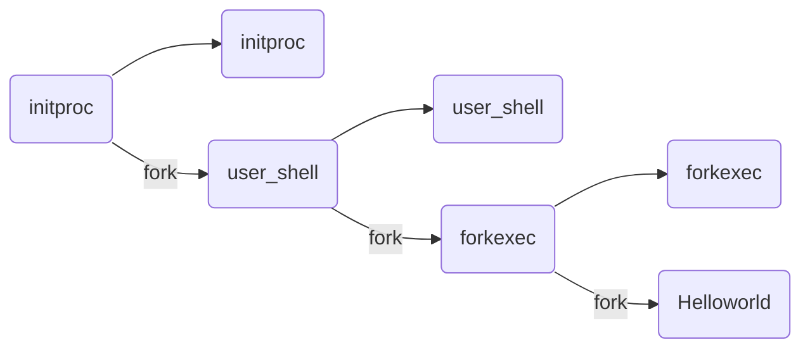

# 绪论
OS 内核特征
- 并发：计算机系统中同时存在多个运行的程序
- 共享：程序间“同时”访问，互斥共享各种资源
- 虚拟：每个程序“独占”一台完整计算机
- 异步：服务的完成时间不确定，也可能失败
微内核结构
- 尽可能把内核功能移到用户空间
- 用户模块间通信使用消息传递
外核结构
- 让内核分配物理资源给多个应用程序，并让每个程序决定如何处理这些资源
虚拟机
- 多 OS 共享硬件资源
# 进程
进程是指一个具有一定<font color="#ff0000">独立功能</font>的程序在一个<font color="#ff0000">数据集合</font>上的一次<font color="#ff0000">动态执行</font>过程
进程包含了正在运行的一个程序的所有状态信息
- 代码
- 数据
- 状态寄存器
	- CPU 寄存器 CR0，指令指针 IP
- 通用寄存器
- 进程占用系统资源
	- 打开文件、已分配内存

程序 = 文件(静态的可执行文件)
进程 = 执行中的程序(暂时) = 程序 + 执行状态 = 程序 + 数据 + PCB
同一个程序的多次执行过程对应为不同进程
## PCB
PCB：OS 管理控制进程运行所用的信息集合
PCB 是进程存在的唯一标志


进程控制信息：
- 调度和状态信息
	- 调度进程和处理机使用情况
- 进程间通信信息
	- 进程间通信相关的各种标识
- 存储管理信息
	- 指向进程映像存储空间数据结构
- 进程所用资源
	- 进程使用的系统资源，如打开文件等
- 有关数据结构连接信息
	- 与 PCB 相关的进程队列
## 进程的生命周期划分
- 运行状态：进程正在处理机上运行
- 就绪状态：进程获得了除处理机之外的所需资源，得到处理机即可运⾏
- 等待状态（阻塞状态）：进程正在等待某个事件的出现而暂停运行
- 创建状态：一个进程正在被创建，还没被转到就绪状态之前的状态（分配资源和相应的数据结构，<font color="#ff0000">每个进程在整个生命周期中，只会进来一次创建</font>）
- 结束状态：一个进程正在从系统中消失时的状态，这是因为进程结束或由于其他原因所导致


sleep()系统调用没有从运行->就绪状态

状态队列：OS 维护一组(PCB)队列，表示 OS 中所有进程的当前状态
进程状态变化时，它所在的 PCB 会从一个队列换到另一个队列

shell 执行用户输入命令过程：
1. OS 初始化
2. 找到 initproc 执行程序并创建 initproc 的 PCB
3. 执行 initproc APP
4. initproc 执行 fork + exec(user_shell)，执行 waitpid 等待子进程
5. user_shell 在得到字符串输入"forkexec"后，执行 fork+exec(forkexec)，执行 waitpid 等待子进程
6. forkexec 执行 fork+exec(helloworld)，执行 waitpid 等待子进程
7. helloworld 执行完毕并退出
8. forkexec 执行 waitpid 返回并退出
9. user_shell 执行 waitpid 返回，回到第 5 步继续等待字符串输入

## 进程切换

切换前，保存进程上下文，切换后，恢复进程上下文
`idle task`：空闲任务，这个任务在没有其它任务进入就绪态时进入运行。永远设为最低优先级，只是在不停地给一个32位的名叫OSIdleCtr的计数器加1

## 进程管理的系统调用
### fork
创建一个继承的子进程
- 复制父进程的所有变量和<font color="#ff0000">内存</font>
- 复制父进程(除区分父子进程 PID 外的)所有 CPU 寄存器
返回值：
- 子进程的 fork()返回 0，PID可通过 getpid()获取
- 父进程的 fork()返回子进程 PID
```c
for(i=0;i<loop;i++)
{
	pid = fork();
	if(pid==0){
	    printf("i=%d, pid=%d, parent pid=%d\n",i,getpid(),getppid());
	}
}
```
fork 后，不同进程之间的 `i` 独立

#### COW
1. 当父进程调用fork()创建子进程时,内核会将父进程的所有内存页都标记为只读(即共享页面)，并增加每个页面的引用计数。在这个过程中，父子进程共享同一份内存页面
2. 一旦其中一个进程(父进程或子进程)尝试写入某个内存页，就会触发一个保护故障(缺页异常)，此时会陷入内核，内核将拦截这个写入操作，检查该页面的引用数：
- 如果引用数大于 1，则会创建该页面的副本，并将引用数减 1，同时恢复这个页面的可写权限，然后重新执行这个写操作；
- 如果页面的引用数只有 1，也就是说该页面只被当前进程引用，那么内核就可以跳过分配新页面的步骤，直接修改该页面，将其标记为可写。（注意没有触发异常的页还是共享父进程的）

使用 COW 技术，fork 的实际开销是复制父进程的页表以及给子进程创建 PID
#### vfork
调用 vfork()之后，父进程会一直阻塞，直到子进程调用 exec 函数
fork()会复制父进程的页表，而 vfork()不会复制，直接让子进程<font color="#ff0000">共用</font>父进程的页表
fork()使用了写时复制技术，而 vfork()没有，它任何时候都不会复制父进程地址空间
vfork()产生的子进程跟父进程完全共同使用同一个地址空间，子进程中对任何数据变量的修改，不管是局部的还是全局的，都会影响到父进程
### exec
加载文件并从 `main` 执行，仅当出错时返回
调用成功时，是相同的进程但是运行了不同的程序
- 代码段、堆栈和堆等完全重写
### wait
父进程等待子进程的结束
- 子进程结束时通过 exit() 向父进程返回状态值
- 父进程通过 wait() 接受并处理返回值
功能：
- 有<font color="#ff0000">子进程存活</font>时，父进程已经执行了 wait 并进入等待状态，等待子进程的返回结果
- 当某子进程调用 exit() 时，唤醒父进程，将 exit() 返回值作为父进程中 wait 的返回值
- 若没有子进程存活，wait() 立即返回
#### 僵尸进程(有危害)
子进程<font color="#ff0000">已经退出</font>（并不会马上消失，会在进程表中留下进程项），但父进程<font color="#ff0000">还没执行到</font> wait 回收 PCB。如果将僵尸进程的父进程被 kill，则僵尸进程转为孤儿进程
- 有僵尸子进程等待时，wait() 立即返回其中一个值
#### 孤儿进程(无危害)
父进程退出，但子进程还在运行，孤儿进程会被 init/root 进程(pid=1)等待并回收
### exit
进程结束执行 exit()，完成进程资源回收
功能：
- 将调用参数作为进程的“结果”
- 关闭所有打开的文件等占用资源
- 释放内存
- 释放大部分进程相关的内核数据结构
- 检查父进程是否存活
	- 如果存活，保留结果的值直到父进程需要它，<font color="#ff0000">进入僵尸状态</font>
	- 如果没有，设置父进程为 Root 进程 (孤儿进程)
- (对父进程)清理所有等待的僵尸进程
### 其他系统调用
优先级控制
- nice()指定进程的初始优先级
- Unix 系统中进程优先级会随执行时间而衰减
进程调试
- ptrace()运行一个进程控制另一个进程执行
- 设置断点和查看寄存器等
定时
- sleep()可以让进程在定时器的<font color="#ff0000">等待队列</font>中等待指定时间
## 单处理机调度
