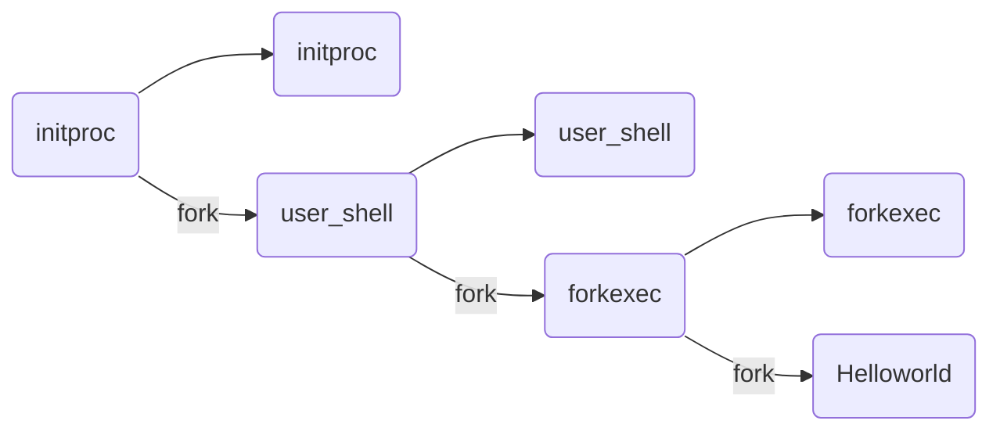

# 绪论
OS 内核特征
- 并发：计算机系统中同时存在多个运行的程序
- 共享：程序间“同时”访问，互斥共享各种资源
- 虚拟：每个程序“独占”一台完整计算机
- 异步：服务的完成时间不确定，也可能失败
微内核结构
- 尽可能把内核功能移到用户空间
- 用户模块间通信使用消息传递
外核结构
- 让内核分配物理资源给多个应用程序，并让每个程序决定如何处理这些资源
虚拟机
- 多 OS 共享硬件资源
# 进程
进程是指一个具有一定<font color="#ff0000">独立功能</font>的程序在一个<font color="#ff0000">数据集合</font>上的一次<font color="#ff0000">动态执行</font>过程
进程包含了正在运行的一个程序的所有状态信息
- 代码
- 数据
- 状态寄存器
	- CPU 寄存器 CR0，指令指针 IP
- 通用寄存器
- 进程占用系统资源
	- 打开文件、已分配内存

程序 = 文件(静态的可执行文件)
进程 = 执行中的程序(暂时) = 程序 + 执行状态 = 程序 + 数据 + PCB
同一个程序的多次执行过程对应为不同进程
## PCB
PCB：OS 管理控制进程运行所用的信息集合
PCB 是进程存在的唯一标志


进程控制信息：
- 调度和状态信息
	- 调度进程和处理机使用情况
- 进程间通信信息
	- 进程间通信相关的各种标识
- 存储管理信息
	- 指向进程映像存储空间数据结构
- 进程所用资源
	- 进程使用的系统资源，如打开文件等
- 有关数据结构连接信息
	- 与 PCB 相关的进程队列
## 进程的生命周期划分
- 运行状态：进程正在处理机上运行
- 就绪状态：进程获得了除处理机之外的所需资源，得到处理机即可运⾏
- 等待状态（阻塞状态）：进程正在等待某个事件的出现而暂停运行
- 创建状态：一个进程正在被创建，还没被转到就绪状态之前的状态（分配资源和相应的数据结构，<font color="#ff0000">每个进程在整个生命周期中，只会进来一次创建</font>）
- 结束状态：一个进程正在从系统中消失时的状态，这是因为进程结束或由于其他原因所导致


sleep()系统调用没有从运行->就绪状态

状态队列：OS 维护一组(PCB)队列，表示 OS 中所有进程的当前状态
进程状态变化时，它所在的 PCB 会从一个队列换到另一个队列

shell 执行用户输入命令过程：
1. OS 初始化
2. 找到 initproc 执行程序并创建 initproc 的 PCB
3. 执行 initproc APP
4. initproc 执行 fork + exec(user_shell)，执行 waitpid 等待子进程
5. user_shell 在得到字符串输入"forkexec"后，执行 fork+exec(forkexec)，执行 waitpid 等待子进程
6. forkexec 执行 fork+exec(helloworld)，执行 waitpid 等待子进程
7. helloworld 执行完毕并退出
8. forkexec 执行 waitpid 返回并退出
9. user_shell 执行 waitpid 返回，回到第 5 步继续等待字符串输入

## 进程切换

切换前，保存当前进程在 PCB 中的执行上下文(CPU 状态)，切换后，恢复下一个进程的执行上下文
`idle task`：空闲任务，这个任务在没有其它任务进入就绪态时进入运行。永远设为最低优先级，只是在不停地给一个32位的名叫OSIdleCtr的计数器加1

## 进程管理的系统调用
### fork
创建一个继承的子进程
- 复制父进程的所有变量和<font color="#ff0000">内存</font>
- 复制父进程(除区分父子进程 PID 外的)所有 CPU 寄存器
返回值：
- 子进程的 fork()返回 0，PID可通过 getpid()获取
- 父进程的 fork()返回子进程 PID
```c
for(i=0;i<loop;i++)
{
	pid = fork();
	if(pid==0){
	    printf("i=%d, pid=%d, parent pid=%d\n",i,getpid(),getppid());
	}
}
```
fork 后，不同进程之间的 `i` 独立

#### COW
1. 当父进程调用fork()创建子进程时,内核会将父进程的所有内存页都标记为只读(即共享页面)，并增加每个页面的引用计数。在这个过程中，父子进程共享同一份内存页面
2. 一旦其中一个进程(父进程或子进程)尝试写入某个内存页，就会触发一个保护故障(缺页异常)，此时会陷入内核，内核将拦截这个写入操作，检查该页面的引用数：
- 如果引用数大于 1，则会创建该页面的副本，并将引用数减 1，同时恢复这个页面的可写权限，然后重新执行这个写操作；
- 如果页面的引用数只有 1，也就是说该页面只被当前进程引用，那么内核就可以跳过分配新页面的步骤，直接修改该页面，将其标记为可写。（注意没有触发异常的页还是共享父进程的）

使用 COW 技术，fork 的实际开销是复制父进程的页表(write 操作时)以及给子进程创建 PID
#### vfork
调用 vfork()之后，父进程会一直阻塞，直到子进程调用 exec 函数
fork()会复制父进程的页表，而 vfork()不会复制，直接让子进程<font color="#ff0000">共用</font>父进程的页表
fork()使用了写时复制技术，而 vfork()没有，它任何时候都不会复制父进程地址空间
vfork()产生的子进程跟父进程完全共同使用同一个地址空间，子进程中对任何数据变量的修改，不管是局部的还是全局的，都会影响到父进程
### exec
加载文件并从 `main` 执行，仅当出错时返回
调用成功时，是相同的进程但是运行了不同的程序
- 代码段、堆栈和堆等完全重写
### wait
父进程等待子进程的结束
- 子进程结束时通过 exit() 向父进程返回状态值
- 父进程通过 wait() 接受并处理返回值
功能：
- 有<font color="#ff0000">子进程存活</font>时，父进程已经执行了 wait 并进入等待状态，等待子进程的返回结果
- 当某子进程调用 exit() 时，唤醒父进程，将 exit() 返回值作为父进程中 wait 的返回值
- 若没有子进程存活，wait() 立即返回
#### 僵尸进程(有危害)
子进程<font color="#ff0000">已经退出</font>（并不会马上消失，会在进程表中留下进程项），但父进程<font color="#ff0000">还没执行到</font> wait 回收 PCB。如果将僵尸进程的父进程被 kill，则僵尸进程转为孤儿进程
- 有僵尸子进程等待时，wait() 立即返回其中一个值
#### 孤儿进程(无危害)
父进程退出，但子进程还在运行，孤儿进程会被 init/root 进程(pid=1)等待并回收
### exit
进程结束执行 exit()，完成进程资源回收
功能：
- 将调用参数作为进程的“结果”
- 关闭所有打开的文件等占用资源
- 释放内存
- 释放大部分进程相关的内核数据结构
- 检查父进程是否存活
	- 如果存活，保留结果的值直到父进程需要它，<font color="#ff0000">进入僵尸状态</font>
	- 如果没有，设置父进程为 Root 进程 (孤儿进程)
- (对父进程)清理所有等待的僵尸进程
### 其他系统调用
优先级控制
- nice()指定进程的初始优先级
- Unix 系统中进程优先级会随执行时间而衰减
进程调试
- ptrace()运行一个进程控制另一个进程执行
- 设置断点和查看寄存器等
定时
- sleep()可以让进程在定时器的<font color="#ff0000">等待队列</font>中等待指定时间
## 单处理机调度
调度程序：从就绪队列中挑选下一个占用 CPU 运行进程的<font color="#ff0000">内核函数</font>
调度时机：
- 内核运行调度程序的条件：
	- 进程从运行状态切换到等待/就绪状态
	- 进程被终结了
- 非抢占系统
	- 当前进程主动放弃 CPU 时
- 可抢占系统
	- 中断请求被服务例程响应完成时
	- 当前进程被抢占
		- 进程时间片用完
		- 进程从等待切换到就绪
进程在 CPU 计算和 I/O 操作间交替
### 相关指标
CPU 使用率：CPU 处于忙状态的<font color="#ff0000">时间百分比</font>
吞吐率：单位时间内完成的<font color="#ff0000">进程数量</font>——OS 的计算带宽
周转时间：进程从初始化到结束(包括等待)的<font color="#ff0000">总时间</font>
等待时间：进程在<font color="#ff0000">就绪队列</font>中的总时间
响应时间：从提交请求到<font color="#ff0000">产生响应</font>所花费的总时间——OS 的计算延迟
公平：进程占用相同的资源，如 CPU 时间
减少平均响应时间的波动
增加吞吐量：
- 减少开销(OS 开销，上下文切换)
- OS 资源的高效利用(CPU，I/O 设备)
- 减少进程的等待时间
OS 需要保证吞吐量不受用户交互的影响
公平：
- 保证每个进程占用相同的 CPU 时间
- 保证每个进程的就绪等待时间相同
公平通常会增加平均响应时间
### FCFS
依据进程<font color="#ff0000">进入就绪状态</font>的先后顺序排列
当进程进入等待或结束状态时，就绪队列中的下一个进程占用 CPU

优点：简单
缺点：
- 平均等待时间波动较大
	- 短进程可能排在长进程后面
- I/O 资源和 CPU 资源的利用率较低
	- CPU 密集型进程会导致 I/O 设备闲置时I/O 密集型进程等待
### SPN/SJF
选择就绪队列中执行时间最短进程占用 CPU 进入运行状态
- 按预期的执行时间来排序
优点：具有<font color="#ff0000">最优</font>平均周转时间
缺点：
- 可能导致饥饿(连续的短进程会使长进程无法获得 CPU 资源)
- 需要预知未来
用历史的执行时间来预估未来的执行时间
$\tau_{n+1} = \alpha t_n + (1-\alpha)\tau_n \ , 0\leq\alpha\leq1$
$t_n$：第 n 次 CPU 计算时间
$\tau_{n+1}$：第 n+1 次 CPU 计算时间预估
$\tau_{n+1} = \alpha t_n + (1-\alpha)\alpha t_{n-1} + (1-\alpha)(1-\alpha)\alpha t_{n-2}+...$
### SRT
SRT 支持<font color="#ff0000">抢占</font>调度机制，当有新的进程就绪，且新进程的服务时间小于当前进程的<font color="#ff0000">剩余时间</font>，则转到新的进程执行
### HRRN
是对 FCFS 和 SJF 的综合平衡
选择就绪队列中响应比 R 值最高的进程
$R = \frac{w+s}{s}$，w：等待时间，S：执行时间
不可抢占，防止无限期推迟
### RR
时间片：分配处理机资源的基本时间单元
时间片结束时，按 <font color="#ff0000">FCFS</font> 算法切换到下一个就绪进程
每隔(n-1)个时间片进程执行下一个时间片 q

有额外的上下文切换开销，平均等待时间较差
时间片太大：
- 等待时间过长
- 极限情况退化成 FCFS
时间片太小：
+ 反应迅速，但产生大量上下文切换
+ 大量上下文切换开销影响到系统吞吐量
通常选择维持上下文切换开销处于 1%以内大小
### MQ 多级队列
就绪队列被划分成多个独立的子队列
- 每个队列拥有自己的调度策略
- 同一优先级的进程属于某个队列，且<font color="#ff0000">不能跨越队列</font>
规则：
1. 如果 $A_{priority}>B$，运行 A 不运行 B
2. 如果 $A_{priority}=B$，轮转运行 A 和 B
队列间的调度：
- 固定优先级
	- 先处理前台(交互)进程，然后处理后台进程
	- 可能导致饥饿
- 时间片轮转
	- <font color="#ff0000">每个队列</font>都得到一个确定的能够调度其进程的 CPU <font color="#ff0000">总时间</font>
### MLFQ
进程可以在不同队列之间移动
规则：
1. 如果 $A_{priority}>B$，运行 A 不运行 B
2. 如果 $A_{priority}=B$，轮转/FIFO运行 A 和 B
3. 进程进入系统时，放在最高优先级(最上层队列)
4. 如果进程在当前的时间片没有完成(无论中间主动放弃了多少次 CPU)，降到下一个优先级
5. 如果进程在其时间片内主动释放 CPU，优先级不变
6. 经过一段时间S后，就将系统中所有工作重新加入最高优先级队列
7. 时间片大小随优先级增加而减少

特征：
- CPU 密集型进程的优先级下降很快
- I/O 密集型进程将停留在高优先级
潜在问题：
- CPU 密集型进程会饥饿
### FSS 公平共享
控制用户对 OS 资源的访问
- 不同用户拥有多个进程
- 按用户优先级分配资源
- 保证不重要的用户无法垄断资源
- 未使用的资源按比例分配
### Stride

优先级与 pass 成反比
stride 溢出处理：
- $stride_{max} - stride_{min} \leq pass_\max$
- stride，pass 无符号整数
- 判断 stride 大小改为 signed int(A.stride - B.stride) ? 0
初始：A.stride = 125，A.pass = 6；B.stride = 124, B.pass = 5
若无符号整数范围是 0~127，124<125，此时调度 B
B.Stride = 124 + 5 = 129 = 1(溢出)<A.stride，则之后会一直调度 B
而(A.stride - B.stride) = (125 - 1) = 124，有符号数范围是 -64~63，所以 124->-4，则 strideA - strideB = -4 < 0，调度进程 A
## 实时调度
实时操作系统的定义
- 正确性依赖于其<font color="#ff0000">时间</font>和<font color="#ff0000">功能</font>两方面
性能指标
- 时间约束的<font color="#ff0000">及时性</font>(必须在约定时间内完成约定的工作)
- 速度和平均性能相对不重要
特性：
- 时间约束的<font color="#ff0000">可预测性</font>
分类：
- 强实时 OS：要求在指定的时间内<font color="#ff0000">必须</font>完成重要的工作
- 弱实时 OS：重要进程有高优先级，要求<font color="#ff0000">尽量但非必须</font>完成
实时任务：

周期实时任务：一系列相似的任务
- 任务有规律的重复
- 周期 p = 任务请求时间间隔
- 执行时间 e = 最大执行时间(0<e<p)(从所有执行时间中选择 max)
- 使用率 U= e/p

可调度的必要条件：$\Sigma_i \frac{e_i}{p_i}\leq1$，对于 RM 算法满足必要条件仍可能不可调度；$\Sigma_i \frac{e_i}{p_i}>1$ 必定不可调度
硬时限：
- 错过任务时限会导致严重后果
- 必须验证在最坏情况下能满足时限
软时限：
- 通常能满足任务时限
	- 如果有时不能满足，则降低要求
- 尽力保证满足任务时限
可调度：表示一个实时 OSen
