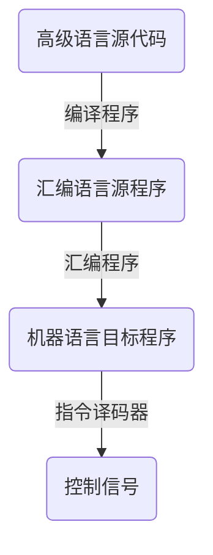

# 1 绪论
## 1.2 计算机系统的基本组成
冯诺依曼结构
	运算器：基本算术运算，逻辑运算，附加运算
	控制器：自动执行指令
	存储器：存放指令和数据（形式上没有区别）
	输入设备
	输出设备
- 核心思想：存储程序工作方式
## 1.3 计算机系统层次结构
ISA（指令集体系结构）处于软件和硬件的交界面
	定义了计算机可以执行的所有指令的集合
	是对硬件的抽象
	所有软件功能都建立在 ISA 之上
## 1.4 程序开发与执行过程

## 1.5 计算机系统性能评价
- (CPU)时钟周期：CPU 主脉冲信号的宽度（用于同步）
- (CPU)时钟频率：时钟周期的倒数
- CPI：执行指令所需时钟周期数
- 程序所含时钟周期数 = 程序所含指令条数 \* CPI = $\sum^{n}_{i=1}CPI_i \times C_i$（n 种不同类型的指令）
- 程序的综合 CPI = $\sum^{n}_{i=1}(CPI_i \times F_i)$ = 程序所含时钟周期数 / 程序所含指令条数
- CPU 执行时间 = 程序所含时钟周期数 / 时钟频率 = 程序所含时钟周期数 \* 时钟周期 = CPI \* 程序总指令条数 \* 时钟周期
两台计算机性能之比=CPU 执行时间之比的倒数
时钟周期、指令条数、CPI 相互制约
## 习题
1. 程序 P 在 M1 上运行需要 10 秒，M1 的时钟频率为 2GHz，M2 与 M1 有相同的 ISA，程序 P 在 M2 上的时钟周期数是在 M1 上的 1.5 倍，则 M2 的时钟频率至少要多少才能使程序 P 在 M2 上的运行时间缩短为 6 秒
> [!hint]-
> P 在 M1 上的时钟周期数 = $10s*2GHz=20G$
> 
> P 在 M2 上的时钟周期数 = $20G*1.5=30G$
> 
> M2 的时钟频率 = $30G \div 6s = 5Ghz$

2. M 的指令集包含 A、B、C 三类指令，其 CPI 分别为 1，2，4。程序 P 在 M 上被编译成两个不同的目标代码序列 P1、P2，分别含 A、B、C 指令条数 8、2、2；2、5、3，请问哪个代码序列指令条数少？哪个执行速度快？它们的 CPI 分别是多少？
>[!hint]- 
> P1 指令条数 = 8 + 2 + 2 = 12
> 
> P2 指令条数 = 2 + 5 + 3 = 10
> 
> P2 指令条数少
> 
> P1 时钟周期数：$8*1+2*2+2*4=20$
> 
> P2 时钟周期数：$2*1+5*2+3*4=24$
> 
> 因为两个序列在同一台机器上运行，所以 CPU 时钟周期一样，P1 时钟周期数少，用时短，执行速度快
> 
> P1 的 CPI = $20 / 12 = 1.67$
> 
> P2 的 CPI = $24 / 10 = 2.4$

3. （2012-912）执行相同程序，以下四个处理器所需要的时间最短的是（）
A：处理器 1 频率为 3 GHz，CPI=1.5
B：处理器 2 频率为 2.5 GHz，CPI=1
C：处理器 3 频率为 4 GHz，CPI=2.2
D：处理器 4 频率为 2.8 GHz，CPI=1.1
> [!hint]-
> D
> 
> 每条指令执行时间 = CPI/CPU频率
> 
> A：0.5
> 
> B：0.4
> 
> C：0.55
> 
> D：0.39...

4. （2018-912）提高 CPU 主频可以加快程序执行速度，CPU 的主频越高，指令执行的越快（）
>[!hint]-
>错误
>
> 三个因素相互制约，提高主频可能导致其他两个因素下降

# 2 数据的机器级表示
## 2.1 数制和编码
- 整数十进制转 R 进制：除到 0，逆向输出余数
- 小数十进制转 R 进制：乘到没有小数（可能小数部分总不为 0），正序输出整数部分
  $0.63*2=1 + 0.26$ -> 1
  $0.26*2 = 0.52$ -> 0
  $0.52 * 2 = 1 + 0.04$ -> 1
  $0.04 * 2 = 0.08$ -> 0
  $0.63 = 0.1010...B$
- 整数+小数分别转化再组合
定点数的编码：
正数的三码都一样
- 原码：0 的表示不唯一
	  加、减运算方式不唯一
	  需额外对符号位处理，不利于硬件设计
	  特别当 a\<b 时，实现 a-b 困难
- 反码：负数反码->符号位不变，数值位取反
	  0 的表示不唯一
	  运算时必须考虑循环进位
- 补码：负数补码->负数的反码+1
	 0 的表示唯一
	 可用加法实现减法运算
	 多表示一个最小负数
	 不需要循环进位调整结果
	 加法运算：符号位和数值位同样计算 $[x+y]_{\text{补}}=[x]_{\text{补}}+[y]_{\text{补}}$
例 $35+(-18)=0010\ 0011+1110 \ 1110 = 1(最高位舍弃)\ 0001 \ 0001 = 0001 \ 0001 = 17$
- 已知补码，求相反数的补码->连同符号位，各位取反，末位加一
例：求 $x_补=1000 \ 0000$ 相反数的补码 
$-x_补 = 0111\ 1111 + 0000\ 0001 = 1\ 0000\ 0000(结果溢出)$，这是由于 +128 无法用补码表示

| 十进制 | 原码                               | 反码                               | 补码                               |
| --- | -------------------------------- | -------------------------------- | -------------------------------- |
| 0   | 000 | 000 | 000 |
| 1   | 001 | 001 | 001 |
| 2   | 010 | 010 | 010 |
| 3   | 011 | 011 | 011 |
| -0  | 100 | 111 | 000 |
| -1  | 101 | 110 | 111 |
| -2  | 110 | 101 | 110 |
| -3  | 111 | 100 | 101 |
| -4  |                                  |                                  | 100                              |
## 2.2 整数的表示
- 无符号整数：默认数的符号为正，所以无符号整数就是非负整数
  表示范围：$0\sim(2^n-1)$
- 有符号整数：用补码表示，表示范围：$-2^{n-1}\sim(2^{n-1}-1)$
## 2.3 实数的表示
浮点数通常表示为：
$N = (-1) ^S \times M \times r^E$
- S：符号位，一般 0 表示正，1 表示负
- r：**基**，可以约定为 2、4、16...
- E：**阶码**，反映浮点数的表示范围和小数点的实际位置
- M：**尾数**，其位数决定了浮点数的有效位数
规格化：使尾数的最高位非 0
	- 左规：$\pm0.001bb\times2^E\to\pm0.1bb\times2^{E-2}$
	- 右规：$\pm 1b.b\times2^E\to\pm0.1bb\times2^{E+2}$
IEEE 754：

| 类型   | 数阶  | 阶码  | 尾数数值 | 总位数 | 偏置值  |
| ---- | --- | --- | ---- | --- | ---- |
| 短浮点数 | 1   | 8   | 23   | 32  | 127  |
| 长浮点数 | 1   | 11  | 52   | 64  | 1023 |
隐藏位技术：非 0 值 尾数 规格化后数值的最高位必定为 1(0.1xxx)，通过尾数左移(1.xxx)，强制将该位去掉
- 移码：整数补码+偏移值
例：将十进制-0.75 转为 IEEE754 单精度浮点数
> [!important] 
> $(-0.75)_{10}=(-0.11)_2=-(1.1)_2\times2^{-1}=(-1)^S\times1.f\times2^{e-127}$
>
> S = 1
>
> f = 0.100...0
> 
> e = 127 - 1 = 126 = 0111 1110
> 
> 对应的浮点数为：1011 1111 0100 0000 0000 0000 0000 0000
> 
> 对应的十六进制为：BF40 0000H

例：IEEE754 单精度浮点数 C0A0 0000H 的值是多少
>[!important] 
> C0A0 0000H -> 1100 0000 1010 0000 0000 0000 0000 0000
> 
> S = 1
> 
> $f = (0.01)_2 = (0.25)_{10}$
> 
> $e = (10000001)_2 = (129)_{10}$
> 
> 所以其值为 $(-1)^1\times\textcolor{red}{1}.25\times2^{129-127}=-5.0$

- 全 0 阶码
	- 全 0 尾数：$\pm0$
		  0 的符号取决于数符 s
	- 非 0 尾数：非规格化数
		  当某个数**非常**接近零时才会使用，始终小于规格化数
		  非规格化数的隐藏位为 0，并且单精度和双精度浮点数的指数分别为-126 或-1022
		  数值分别为 $(-1)^s \times 0.f \times 2^{-126}$ 和 $(-1)^s \times 0.f \times 2^{-1022}$
		  非规格化数可用于处理阶码下溢，使得出现比最小规格化数还小的数时程序还能继续进行下去
- 全 1 阶码
	- 全 0 尾数：$\pm\infty$
	- 非 0 尾数：NaN（出现 $\frac{0}{0},(+\infty)-(+\infty)...$）
- 非全 0 非全 1 阶码：正常的规格化非 0 数
	  指数范围：$-126\sim+127$ 和 $-1022\sim+1023$
	  值的个数：$254(阶码个数)\times2^{23}(尾数个数)=1.98\times2^{31}$ 和 $1.99\times2^{63}$
浮点数表示范围：

- 非规格化数隐藏位是 0，最小时尾数不能全取 0，对应 $(0.000\ 0000\ 0000\ 0000\ 0000\ 0001)_2 = 2^{-23}$，指数只能取 $0-126(偏置)=-126$
- 规格化数隐藏位是 1，最小时尾数取全 0，对应 $(1.000\ 0000\ 0000\ 0000\ 0000\ 0000)_2 = 1$，指数取值范围是 $-126\sim 127$
int --> float：可能损失精度（有效数字比float多）
float --> int：可能溢出（超出int表示范围）及损失精度（小数部分）
浮点数运算
1. 对阶
2. 尾数运算
3. 规格化
4. 舍入处理
5. 溢出判断
## 2.4 非数值数据的编码表示
- Unicode 编码
	 使用 16 位表示一个字符
	 保留 6400 个码点供本地化使用
- UTF-8 编码（是 Unicode 的实现方式之一）

| 字符位数     | 字节 1       | 字节 2       | 字节 3       | 字节 4       | 字节 5       | 字节 6       |
| -------- | ---------- | ---------- | ---------- | ---------- | ---------- | ---------- |
| 7(ASCII) | `0xxxxxxx` |            |            |            |            |            |
| 11       | `110xxxxx` | `10xxxxxx` |            |            |            |            |
| 16       | `1110xxxx` | `10xxxxxx` | `10xxxxxx` |            |            |            |
| 21       | `11110xxx` | `10xxxxxx` | `10xxxxxx` | `10xxxxxx` |            |            |
| 26       | `111110xx` | `10xxxxxx` | `10xxxxxx` | `10xxxxxx` | `10xxxxxx` |            |
| 31       | `1111110x` | `10xxxxxx` | `10xxxxxx` | `10xxxxxx` | `10xxxxxx` | `10xxxxxx` |
## 2.5 数据的宽度和存储
(机器)字长：计算机能直接处理的二进制数据的位数
LSB：最低有效字节(数字的最低位)
MSB：最高有效字节(数字的最高位)
大端模式（便于人类阅读）：最高有效字节放在低地址
	例：01234567H 保存在地址 0800H 的位置
	0800H         0801H    0802H    0803H
	01H(MSB)    23H        45H        67H(LSB)        
小端模式（便于机器处理）：最低有效字节放在低地址
	0800H         0801H    0802H    0803H
	67H(LSB)    45H        23H         01H(MSB)
# 3 运算方法和运算部件
- 逻辑移位(无符号数)：不用考虑符号位
	左移：高位移出，低位补 0，若最高位移出的是 1，发生溢出
	右移：低位移出，高位补 0
- 算术移位(有符号数)：
	左移：高位移出，低位补 0，若移动前后符号位不同，发生溢出
	右移：低位移出，高位补符号
对于左移，逻辑移位和算术移位结果相同
- 位扩展
	无符号数扩展（0 扩展）：在无符号数前添 0
	有符号数扩展（符号扩展）：在补码前补符号位
- 位截断
	无论是无符号数还是有符号数补码，都是丢弃高位。把截断后的低 k 位结果分别解释成无符号数和有符号数。
## 3.2 基本运算部件
# 4 指令系统
指令包含操作码字段和地址码字段(可能没有，零地址指令)
指令是计算机运行的最小功能单元
指令字：完整的一条指令的二进制表示
指令字长：组成一条指令的二进制数的位数
指令字长（字节倍数）= 0.5、1、2...个机器字长
## 4.2 寻址方式
形式地址：在指令中给出的操作数（或指令）地址
实际地址：根据形式地址计算得到或读操作得到
- 立即数寻址：所需操作数在指令地址字段直接给出
	1. 取指时同时取得操作数而不必到存储器中取
	2. 立即数较大时需要用指令的第二个字
- 直接寻址：地址码字段直接给出所需地址
	$[addr]$：从 addr 内存地址中读出的操作数
- 间接寻址：地址码字段给出地址的地址
	多一次读内存储器的操作
	共需要**三次访存**：取指令，指向主存单元→访问主存单元，得到真实地址→访问真实地址，得到操作数
- 寄存器寻址：地址码部分给出**寄存器编号**，相应的寄存器中存放着真实地址
- 寄存器间接寻址：地址码部分给出寄存器编号，寄存器中存放着主存单元地址，该主存单元中存放着真实地址
- 变址寻址：操作数的地址由指定的变址寄存器的内容和指令中的变址偏移量(Disp)相加得到
	袁书：指令地址码字段给出形式地址作为基准地址，变址寄存器中存放偏移量
	PPT：指令中给出变址偏移量作为基准地址
- 相对寻址：将PC中存放的值（下一条指令地址）和相对寻址偏移量相加得到
	偏移量可正可负，通常用补码表示
- 基址寻址：将基址寄存器(BR)的值加上形式地址所表示的偏移量
	用户无法修改 BR 中的内容
- 堆栈寻址：堆栈指针(SP)始终指向堆栈的栈顶地址，当执行出入栈操作时，SP会自动 $\pm1$ 指向新的栈顶元素
指令操作码扩展技术
例如在 16 位字长的指令中同时支持三地址 14 条，二地址 30 条，一地址 31 条，零地址 16 条

|     | 操作码                                                                 | 地址码 1                                                               | 地址码 2                                                               | 地址码 3     |
| --- | ------------------------------------------------------------------- | ------------------------------------------------------------------- | ------------------------------------------------------------------- | --------- |
| 三地址 | 0000~1101                                                           | 任意                                                                  | 任意                                                                  | 任意        |
| 二地址 | 1110~1111 | 0000~1101 | 任意                                                                  | 任意        |
| 一地址 | 1111                                   | 1110~1111 | 0000~1110 | 任意        |
| 零地址 | 1111                                                                | 1111                                                                | 1111                                                                | 0000~1111 |
  
|          | CISC(X86)          | RISC（MIPS，DLX）     |
| -------- | ------------------ | ------------------ |
| 指令系统     | 复杂、庞大              | 简单                 |
| 指令数目     | >200               | <100               |
| 指令字长     | 不固定                | 定长                 |
| 可访存指令    | 不加限制               | 只有Load/Store指令     |
| 各种指令执行时间 | 相差较大               | 绝大多数在一个周期内完成       |
| 各种指令使用频度 | 相差很大               | 都比较常用              |
| 通用寄存器数量  | 较少                 | 多                  |
| 目标代码     | 难以用优化编译生成高效的目标代码程序 | 采用优化的编译程序，生成代码较为高效 |
| 控制方式     | 绝大多数为微程序控制         | 绝大多数为组合逻辑控制        |
| 指令流水线    | 可以通过一定方式实现         | 必须实现               |
## 4.3 程序的机器级表示
# 6 指令流水线
## 6.1 流水线概述
流水线特性：
- 流水线没有缩短单个任务的延迟，但提高了整个系统的吞吐率
- 多个任务同时运行，占用不同资源
- 流水线效率受限于用时最长的阶段
计算机各部件几乎都可以采用流水线技术
流水线时空图表示法：

流水线特点：
- 流水线每个功能段部件后都要有一个缓冲寄存器（锁存器）保存从一个流水段传送到下一个流水段的所有数据和控制信息，总是在下个时钟到来后的 Clock-to-Q 写入
- 装入时间：第一个任务进入流水线到输出流水线的时间
- 排空时间：最后一个任务进入流水线到输出流水线的时间
流水线分类：
- 部件功能级(运算操作)流水线（例如浮点加法器）
- 处理机级(指令)流水线
- 处理机间级(宏)流水线
## 6.2 流水线处理器的实现
流水线实现细节：
- PC 值多路选择器被放在 IF 段，保证对 PC 值的写操作只出现在第一个流水段中
- 流水线周期 = 流水段延迟 + 锁存器延迟
- 流水线延迟 = 流水线段数 \* 流水线周期
MIPS 各步骤占用的资源：
- IF：IM(指令存储器)、PC、总线
	 锁存器 1：PC+4、IR
	 控制信号：不需要（因为所有指令都一样）
- RF(取数)/ID：寄存器组(读端口)、指令译码器、控制信号生成部件
	 锁存器 2：A、B、imm、PC+4、func、rt/rd
	 控制信号：不需要（因为所有指令都一样），但会产生本指令的所有控制信号，包括 1 个时钟周期后 EXE 信号，2 个时钟周期后的 MEM 信号，3 个 时钟周期后的 WB 信号
- EXE：ALU、扩展器
	 锁存器 3：运算结果：PC+4 的值、ALU 结果、结果状态
			 中间结果：B、目的寄存器
	 控制信号：
		 1. ExtOp (扩展器操作)：1-符号扩展；0-零扩展
		 2. ALUSrc (ALU 的 B 口来源)：1- 来源于扩展器；0-来源于 BusB
		 3. ALUOp (主控制器输出，用于辅助局部 ALU 控制逻辑来决定 ALUCtrl) 
		 4. RegDst (指定目的寄存器)：1-Rd；0-Rt
- MEM：DM、总线
	 锁存器 4：目的寄存器、ALU 结果、存储器读出的结果
	 控制信号：
		 1. MemWr(DM 的写信号)：Store 指令时 1，其他指令 0
		 2. Branch (是否为分支指令)：分支指令时 1，其他指令 0
- WB：寄存器组(写端口)
	 控制信号：
		 1. MemtoReg (寄存器的写入源)：1-DM 输出；0-ALU 输出 
		 2. RegWr (寄存器堆写信号)：结果写寄存器的指令都为 1，其他指令为其他指令为 0
指令功能段划分：
- R/I-型：$IF-ID-EXE-[空段]-WB$
- lw：$IF-ID-EXE-MEM(从存储器中读)-WB$
- sw：$IF-ID-EXE-MEM(写入存储器中)-[空段]$
- beq：$IF-ID-EXE-MEM(完成的是PC写入操作)-[空段]$
- J：$IF-ID-EXE(完成的是 PC 写入操作)-[空段]-[空段]$
## 6.3 流水线冒险及其处理
### 6.3.1 结构冲突
结构冲突：多条指令在同一时刻争用同一硬件资源

解决方案：
1. 暂停流水线执行，插入等待周期
2. 增加资源，解决资源冲突

### 6.3.2 数据冲突
数据冲突：一条指令依赖于前面指令执行结果数据但又无法得到

三类数据冒险现象：

- RAW:  写后读（经常发生）还没写就先读了
- WAW：写后写（MIPS不会发生）本该后写的先写入了
- WAR：读后写（MIPS不会发生）还没读就先写了，如上图，只有前面指令的 ID 段长到覆盖后面的指令的 WB 段才会发生，而 MIPS 中各段长度相等
解决方案：
1. 在编译时预先插入空操作指令 nop

硬件控制简单但浪费了三条指令的空间和时间
2. 在硬件上通过阻塞(stall)方式阻止后续指令执行

需要修改数据通路，不增加指令条数但有额外时间开销
阻塞时：
	可将控制信号清零阻止写入锁存器
	可将指令清零使后续指令执行空操作
	让 IF/ID 段寄存器保持不变，sub 指令继续执行
	可将 PC 写使能信号清零使 PC 值不变，and 指令重新执行
1. 数据旁路技术 & 4. 寄存器堆合理实现

在 EXE 段结束后就已经得到了需要的 r1
- 对于 sub 和 and 指令：将数据从流水段寄存器中直接取到 ALU 的输入端（数据旁路）
- 对于 or 指令：寄存器写/读口分别在前/后半周期，使写入被直接读出（寄存器堆合理实现）
（load-use）装入-使用数据冒险（也属于 RAW）

虽然数据旁路技术可以解决大部分 RAW 数据冒险，但无法解决上图 load 指令随后的第一条指令(sub)产生的数据冒险

解决方案：
1. 硬件阻止指令执行

用硬件阻塞一个周期，指令被重复执行一次
2. 软件上插入 NOP 指令

MIPS1 处理器不支持硬件阻塞处理，所以由编译器插入一条 NOP 指令
3. 编译器进行指令顺序调整

编译器优化后的代码可以避免 Load 阻塞

RAW 数据冒险的旁路转发条件：
1. 后面指令需要用 ALU 输出结果
R-Type 后跟 R/lw/sw/beq 等
   - C1：目的寄存器是后一条指令的源寄存器
   - C2：目的寄存器是后第二条指令的源寄存器
2. 后面指令需要用从 DM 读出的结果
load 后跟 R/beq 等
   - C3：目的寄存器是后第二条指令的源寄存器

数据冲突的检测：
- 所有的数据冲突均可以在ID段检测到
    - 如果存在数据冲突，就在相应的指令流出 ID 段之前将之暂停
    - 完成该工作的硬件称为流水线的互锁机制
- 检测冲突是通过比较寄存器地址是否相等来实现的
### 6.3.3 控制冲突
控制冲突：分支指令或其他需要改写 PC 的指令造成冲突
- 数据冲突影响到的仅仅是本条指令附近少数几条指令，所以称为局部冲突
- 控制冲突影响的范围要大得多，它会引起程序执行方向的改变，使流水线损失更多的性能，所以称为全局冲突

取得 Beq 指令待跳转的正确指令前，已经有三条指令被错误取出（注意：Beq 指令是在 MEM 段完成 PC 写入）
解决方案：
1. 暂停流水线，直到有了正确的转移地址
   - 可以硬件上阻塞分支指令
   - 也可以软件上插入空指令
暂停方法 1：

直接暂停三个周期，等待 PC 写入完成后继续

| IF    | ID  | EX    | MEM   | WB    |       |
| ----- | --- | ----- | ----- | ----- | ----- |
| 第一个暂停 | IF  | Stall | Stall | Stall | Stall |
| 第二个暂停 |     | IF    | Stall | Stall | Stall |
| 第三个暂停 |     |       | IF    | Stall | Stall |
|       |     |       |       | IF    | ID    |
简化为：

| IF  | Stall | Stall | IF  | ID  |
| --- | ----- | ----- | --- | --- |

暂停方法 2：

其实在 EX 段 ALU 就计算出了要跳转的地址，所以可以使用旁路转发到 IF 段，这样只用暂停两个周期

暂停方法 3：

在 ID 段译码完成后，就得到了跳转所需要的所有数据，如果增加比较器并调整加法器到 ID 段，那么在 ID 段就能得到转移位置，这样只用暂停一个周期，但引入这些部件会导致 ID 段所需时间增加，可能使整个流水线时钟周期增加

2. 分支预测
- 静态预测：
	2.1.1 总是预测分支转移失败：即继续执行分支指令的后续指令，发现预测错误后，要清除已执行指令的影响
	2.1.2 总是预测分支转移成功：一旦完成分支指令的译码且计算出了分支的目标地址，就假设分支转移成功，并且开始在分支目标地址处取指令执行（Idle 表示无有效数据，同上述暂停方法 3，认为在 ID 段后就可以得到转移地址）

- 动态预测：
基本思想：利用最近转移发生的情况来预测下一次可能发生的转移，预测后，在实际发生时验证并调整预测，转移发生的历史情况记录在 BHT 中
BranchHistoryTable：分支历史记录表
BranchTargetBuffer：分支目标缓冲技术
BHT 中每个表项由分支指令地址低位作索引，所以在 IF 段就可以取到预测位（低位地址相同的分支指令共享一个表项，可能取得其他分支指令的预测位）

预测实现的方法：
- 增加分支目的地址的存储（BTB）
- 首次遇到新的 PC 时，保存它的下一条指令地址
- 通过只保存转移指令的 PC 值减少 BTB 容量
3. 分支延迟槽
属于静态调度技术，由编译器重排指令顺序实现
基本思想：延迟槽紧跟在分支指令后，其大小和分支错误跳转影响的指令条数相同（可能是 3、2、1 见暂停方式），用与分支跳转无关的指令填充延迟槽，无论分支预测结果如何，对执行延迟槽指令没有任何影响，延迟槽指令执行完成同时知道了分支跳转的目的地址
调度方式 1：把分支指令前面的与分支指令无关的指令调到分支指令后面执行，以填充延迟时间片，不够时用 nop 操作填充

调度方式 2：分支指令要跳转到的目标地址无关指令填入延迟槽
调度方式 3：延迟槽之后的无关指令填入延迟槽

| 调度方式     | 所受限制                                        | 对流水线性能改善的影响                          |
| -------- | ------------------------------------------- | ------------------------------------ |
| 1 来自分支前  | 被调度指令必须与分支指令不相关                             | 总是可以提高流水线性能                          |
| 2 来自目标地址 | 如果分支转移失败，必须保证被调度的指令对程序的执行没有影响，可能还需要复制被调度的指令 | 分支转移成功时，可以提高流水线性能，但由于需要复制指令，可能加大程序空间 |
| 3 来自延迟槽后 | 如果分支转移成功，必须保证被调度的指令对程序的执行没有影响               | 分支转移失败时，可以提高流水线的性能                   |
MIPS 处理器的分支延迟槽数是 1
RISC-V 不采用分支延迟技术
### 6.3.4 异常和中断
异常和中断会导致控制冲突

# 7 存储器层次结构
## 7.2 半导体随机存储器
存储原理：MOS 管寄生电容、触发器
访问机制：随机访问
分类：
	按访问方式分类：
		RAM(随机访问存储器)：访问时间与存放位置无关(半导体存储器)
			地址译码时间相同
		SAM(顺序访问存储器)：按照存储位置依次访问(磁带存储器)
			数据按顺序从存储载体的始端读出或写入，存取时间与位置相关
		DAM(直接访问存储器)：随机+顺序(磁盘存储器)
			直接定位到读写数据块，读写数据块时按顺序进行
		CAM(关联访问存储器)：根据内容访问(Cache 和 TLB)
	 按存储介质分类：
		 半导体存储器：双极型，静态 MOS 型，动态 MOS 型
		 磁表面存储器：磁盘、磁带
		 光存储器：CD，CD-ROM，DVD
	 按信息的可更改性分类：
		 读写存储器：可读可写
		 只读存储器(ROM)：只能读不能写
	 按断电后信息的可保存性分类：
		 非易失(不挥发)性存储器：信息可以一直保留，不需电源维持(ROM，磁表面存储器，光存储器)
		 易失(挥发)性存储器：电源关闭时信息自动丢失(RAM，Cache)
	 按功能/容量/速度/所在位置分类：
		 寄存器：封装在CPU 内，用触发器实现
		 Cache：位于 CPU 内或附近，用 SRAM 实现
		 主存：位于 CPU 外，用 DRAM 实现
		 外存：位于主机外，用磁表面或光存储器实现
层次之间应满足的原则：
	1. 一致性原则：处在不同层次存储器中的同一个信息应保持相同的值
	2.包含性原则：处在内层的信息一定被包含在其外层的存储器中
主存储器通过地址、数据、控制三类总线与 CPU 和其他部件连通

动态存储器：
	破坏性读出
		读出时被强制清零
		预充电延迟
	需定期刷新
		集中刷新：停止读写，逐行刷新
		分散刷新：存储周期前半段正常操作，后半段用于刷新
		异步刷新：在一个刷新周期内每行刷新一次
静态存储器：
	存储密度低，单位面积存储容量小
	数据入/出共用管脚

|       | SRAM | DRAM |
| ----- | ---- | ---- |
| 存储信息  | 触发器  | 电容   |
| 破坏性读出 | 否    | 是    |
| 需要刷新  | 不用   | 需要   |
| 送行列地址 | 同时送  | 分两次送 |
| 访问速度  | 快    | 慢    |
| 集成度   | 低    | 高    |
| 发热量   | 大    | 小    |
| 存储成本  | 高    | 低    |
