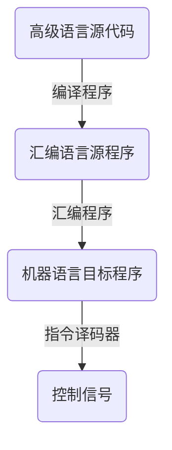
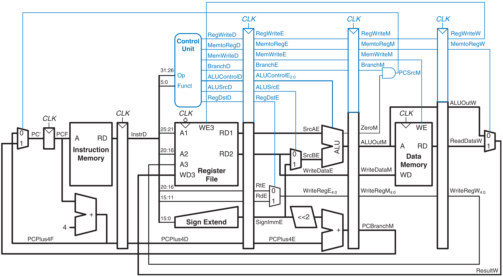
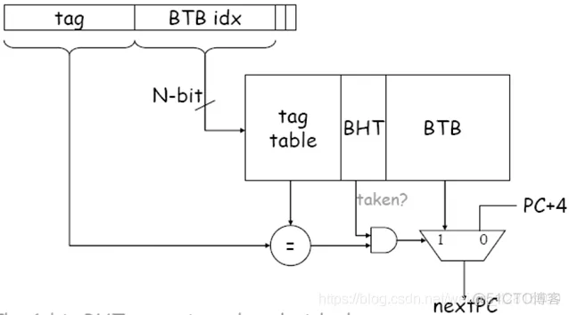

# 1 绪论
## 1.2 计算机系统的基本组成
冯诺依曼结构
	运算器：基本算术运算，逻辑运算，附加运算
	控制器：自动执行指令
	存储器：存放指令和数据（形式上没有区别）
	输入设备
	输出设备
- 核心思想：存储程序工作方式
## 1.3 计算机系统层次结构
ISA（指令集体系结构）处于软件和硬件的交界面
	定义了计算机可以执行的所有指令的集合
	是对硬件的抽象
	所有软件功能都建立在 ISA 之上
## 1.4 程序开发与执行过程

## 1.5 计算机系统性能评价
- (CPU)时钟周期：CPU 主脉冲信号的宽度（用于同步）
- (CPU)时钟频率：时钟周期的倒数
- CPI：执行指令所需时钟周期数
- 程序所含时钟周期数 = 程序所含指令条数 \* CPI = $\sum^{n}_{i=1}CPI_i \times C_i$（n 种不同类型的指令）
- 程序的综合 CPI = $\sum^{n}_{i=1}(CPI_i \times F_i)$ = 程序所含时钟周期数 / 程序所含指令条数
- CPU 执行时间 = 程序所含时钟周期数 / 时钟频率 = 程序所含时钟周期数 \* 时钟周期 = CPI \* 程序总指令条数 \* 时钟周期
两台计算机性能之比=CPU 执行时间之比的倒数
时钟周期、指令条数、CPI 相互制约
## 习题
1. 程序 P 在 M1 上运行需要 10 秒，M1 的时钟频率为 2GHz，M2 与 M1 有相同的 ISA，程序 P 在 M2 上的时钟周期数是在 M1 上的 1.5 倍，则 M2 的时钟频率至少要多少才能使程序 P 在 M2 上的运行时间缩短为 6 秒
> [!hint]-
> P 在 M1 上的时钟周期数 = $10s*2GHz=20G$
> 
> P 在 M2 上的时钟周期数 = $20G*1.5=30G$
> 
> M2 的时钟频率 = $30G \div 6s = 5Ghz$

2. M 的指令集包含 A、B、C 三类指令，其 CPI 分别为 1，2，4。程序 P 在 M 上被编译成两个不同的目标代码序列 P1、P2，分别含 A、B、C 指令条数 8、2、2；2、5、3，请问哪个代码序列指令条数少？哪个执行速度快？它们的 CPI 分别是多少？
>[!hint]- 
> P1 指令条数 = 8 + 2 + 2 = 12
> 
> P2 指令条数 = 2 + 5 + 3 = 10
> 
> P2 指令条数少
> 
> P1 时钟周期数：$8*1+2*2+2*4=20$
> 
> P2 时钟周期数：$2*1+5*2+3*4=24$
> 
> 因为两个序列在同一台机器上运行，所以 CPU 时钟周期一样，P1 时钟周期数少，用时短，执行速度快
> 
> P1 的 CPI = $20 / 12 = 1.67$
> 
> P2 的 CPI = $24 / 10 = 2.4$

3. （2012-912）执行相同程序，以下四个处理器所需要的时间最短的是（）
A：处理器 1 频率为 3 GHz，CPI=1.5
B：处理器 2 频率为 2.5 GHz，CPI=1
C：处理器 3 频率为 4 GHz，CPI=2.2
D：处理器 4 频率为 2.8 GHz，CPI=1.1
> [!hint]-
> D
> 
> 每条指令执行时间 = CPI/CPU频率
> 
> A：0.5
> 
> B：0.4
> 
> C：0.55
> 
> D：0.39...

4. （2018-912）提高 CPU 主频可以加快程序执行速度，CPU 的主频越高，指令执行的越快（）
>[!hint]-
>错误
>
> 三个因素相互制约，提高主频可能导致其他两个因素下降

5. 冯诺依曼体系计算机把程序当数据保存在内存中 (√)
# 2 数据的机器级表示
## 2.1 数制和编码
- 整数十进制转 R 进制：除到 0，逆向输出余数
- 小数十进制转 R 进制：乘到没有小数（可能小数部分总不为 0），正序输出整数部分
  $0.63*2=1 + 0.26$ -> 1
  $0.26*2 = 0.52$ -> 0
  $0.52 * 2 = 1 + 0.04$ -> 1
  $0.04 * 2 = 0.08$ -> 0
  $0.63 = 0.1010...B$
- 整数+小数分别转化再组合
定点数的编码：
正数的三码都一样
- 原码：0 的表示不唯一
	  加、减运算方式不唯一
	  需额外对符号位处理，不利于硬件设计
	  特别当 a\<b 时，实现 a-b 困难
- 反码：负数反码->符号位不变，数值位取反
	  0 的表示不唯一
	  运算时必须考虑循环进位
- 补码：负数补码->负数的反码+1
	 0 的表示唯一
	 可用加法实现减法运算
	 多表示一个最小负数
	 不需要循环进位调整结果
	 加法运算：符号位和数值位同样计算 $[x+y]_{\text{补}}=[x]_{\text{补}}+[y]_{\text{补}}$
例 $35+(-18)=0010\ 0011+1110 \ 1110 = 1(最高位舍弃)\ 0001 \ 0001 = 0001 \ 0001 = 17$
- 已知补码，求相反数的补码->连同符号位，各位取反，末位加一
例：求 $x_补=1000 \ 0000$ 相反数的补码 
$-x_补 = 0111\ 1111 + 0000\ 0001 = 1\ 0000\ 0000(结果溢出)$，这是由于 +128 无法用补码表示

| 十进制 | 原码                               | 反码                               | 补码                               |
| --- | -------------------------------- | -------------------------------- | -------------------------------- |
| 0   | <font color="#d83931">0</font>00 | <font color="#d83931">0</font>00 | <font color="#d83931">0</font>00 |
| 1   | <font color="#d83931">0</font>01 | <font color="#d83931">0</font>01 | <font color="#d83931">0</font>01 |
| 2   | <font color="#d83931">0</font>10 | <font color="#d83931">0</font>10 | <font color="#d83931">0</font>10 |
| 3   | <font color="#d83931">0</font>11 | <font color="#d83931">0</font>11 | <font color="#d83931">0</font>11 |
| -0  | <font color="#f79646">1</font>00 | <font color="#f79646">1</font>11 | <font color="#d83931">0</font>00 |
| -1  | <font color="#f79646">1</font>01 | <font color="#f79646">1</font>10 | <font color="#f79646">1</font>11 |
| -2  | <font color="#f79646">1</font>10 | <font color="#f79646">1</font>01 | <font color="#f79646">1</font>10 |
| -3  | <font color="#f79646">1</font>11 | <font color="#f79646">1</font>00 | <font color="#f79646">1</font>01 |
| -4  |                                  |                                  | <font color="#f79646">1</font>00 |

-4 的相反数：对 100 全部取反加 1-> 011+1->100，即-4 的相反数还是-4
-4 的原码：对 100 求补码->111+1->000（+0）
-4 的反码：对原码 000 求反码仍然是 000（+0）
-4 的补码：对原码 000 求补码仍然是 000（+0）
## 2.2 整数的表示
- 无符号整数：默认数的符号为正，所以无符号整数就是非负整数
  表示范围：$0\sim(2^n-1)$
- 有符号整数：用补码表示，表示范围：$-2^{n-1}\sim(2^{n-1}-1)$
## 2.3 实数的表示
浮点数通常表示为：
$N = (-1) ^S \times M \times r^E$
- S：符号位，一般 0 表示正，1 表示负
- r：**基**，可以约定为 2、4、16...
- E：**阶码**，反映浮点数的表示范围和小数点的实际位置
- M：**尾数**，其位数决定了浮点数的有效位数
规格化：使尾数的最高位非 0
	- 左规：$\pm0.001bb\times2^E\to\pm0.1bb\times2^{E-2}$
	- 右规：$\pm 1b.b\times2^E\to\pm0.1bb\times2^{E+2}$
IEEE 754：


| 类型   | 数阶  | 阶码  | 尾数数值 | 总位数 | 偏置值  |
| ---- | --- | --- | ---- | --- | ---- |
| 短浮点数 | 1   | 8   | 23   | 32  | 127  |
| 长浮点数 | 1   | 11  | 52   | 64  | 1023 |
隐藏位技术：非 0 值 尾数 规格化后数值的最高位必定为 1(0.1xxx)，通过尾数左移(1.xxx)，强制将该位去掉
- 移码：整数原码+偏移值
例：将十进制-0.75 转为 IEEE754 单精度浮点数
> [!important] 
> $(-0.75)_{10}=(-0.11)_2=-(1.1)_2\times2^{-1}=(-1)^S\times1.f\times2^{e-127}$
>
> S = 1
>
> f = 0.100...0
> 
> e = - 1 + 127 = 126 = 0111 1110
> 
> 对应的浮点数为：<font color="#fac08f">1</font><font color="#00b0f0">011 1111 0</font><font color="#ffff00">100 0000 0000 0000 0000 0000</font>
> 
> 对应的十六进制为：BF40 0000H

例：IEEE754 单精度浮点数 C0A0 0000H 的值是多少
>[!important] 
> C0A0 0000H -> <font color="#fac08f">1</font><font color="#00b0f0">100 0000 1</font><font color="#ffff00">010 0000 0000 0000 0000 0000</font>
> 
> S = 1
> 
> $f = (0.01)_2 = (0.25)_{10}$
> 
> $e = (10000001)_2 = (129)_{10}$
> 
> 所以其值为 $(-1)^1\times\textcolor{red}{1}.25\times2^{129-127}=-5.0$

- 全 0 阶码
	- 全 0 尾数：$\pm0$
		  0 的符号取决于数符 s
	- 非 0 尾数：非规格化数
		  当某个数**非常**接近零时才会使用，始终小于规格化数
		  非规格化数的隐藏位为 0，并且单精度和双精度浮点数的指数分别为-126 或-1022
		  数值分别为 $(-1)^s \times 0.f \times 2^{-126}$ 和 $(-1)^s \times 0.f \times 2^{-1022}$
		  非规格化数可用于处理阶码下溢，使得出现比最小规格化数还小的数时程序还能继续进行下去
- 全 1 阶码
	- 全 0 尾数：$\pm\infty$
	- 非 0 尾数：NaN（出现 $\frac{0}{0},(+\infty)-(+\infty)...$）
- 非全 0 非全 1 阶码：正常的规格化非 0 数
	  指数范围：$-126\sim+127$ 和 $-1022\sim+1023$
	  值的个数：$254(阶码个数)\times2^{23}(尾数个数)=1.98\times2^{31}$ 和 $1.99\times2^{63}$

阶码范围：8 位原码的范围是 $[-127,-0]\cup[+0,+127]$，全 0 阶码实际是+0，被占用，全 1 阶码实际是-127，被占用，原码剩下(对应真实指数) $[-126,-0]\cup[+1,+127]$，移码表示后就是 $[+1,+254]$

浮点数表示范围：

- 非规格化数隐藏位是 0，最小时尾数不能全取 0，对应 $(0.000\ 0000\ 0000\ 0000\ 0000\ 0001)_2 = 2^{-23}$，指数只能取 $0-126(偏置)=-126$
- 规格化数隐藏位是 1，最小时尾数取全 0，对应 $(1.000\ 0000\ 0000\ 0000\ 0000\ 0000)_2 = 1$，指数取值范围是 $-126\sim 127$
int --> float：可能损失精度（有效数字比float多）
	int型的有效位数是31，而float型小数域的有效位只有23位，也就是说如果 int 型二进制的有效位超过了24位，那么float型的小数域的精度就不够了
float --> int：可能溢出（超出int表示范围）及损失精度（小数部分）
浮点数运算
1. 对阶
2. 尾数运算
3. 规格化
4. 舍入处理
5. 溢出判断
## 2.4 非数值数据的编码表示
- Unicode 编码
	 使用 16 位表示一个字符
	 保留 6400 个码点供本地化使用
- UTF-8 编码（是 Unicode 的实现方式之一）

| 字符位数     | 字节 1       | 字节 2       | 字节 3       | 字节 4       | 字节 5       | 字节 6       |
| -------- | ---------- | ---------- | ---------- | ---------- | ---------- | ---------- |
| 7(ASCII) | `0xxxxxxx` |            |            |            |            |            |
| 11       | `110xxxxx` | `10xxxxxx` |            |            |            |            |
| 16       | `1110xxxx` | `10xxxxxx` | `10xxxxxx` |            |            |            |
| 21       | `11110xxx` | `10xxxxxx` | `10xxxxxx` | `10xxxxxx` |            |            |
| 26       | `111110xx` | `10xxxxxx` | `10xxxxxx` | `10xxxxxx` | `10xxxxxx` |            |
| 31       | `1111110x` | `10xxxxxx` | `10xxxxxx` | `10xxxxxx` | `10xxxxxx` | `10xxxxxx` |
## 2.5 数据的宽度和存储
(机器)字长：计算机能直接处理的二进制数据的位数
存储单元：CPU 访问存储器的<font color="#c0504d">最小单元</font>，每个存储单元都有一个地址
按字节编址：如下图，一个存储单元大小为 1B，对应一个地址

按字编址：假设字长 16 bit=2B，一个存储单元 2B

**存储字长**：存储单元所存储的二进制的位数
**数据线**：数据线确定存储字长，数据线的条数=存储字长的位数(8 条数据线就是一个字节)
**地址线**：存储单元的个数 = 2^地址线的条数(两条线可以寻 00，01，10，11 四个地址)
**存储容量**：主存中能存放二进制的总位数，**存储容量 = 存储单元个数 \* 存储字长**
LSB：最低有效字节(数字的最低位)
MSB：最高有效字节(数字的最高位)
大端模式（便于人类阅读）：最高有效字节放在低地址
	例：01234567H 保存在地址 0800H 的位置
	0800H         0801H    0802H    0803H
	01H(MSB)    23H        45H        67H(LSB)        
小端模式（便于机器处理）：最低有效字节放在低地址
	0800H         0801H    0802H    0803H
	67H(LSB)    45H        23H         01H(MSB)
# 3 运算方法和运算部件
运算器(由 ALU+寄存器组等构成)的基本功能：
1. 完成运算并给出运算结果的状态信息
2. 暂存运算所用操作数
3. 暂存运算的中间结果
4. 输出运算结果
- 逻辑移位(无符号数)：不用考虑符号位
	左移：高位移出，低位补 0，若最高位移出的是 1，发生溢出
	右移：低位移出，高位补 0
- 算术移位(有符号数)：
	左移：高位移出，低位补 0，若移动前后符号位不同，发生溢出
	右移：低位移出，高位补符号
对于左移，逻辑移位和算术移位结果相同
- 位扩展
	无符号数扩展（0 扩展）：在无符号数前添 0
	有符号数扩展（符号扩展）：在补码前补符号位
- 位截断
	无论是无符号数还是有符号数补码，都是丢弃高位。把截断后的低 k 位结果分别解释成无符号数和有符号数。
## 3.2 基本运算部件
全加器：实现两个本位数加上<font color="#ff0000">低位进位</font>生成一位本位和一位向高位的进位
输入 $X_i$，$Y_i$，进位 $C_{i−1}$，输出当前结果 $F_i$ 和进位 $C_i$
$F_i = X_i \oplus Y_i \oplus C_{i-1}$
$C_i = X_iC_{i-1} + Y_iC_{i-1}+X_iY_i$
串行进位加法器速度慢主要因为进位按串行方式传递，高位进位依赖低位进位
定义：$P_i = X_i+Y_i$，$G_i = X_i Y_i$，可得 $C_i$ 之间的进位没有依赖关系

溢出标志 $OF = C_n\oplus C_{n-1}$
符号标示(即两数和是+/-) $SF=F_{n-1}$
零标志 $ZF=1$，当且仅当两数和 $F=0$
进位/借位标志 $CF = C_{out}\oplus C_{in}$，当 $C_{in}=0$ 时，CF 为进位 $C_{out}$，当 $C_{in}=1$，CF 为进位 $C_{out}$ 取反
## 3.3 定点数运算
补码加减运算

通过标志信息来区分带符号和无符号

|     | ZF  | SF  | CF  | OF  |
| --- | --- | --- | --- | --- |
| 无符号 | 有   | 无   | 有   | 无   |
| 带符号 | 有   | 有   | 无   | 有   |

ZF = 1 表示结果为 0，带符号和无符号都有意义
SF 表示结果的符号，对于无符号运算，SF 无意义
加法时，若 CF=1，则表示无符号数溢出；减法时，若 CF=1，则表示有借位；<font color="#ff0000">对于带符号数，CF 没有意义</font>
OF=1 表示带符号数溢出，对于无符号数无意义

例：用 4 位补码计算-7-6
>[!important] 
> $[-7]_{原} = 1111$，$[-6]_{原} = 1110$
> 
> $[-7]_{补} = 1001$，$[-6]_{补} = 1010$
> 
> $[-7-6]_{补} = [-7]_{补}+[-6]_{补} = 1001+1010=0011(+3)$
> 
> 因为 4 位补码可表示范围是 $-8\sim +7$，所以结果发生了溢出

可以用两种方法判断：
1. 最高位和次高位的进位不同

判断方法：$OF = C_{n-1}\oplus C_{n}$
2. 和的符号位和加数的符号位不同
## 3.5 浮点数运算
浮点数加减运算
1. 对阶
   - 使两个操作数的小数点位置对齐，阶码相同
   - 先求阶差，<font color="#ff0000">小阶向大阶</font>对齐，小阶尾数每右移一位，阶码+1
   - 尾数右移时，<font color="#ff0000">舍弃掉有效位</font>会产生误差，影响精度
2. 尾数加减
   - 对阶后的尾数按定点数加/减运算规则运算
   - 运算后的尾数不一定是规格化，需要重新规格化处理
3. 尾数规格化
   - 右规：可能会有舍入情况
   - 左规
4. 尾数的舍入处理
   - 为保证运算精度，一般将低位<font color="#ff0000">移出的两位</font>保留下来，参与中间过程的运算，最后将运算结果进行舍入(1000.0011->1.00000<font color="#ff0000">11</font>)
   - 粘位、就近舍入、朝 $+/-\infty$ 舍入、朝 0 舍入
5. 溢出判断
   - 右规和尾数舍入
	- 数值很大的尾数舍入时，可能因为末位加 1 而发生尾数溢出，此时需要通过右规来调整尾数和阶。右规时阶加 1，导致阶增大，此时需判断是否发生了指数上溢
	- 例如：当调整前的阶码为 11111110 时，加一后，会变成 11111111 发生指数上溢
   - 左规
	- 左规时阶减一，导致阶减小，此时需判断是否发生了指数下溢
	- 左规一次阶码减一，判断阶码是否全为 0 来确定是否发生了指数下溢
   - 说明 
	 - 浮点数的溢出并非以尾数溢出来判断的，尾数溢出可以通过右规操作得到纠正
	 - 运算结果是否溢出主要看<font color="#ff0000">结果的指数是否发生了上溢</font>，因此是由指数上溢来判断的
浮点运算不满足加法结合律
例：若 x 和 y 是 float 变量，x=10.5，y=-120.625 计算 x+y
>[!important] 
>
## 习题
1. C 语言中，int x,y 若 x>y，则一定有-x< y（×）
   因为补码多了一个负数，若 x = -2147483647，y = -2147483648
   -x = 2147483647 -y = -2147483648(y 取相反数还是 y)
2. -2017 的 32 位补码表示？
   
3. x 是 C 语言中的 int 型，如果 x>0，则 x⋅x>0（×）
   可能发生溢出，例如 int x = 47000，x⋅x = -2085967296
4. d 是 double 型，则 d⋅d>0（√）
   浮点数溢出仍然正确
5. +1234 的 32 位补码为？(用 16 进制，小端表示)
   正数的补码和原码相同，1234 的二进制表示为 100,1101,0010
   变成 32 位：0000,0000,0000,0000,0000,0100,1101,0010
   变成 16 进制：0x000004D2，变成小端存储 0xD2 04 00 00
6. 浮点数 float y，若 y>0，且 y⋅y 仍在浮点数表示范围内，则 y⋅y>0
   × 考虑下溢情况，例如取 y=0.00000000000000000000000001
   y > 0，但 y⋅y 下溢舍弃最低位，y⋅y=0
7. 采用补码表示的 short 类型数据，存放在内存中的连续 2 个字节单元，其值分别为 0xFF(低字节)和 0x01(高字节)，如果是小端机，则其十进制值为？如果是大端机,则其十进制值为？
   如果是小端机，数据为 0x01FF，对应的二进制是正数，原码和补码相同，十进制是 511
   如果是大端机，数据为 0xFF01，对应的二进制是负数，原码等于补码数值位取反加 1，十进制是-255
8. 补码表示的一个 4 字节的有符号整数的最大值是？
   符号位为 0，数值位全 1，对应 0x7F FF FF FF
9. 用补码表示的 32 位正数加法满足交换律（√）
   如果溢出，也同样满足，因为溢出的值也相同
10. 负数的原码、补码、反码都不同（×）
    以 4 比特位为例，-4 的原码是 1100，补码是 1011+1=1100
11. 若 x 和 y 是补码，则
    (A)若-x < 0 则x > 0
    (B)若-x > 0 则x < 0
    (C)若-x < -y 则x > y
    (D)若-x > -y 则 x < y
    (A)(B)取 x = -2147483648，则-x = x < 0，这是由于补码会多表示一个相反数是自己的负数，而若-x > 0，则 x = -(-x)必定为负，(C)、(D)等价，同题 1 取 x，y 即可，选(B)
12. IEEE754 规格化单精度浮点数能表示的最小正数是 $2^{-126}$
13. -2017 的 IEEE 单精度浮点表示？
> [!note]-
> 

14. 单精度浮点数-27.625 在 IEEE754 下表示为？
>[!note]-
>

15. 关于 IEEE754 单精度浮点数正数和负数个数之间的关系是？
    正数的个数和负数的个数一样多
16. IEEE754 标准中的单精度浮点数的最大规约数在内存中表示为？
    符号位为 0，阶码最大 254，尾数全 1，0x7F7F FFFF
17. IEEE754 双精度浮点数加法满足结合率 (×)
    运算过程中可能有舍入情况，例如
    9.12 + 10000000000000.0 - 10000000000000.0 = 9.11914
    9.12 + (10000000000000.0 - 10000000000000.0) = 9.12
18. 在字符的编码中包含了字符如何显示的信息 (×)
    字符编码主要定义了字符与数字之间的映射关系，并不包括字符的显示样式（如字体、大小、颜色等）这些显示属性通常由其他规范或文件格式来定义
19. 以下关于字符描述的说法中错误的是
    A. ASCII码使用一个字节进行编码 
    B. UTF-8 码使用两个字节进行编码
	C. 字符编码不包括字符如何显示的信息
	D. 使用矢量字体的字符放大后不会失真
	选B，UTF-8 是变长编码
20. utf-8 中任意读取一个字节，一定能判断它是否 ASCII（√）
    取任一一个字节，看最高位是不是 0 
21. 处理机（组合）逻辑电路进行算术运算，（时序）逻辑电路用于数据暂存，（组合）逻辑电路用于分支选择

- 组合逻辑输出仅仅取决于当前的输入信号状态
  包括逻辑门（AND、OR、NOT等）、编码器、译码器、加法器、数据选择器、数值译码器等其他不带存储元件的电路
- 时序逻辑输出不仅取决于当前的输入信号状态，还受到时钟信号和过去的输入信号状态的影响
  包括锁存器、触发器、寄存器、移位寄存器、存储器等

# 4 指令系统
指令包含操作码字段和地址码字段(可能没有，零地址指令)
指令是计算机运行的最小功能单元
指令系统：一台计算机提供的全部指令构成该计算机的指令系统
指令字：完整的一条指令的二进制表示
指令字长：组成一条指令的二进制数的位数
指令字长（字节倍数）= 0.5、1、2...个机器字长
## 4.1 指令格式设计
冯诺依曼计算机采用“存储程序”工作方式。程序启动允许必须能<font color="#ff0000">自动地</font>逐条从内存取出指令执行，一条指令中必须显示或者隐式的包含：
- 操作码
- 源操作数或其地址
- 结果的地址
- 下条指令地址
注意指令长度应该是<font color="#ff0000">字节的整数倍</font>
指令系统设计要求：
- 完备性
- 规整性
- 高效性
- 兼容性
计算机硬件系统中的部件：
1. 运算器部件
2. 控制器部件
3. 存储器部件
4. 输入设备
5. 输出设备
指令系统设计风格
- 按操作数位置指定风格来分
	- 累加器型：总把其中一个操作数隐含在累加器中，结果也在累加器中（现在不采用）
	- 栈型：Java 虚拟机采用，规定指令的操作数总来自栈顶
	- 通用寄存器型：使用通用寄存器来存放临时数据
	- Load/Store 型：只有 load/store 指令可以访存
- 按指令格式的复杂度来分
	- CISC
	- RISC
## 4.2 寻址方式
形式地址：在指令中给出的操作数（或指令）地址
实际地址：根据形式地址计算得到或读操作得到
- 立即数寻址：所需操作数在指令地址字段直接给出
	1. 取指时同时取得操作数而不必到存储器中取
	2. 立即数较大时需要用指令的第二个字
- 直接寻址：地址码字段直接给出所需地址
	$[addr]$：从 addr 内存地址中读出的操作数
- 间接寻址：地址码字段给出地址的地址
	多一次读内存储器的操作
	共需要**三次访存**：取指令，指向主存单元→访问主存单元，得到真实地址→访问真实地址，得到操作数
- 寄存器寻址：地址码部分给出**寄存器编号**，相应的寄存器中存放着真实地址
- 寄存器间接寻址：地址码部分给出寄存器编号，寄存器中存放着主存单元地址，该主存单元中存放着真实地址
- 变址寻址：操作数的地址由指定的变址寄存器的内容和指令中的变址偏移量(Disp)相加得到
	袁书：指令地址码字段给出形式地址作为基准地址，变址寄存器中存放偏移量
	PPT：指令中给出变址偏移量作为基准地址
	- 便于读写数组中的元素
- 相对寻址：将PC中存放的值（下一条指令地址）和相对寻址偏移量相加得到
	偏移量可正可负，通常用补码表示
	- 主要用于转移指令，对浮动程序很有用
	- 转移目标地址的寻址
- 基址寻址：将基址寄存器(BR)的值加上形式地址所表示的偏移量
	用户无法修改 BR 中的内容
	- 主要用于为程序或数据分配存储区，对多道程序或浮动程序很有用
- 堆栈寻址：堆栈指针(SP)始终指向堆栈的栈顶地址，当执行出入栈操作时，SP会自动 $\pm1$ 指向新的栈顶元素
指令操作码扩展技术
例如在 16 位字长的指令中同时支持三地址 14 条，二地址 30 条，一地址 31 条，零地址 16 条

|     | 操作码                                                                 | 地址码 1                                                               | 地址码 2                                                               | 地址码 3     |
| --- | ------------------------------------------------------------------- | ------------------------------------------------------------------- | ------------------------------------------------------------------- | --------- |
| 三地址 | 0000~1101                                                           | 任意                                                                  | 任意                                                                  | 任意        |
| 二地址 | <font color="#ffc000">1110</font>~<font color="#00b0f0">1111</font> | <font color="#ffc000">0000</font>~<font color="#00b0f0">1101</font> | 任意                                                                  | 任意        |
| 一地址 | <font color="#ffc000">1111</font>                                   | <font color="#ffc000">1110</font>~<font color="#00b0f0">1111</font> | <font color="#ffc000">0000</font>~<font color="#00b0f0">1110</font> | 任意        |
| 零地址 | 1111                                                                | 1111                                                                | 1111                                                                | 0000~1111 |
  
|          | CISC(X86)          | RISC（MIPS，DLX）     |
| -------- | ------------------ | ------------------ |
| 指令系统     | 复杂、庞大              | 简单                 |
| 指令数目     | >200               | <100               |
| 指令字长     | 不固定                | 定长                 |
| 可访存指令    | 不加限制               | 只有Load/Store指令     |
| 各种指令执行时间 | 相差较大               | 绝大多数在一个周期内完成       |
| 各种指令使用频度 | 相差很大               | 都比较常用              |
| 通用寄存器数量  | 较少                 | 多                  |
| 目标代码     | 难以用优化编译生成高效的目标代码程序 | 采用优化的编译程序，生成代码较为高效 |
| 控制方式     | 绝大多数为微程序控制         | 绝大多数为组合逻辑控制        |
| 指令流水线    | 可以通过一定方式实现         | 必须实现               |
## 4.3 程序的机器级表示
MIPS 指令格式：所有指令都是 32 位宽度，指令格式共 3 种，即立即数型、转移型和寄存器型。

MIPS 中移位指令多用桶形移位器实现来提高速度
R-型指令寻址方式(1 种)：寄存器寻址
I-型指令寻址方式(4 种)：寄存器寻址、立即数寻址、相对寻址、基址寻址或变址寻址
J-型指令寻址方式(1 种)：(变通的)直接寻址(当前 PC 高 4 位拼上 26 位直接地址，最后添两个“0”)

| 指令举例              | 操作                                  | 说明        |
| ----------------- | ----------------------------------- | --------- |
| subu $1, $2, $3   | $1 = $2 - $3                        | 无符号数减法    |
| addiu $1, $2, 100 | $1 = $2 + 100                       | 无符号立即数加法  |
| mfco $1, $epc     | $1 = $epc                           | 读取异常 PC   |
| multu $2, $3      | Hi, Lo = $2 \* $3                   | 无符号数乘法    |
| divu $2, $3       | Lo = $2 / $3<br>Hi = $2 mod $3      | 无符号数除法    |
| mfhi $1           | $1 = Hi                             | 从 Hi 中取数据 |
| sll $1, $2, 10    | $1 = $2 << 10                       | 逻辑左移      |
| lw $1, 100($2)    | $1 = M\[$2+100 \]                   | 装入字       |
| sw $1, 100($2)    | M\[$2+100\] = $1                    | 存储字       |
| lui $1, 100       | $1 = 100 \* 2^16                    | 装入立即数到高位  |
| beq $1, $2, 100   | if($1\=\=$2) go to <br>PC +4 + 100  | 相等时转移     |
| slt $1, $2, $3    | if($2<$3)<br>$1 = 1; else<br>$1 = 0 | 小于时置位     |
| jal 10000         | $31 = PC +4;<br>go to 10000         | 转移并链接     |
## 习题
1. 指令由（操作码）和（操作数地址）组成
2. 下列表述中正确的是
   (A)指令必须给出指令操作码
   (B)指令必须给出指令操作数
   (C)指令的长度必须一样长
   (D)指令的操作数的个数都一样多
   A 正确，B->零地址指令没有操作数
3. MIPS 指令不支持间接寻址 (√)
4. 指令系统操作数地址长 6 位，有一地址 14 条，二地址 253 条，三地址 20 条，指令的长度至少为？
   三地址 20 条，至少要留 5 位，则 00000~10011 共 20 条
   操作码 <font color="#4bacc6">101</font>00,000000~<font color="#4bacc6">101</font>11,111100 共 253 条二地址指令
   操作码 <font color="#fac08f">10111,111101</font>,000000~<font color="#fac08f">10111,111101</font>,001101 共 14 条一地址指令，共 23 位；如果考虑指令长度是字节的整数倍，则应该是 24 位，记得写备注
# 5 中央处理器
## 5.1 单周期 CPU 设计
指令周期：一条指令的执行时间
CPU 周期：一个 CPU 时钟时间
CPI：执行每条指令<font color="#ff0000">平均</font>使用的 CPU 周期数
全部指令都选用<font color="#ff0000">一个</font> CPU 周期完成的系统被称为单周期 CPU
指令串行执行，每条指令<font color="#ff0000">都用 5 个步骤</font>的时间完成(lw 指令)，控制各部件运行的<font color="#ff0000">信号在整个指令周期不变化</font>

D 触发器：时钟上升沿写入数据并<font color="#ff0000">保持</font>到下一个上升沿
寄存器组：3 个地址端口(2 读 1 写)，每个时钟周期可以完成 3 次访问
寄存器组的读操作属于组合逻辑操作，无须时钟信号控制
取指后分析指令，并给出整个执行期间的<font color="#ff0000">全部</font>信号
<font color="#ff0000">不需要状态信息</font>，在时钟结束的边沿写入结果
- 单周期信号竞争问题：存储器被简化为理想情况，认为每次写操作都有时钟控制，且在每次时钟到来时，地址、数据和写使能信号都<font color="#ff0000">已稳定</font>一段时间。实际上写操作是<font color="#ff0000">组合逻辑</font>电路，当写使能信号有效且写入数据和地址已稳定，经过一个写操作时间后，数据被写入。但地址、数据和写使能之间存在竞争问题，所以<font color="#d83931">单周期存储器无法可靠工作</font>
- 多周期可以解决上述问题
设计需要总结：
- 全部控制信号(组合逻辑电路)
- 无需状态信号
- 控制信号生成
	- 输入：OP、FUNC 段
	- 输出：完成指令功能所需要的全部控制信号
性能计算：

问题：
1. 指令和数据都保存在同一个存储器中
2. 许多部件保持数据的时间过长，<font color="#ff0000">无法复用</font>
## 5.2 多周期 CPU
每个<font color="#ff0000">步骤</font>占用一个时钟周期
- 尽量平衡各步骤间的延迟
- 尽量限制每个步骤使用单一的主要部件
- 控制器仅需提供<font color="#ff0000">当前步骤</font>所需要的控制信号
前提
- 保存好下一步骤要用到的值：引入锁存器
- 转到下一步骤执行：引入状态标记当前步骤
控制器的组成：
1. PC
2. IR：存放指令内容：操作码和操作数地址
3. <font color="#ff0000">指令执行步骤标记线路</font>：指明每条指令执行步骤和相对次序关系
4. <font color="#ff0000">控制信号产生线路</font>：给出各功能部件协同运行所需要的控制信号

根据 3、4 不同的组成和不同的运行原理，分为两种类型的控制器：
1. 硬连线控制器(组合逻辑控制器)：
   采用组合逻辑线路，依据<font color="#ff0000">指令</font>及其<font color="#ff0000">执行步骤</font>(节拍发生器 Timer)直接产生控制信号
2. 微程序控制器：
   采用<font color="#ff0000">存储器电路</font>把控制信号存储起来，依据指令执行的步骤读出(微地址访问)要用到的信号组合
   根据指令操作码映射出该指令的首条微指令地址，每条微指令给出其下一步骤的微地址
J 型指令：2 步
I 型指令：3 步
R 型指令：4 步
LW 指令：5 步


多周期和单周期执行相同指令，多周期总时间不一定能更优
# 6 指令流水线
## 6.1 流水线概述
一条指令流水线被分为 k 段，每一段时间都为 $\Delta t$，连续输入 n 条指令，则处理完 n 个任务所需时间为：

吞吐率：单位时间执行指令的数量 $Tp = \frac{指令条数}{流水线执行时间}=\frac{n}{T_k}$
最大吞吐率：流水线在达到稳定状态后所得到的吞吐率
	$Tp_{max}=\lim_{n\to+\infty}T_p = \frac{1}{CPU时钟周期}$
加速比：与串行执行时速度提高的比率，极限趋于 k
效率：流水线中各功能段的利用率，也就是上图蓝色面积和虚线包围面积的比值，极限趋于 1
流水线特性：
- 流水线没有缩短单个任务的延迟，但提高了整个系统的吞吐率
- 多个任务<font color="#d83931">同时</font>运行，占用<font color="#d83931">不同</font>资源
- 流水线效率受限于<font color="#d83931">用时最长的阶段</font>
计算机各部件几乎都可以采用流水线技术
流水线时空图表示法：

流水线特点：
- 流水线每个功能段部件后都要有一个缓冲寄存器（锁存器）保存从一个流水段传送到下一个流水段的所有数据和<font color="#d83931">控制信息</font>，总是在下个时钟到来后的 Clock-to-Q 写入
- 装入时间：第一个任务进入流水线到输出流水线的时间
- 排空时间：最后一个任务进入流水线到输出流水线的时间
流水线分类：
- 部件功能级(运算操作)流水线（例如浮点加法器）
- 处理机级(指令)流水线
- 处理机间级(宏)流水线
## 6.2 流水线处理器的实现
流水线实现细节：
- PC 值多路选择器被放在 IF 段，保证对 PC 值的写操作只出现在第一个流水段中
- 流水线周期 = 流水段延迟 + 锁存器延迟
- 流水线延迟 = 流水线段数 \* 流水线周期
MIPS 各步骤占用的资源：
- IF：IM(指令存储器)、PC、总线
	 <font color="#d99694">锁存器 1</font>：PC+4、IR
	 <font color="#9bbb59">控制信号</font>：<font color="#d83931">不需要</font>（因为所有指令都一样）
- RF(取数)/ID：寄存器组(<font color="#ff0000">读</font>端口)、指令译码器、<font color="#00b0f0">控制信号生成部件</font>
	 <font color="#d99694">锁存器 2</font>：A、B、imm、PC+4、func、rt/rd
	 <font color="#9bbb59">控制信号</font>：<font color="#d83931">不需要</font>（因为所有指令都一样），但会<font color="#00b0f0">产生</font>本指令的<font color="#00b0f0">所有</font>控制信号，包括 1 个时钟周期后 EXE 信号，2 个时钟周期后的 MEM 信号，3 个 时钟周期后的 WB 信号
- EXE：ALU、扩展器
	 <font color="#d99694">锁存器 3</font>：运算结果：PC+4 的值、ALU 结果、结果状态
			 中间结果：B、目的寄存器
	 <font color="#9bbb59">控制信号</font>：
		 1. ExtOp (扩展器操作)：1-符号扩展；0-零扩展
		 2. ALUSrc (ALU 的 B 口来源)：1- 来源于扩展器；0-来源于 BusB
		 3. ALUOp (主控制器输出，用于辅助局部 ALU 控制逻辑来决定 ALUCtrl) 
		 4. RegDst (指定目的寄存器)：1-Rd；0-Rt
- MEM：DM、总线
	 <font color="#d99694">锁存器 4</font>：目的寄存器、ALU 结果、存储器读出的结果
	 <font color="#9bbb59">控制信号</font>：
		 1. MemWr(DM 的写信号)：Store 指令时 1，其他指令 0
		 2. Branch (是否为分支指令)：分支指令时 1，其他指令 0
- WB：寄存器组(<font color="#ff0000">写</font>端口)
	 <font color="#9bbb59">控制信号</font>：
		 1. MemtoReg (寄存器的写入源)：1-DM 输出；0-ALU 输出 
		 2. RegWr (寄存器堆写信号)：结果写寄存器的指令都为 1，其他指令为其他指令为 0
指令功能段划分：
- R/I-型：$IF-ID-EXE-[空段]-WB$
- lw：$IF-ID-EXE-MEM(从存储器中读)-WB$
- sw：$IF-ID-EXE-MEM(写入存储器中)-[空段]$
- beq：$IF-ID-EXE-MEM(完成的是PC写入操作)-[空段]$
- J：$IF-ID-EXE(完成的是 PC 写入操作)-[空段]-[空段]$
对 J 型指令，看情况是 EXE 结束还是 ID 结束

（判断）流水线控制器中控制信号和单周期控制器类似，流水线控制器的设计可以完全按照单周期控制器设计的思路进行而不是按照多周期控制器的设计思路进行(√) 书上原话，流水线控制器中控制信号在 ID 段生成后不发生变化，和数据同步传递给后面的流水段
## 6.3 流水线冒险及其处理
### 6.3.1 结构冲突
结构冲突：多条指令在同一时刻争用同一硬件资源

解决方案：
1. 暂停流水线执行，插入等待周期
2. 增加资源，解决资源冲突

### 6.3.2 数据冲突
数据冲突：一条指令依赖于前面指令执行结果数据但又无法得到

三类数据冒险现象：

- RAW:  写后读（经常发生）还没写就先读了
- WAW：写后写（<font color="#ff0000">MIPS不会发生</font>）本该后写的先写入了
- WAR：读后写（<font color="#ff0000">MIPS不会发生</font>）还没读就先写了，如上图，只有前面指令的 ID 段长到覆盖后面的指令的 WB 段才会发生，而 MIPS 中各流水段长度相等
解决方案：
1. 在编译时预先插入空操作指令 nop

硬件控制简单但浪费了三条指令的空间和时间
2. 在<font color="#ff0000">硬件</font>上通过阻塞(stall)方式阻止后续指令执行
   流水线停顿也称为气泡

需要修改数据通路，不增加指令条数但有额外时间开销
阻塞时：
	可将控制信号清零阻止写入锁存器
	可将指令清零使后续指令执行空操作
	让 IF/ID 段寄存器保持不变，sub 指令<font color="#4bacc6">继续</font>执行
	可将 PC 写使能信号清零使 PC 值不变，and 指令<font color="#4bacc6">重新</font>执行
3. 数据旁路技术 & <font color="#548dd4">4. </font>寄存器堆合理实现

在 EXE 段结束后就已经得到了需要的 r1
- 对于 sub 和 and 指令：将数据<font color="#ff0000">从流水段寄存器中</font>直接取到 ALU 的输入端（数据旁路）
- 对于 or 指令：寄存器写/读口分别在前/后半周期，使写入被直接读出（寄存器堆合理实现）
<font color="#ff0000">（load-use）装入-使用数据冒险</font>（也属于 RAW）

虽然数据旁路技术可以解决大部分 RAW 数据冒险，但<font color="#ff0000">无法解决</font>上图 load 指令随后的第一条指令(sub)产生的数据冒险

解决方案：
1. 硬件阻止指令执行

用硬件阻塞一个周期，指令被重复执行一次
2. 软件上插入 NOP 指令

MIPS1 处理器不支持硬件阻塞处理，所以由编译器插入一条 NOP 指令
3. 编译器进行指令顺序调整

编译器优化后的代码可以避免 Load 阻塞

RAW 数据冒险的旁路转发条件：

- C1：`ori r3, r2, 100；sub r5, r3, r4`
 引入冒险检测单元 (Hazard Detection Unit, HDU)用于转发条件判断
 当 ori 指令执行完 EXE 段进入 MEM 段时，EXE/MEM 段 Rd 的值为 r3，ID/EXE 段 Rs 的值为 r3，HDU 发现条件 C1(a)满足，执行转发(如图绿色 C1 线)，并激活 MUX 对应的选择控制信号
- C2 同理，但是从 MEM/WB->ID/EXE
  注意，不能跨两段前传
  
  这样等价于

但上述条件存在不足，以下两种情况会发生错误：
a. 指令的结果不写入目的寄存器 Rd 时
	正如 beq 指令不写回结果到目的寄存器，此时 EXE/MEM 或 MEM/WB 流水段寄存器的 RegWrite 信号为 0
b. Rd 等于$0 时
	$0 是特殊的寄存器，其值始终为 0，当执行指令 `sll $0,$1,$2`，如果转发 EXE 段的计算结果 `R[$2]<<2`，就会产生错误（当 WB 段写回$0 时，计算结果会变成 0）
C1、C2添加判断：`EX/MEM.RegWrite and EX/MEM.RegisterRd≠0`
另外 C(a)和 C(b) 转发线可以合并，只需要一个二路选择器(控制端为 MemtoReg 判断是将 Rd 发给 Rs 还是 Rt )即可，C3 情况同 C2

最后一点不足，如果出现 C1、C2 同时发生：
1) add $1, $1, $2
2) add $1, $1, $3
3) add $1, $1, $4
指令 3) 执行完 ID 发现同时满足 C1、C2 条件，此时应该让 2) 的 EXE 结果前传，因为 2）计算的是最新结果


load-use 数据冲突硬件阻塞
阻塞条件：


此时 and 指令还没写入IF/ID 寄存器中，所以 IF/ID 寄存器中仍然保持着 sub 指令的信息，HDU 让“写使能”信号为 0，使 PC 不变指向 and 指令

数据冲突的检测：
- 所有的数据冲突均可以在<font color="#ff0000">ID段</font>检测到
    - 如果存在数据冲突，就在相应的指令流出 ID 段之前将之暂停
    - 完成该工作的硬件称为<font color="#ff0000">流水线的互锁机制</font>
- 检测冲突是通过比较寄存器地址是否相等来实现的
### 6.3.3 控制冲突
控制冲突：分支指令或其他需要改写 PC 的指令造成冲突
- 数据冲突影响到的仅仅是本条指令附近少数几条指令，所以称为<font color="#ff0000">局部冲突</font>
- 控制冲突影响的范围要大得多，它会引起程序执行方向的改变，使流水线<font color="#ff0000">损失更多的性能</font>，所以称为<font color="#ff0000">全局冲突</font>

取得 Beq 指令待跳转的正确指令前，已经有三条指令被错误取出（注意：Beq 指令是在 MEM 段完成 PC 写入）
解决方案：
1. 暂停流水线，直到有了正确的转移地址
   - 可以硬件上阻塞分支指令
   - 也可以软件上插入空指令
暂停方法 1：

直接暂停<font color="#ff0000">三个周期</font>，等待 PC 写入完成后继续

| IF    | ID  | EX    | MEM   | WB    |       |
| ----- | --- | ----- | ----- | ----- | ----- |
| 第一个暂停 | IF  | Stall | Stall | Stall | Stall |
| 第二个暂停 |     | IF    | Stall | Stall | Stall |
| 第三个暂停 |     |       | IF    | Stall | Stall |
|       |     |       |       | IF    | ID    |
简化为：

| IF  | Stall | Stall | IF  | ID  |
| --- | ----- | ----- | --- | --- |

暂停方法 2：

其实在 EX 段 ALU 就计算出了要跳转的地址，所以可以使用旁路转发到 IF 段，这样只用暂停两个周期

暂停方法 3：

在 ID 段译码完成后，就得到了跳转所需要的所有数据，如果增加<font color="#ff0000">比较器</font>并调整<font color="#ff0000">加法器</font>到 ID 段，那么在 ID 段就能得到转移位置，这样只用暂停一个周期，但引入这些部件会导致 ID 段所需时间增加，可能使整个流水线时钟周期增加

2. 分支预测
- 静态预测：
	2.1.1 总是预测分支转移失败：即继续执行分支指令的后续指令，发现预测错误后，要清除已执行指令的影响
	2.1.2 总是预测分支转移成功：一旦完成分支指令的译码且计算出了分支的目标地址，就假设分支转移成功，并且开始在分支目标地址处取指令执行（Idle 表示无有效数据，同上述暂停方法 3，认为在 ID 段后就可以得到转移地址）

- 动态预测：
基本思想：利用最近转移发生的情况来预测下一次可能发生的转移，预测后，在实际发生时验证并调整预测，转移发生的历史情况记录在 BHT 中
<font color="#ff0000">B</font>ranch<font color="#ff0000">H</font>istory<font color="#ff0000">T</font>able：分支历史记录表
<font color="#ff0000">B</font>ranch<font color="#ff0000">T</font>arget<font color="#ff0000">B</font>uffer：分支目标缓冲技术
- **BTB** 提供分支目标地址（一个 Cache）
- **BHT** 提供分支方向预测（通过历史状态捕获分支模式）
BHT 中每个表项由<font color="#ff0000">分支指令地址低位</font>作索引，所以在<font color="#ff0000"> IF 段</font>就可以取到预测位（低位地址相同的分支指令共享一个表项，可能取得其他分支指令的预测位）（下图中的转移目标地址实际属于 BTB）


预测实现的方法：
- 增加分支目的地址的存储（BTB）
  
- 首次遇到新的 PC 时，保存它的下一条指令地址
- 通过只保存转移指令的 PC 值减少 BTB 容量
3. 分支延迟槽
属于静态调度技术，由编译器重排指令顺序实现
基本思想：延迟槽紧跟在分支指令后，其大小和分支错误跳转影响的指令条数相同（可能是 3、2、1 见暂停方式），用与分支跳转<font color="#ff0000">无关</font>的指令填充延迟槽，无论分支预测结果如何，对执行延迟槽指令没有任何影响，延迟槽指令执行完成同时知道了分支跳转的目的地址
调度方式 1：把分支指令<font color="#ff0000">前面的与分支指令无关的</font>指令调到分支指令后面执行，以填充延迟时间片，不够时用 nop 操作填充

调度方式 2：分支指令要跳转到的目标地址无关指令填入延迟槽
调度方式 3：延迟槽之后的无关指令填入延迟槽

| 调度方式     | 所受限制                                        | 对流水线性能改善的影响                          |
| -------- | ------------------------------------------- | ------------------------------------ |
| 1 来自分支前  | 被调度指令必须与分支指令不相关                             | 总是可以提高流水线性能                          |
| 2 来自目标地址 | 如果分支转移失败，必须保证被调度的指令对程序的执行没有影响，可能还需要复制被调度的指令 | 分支转移成功时，可以提高流水线性能，但由于需要复制指令，可能加大程序空间 |
| 3 来自延迟槽后 | 如果分支转移成功，必须保证被调度的指令对程序的执行没有影响               | 分支转移失败时，可以提高流水线的性能                   |
（填空）在 MIPS 异常处理中，如果异常指令处于延迟槽中，则 EPC = PC - 4；
MIPS 处理器的分支延迟槽数是 1
RISC-V 不采用分支延迟技术
### 6.3.4 异常和中断
异常和中断会导致控制冲突
## 习题
1. 任何指令的执行都可以抽象成一个逻辑组件和寄存器的结构，逻辑组件的延迟为 150ps，寄存器为 10ps，示意图如下：
   
   逻辑部件又可以抽象成下图几个部件的组成：
   
   (1)要形成一个 4 级流水，应该将三个寄存器安插在那些位置？问该四级流水的延迟和最大吞吐率
   (2)为达到最大的吞吐率应该设计成几级流水？寄存器应该安插在哪些位置？问该流水的延迟和最大吞吐率
   >[!note]-
   >(1)插在 AB 之间,BC 之间,DE 之间,最长的流水段为 C+D+锁存器=60ps
   >
   >四级流水的延迟为 60×4=240ps，最大吞吐率为 1/60ps=16.67GIPS
   >
   >(2)设计成 5 级流水：寄存器插在 AB 之间,BC 之间,CD 之间,DE 之间,
   >或 AB 之间,BC 之间,CD 之间,EF 之间，最长的流水段为 A+锁存器=50ps
   >
   >延迟为 50×5=250ps，最大吞吐率为 1/50ps=20GIPS

2. MIPS 设计中：内存延迟是 10ns 一个周期一次读或者写，ALU 的延迟是 6ns，寄存器输出延迟 3ns，输入延迟 1ns，一个时钟周期可同时完成两个寄存器的读和一个的写。流水线寄存器及多周期锁存器输出延迟为 2ns，PC 的寄存器输出延迟为 2ns。每条指令按取指、译码、执行、访存、写回五个阶段执行。从 PC 寄存器的准备输出开始计算（时钟信号上升沿）
   (1)按单周期设计，指令内存与数据内存分开，计算指令延迟
   (2)按多周期设计，指令内存和数据内存在同一内存模块，最长和最短的指令延迟分别是哪条指令，分别计算对应延迟
   (3)按五级流水线设计，指令内存和数据内存不在同一个内存模块，处理器频率最高能到多少？
   >[!note] 
   >（1）按单周期设计，注意单周期没有锁存器，CPI=1，所有指令的指令延迟都是 lw 指令的指令延迟，lw 指令的指令延迟为：
   >PC(2ns) + IF(读内存 10ns) + ID(等寄存器输出 3ns) + ALU(6ns) + MEM(10ns) + WB(输入到寄存器1ns) = 32ns
   >
   >(2) 按多周期设计，最长的指令是 lw 指令，最短的指令是 J 指令，五个阶段中时间最长的是 IF 段，时间是 PC(2ns) + IF 读内存(10ns) + 锁存器延迟(2ns) = 14ns，所以多周期时钟周期是 14ns，lw 占 5 个时钟周期，指令延迟为 70ns，J 指令如果按 2 个周期算，28ns，如果按 3 个周期算 42ns
   >
   >(3) 流水线时钟周期和多周期时钟周期相同，处理器频率最高为 1/14ns = 71.4Mhz

3. 提高流水线的段数可提高 CPU 的频率，并提高单位时间内执行指令的速度（×）
   比如 A=30ps,B=10ps,C=D=E=40ps,锁存器 5ps 那么情况(1)A 和 B 一段,CDE 各一段和情况(2)和 ABCDE 分成五段,CPU 频率是一样的 最大的段都是 40+5=45ps,CPU 频率都是 1/45ps≈22.22GHz
4. 假设寄存器输入延迟为 10ps,寄存器输出延迟为 10ps,各阶段的延迟如下(其中 ID 段算入了通用寄存器的读取时间,其余未算入)
   
   实现以下 3 条指令：
   addu  rd,rs,rt
   lw       rs,rt,imm
   j          target
   (1)按照单周期、多周期、流水线设计，时钟周期最短为？
   (2)按照单周期、多周期、流水线设计，最短的指令延迟为？
   >[!note]
   >单周期(PC 不算通用寄存器所以不用加 10ps)：指令延迟 = 250+180+150+300+200=1080ps
   >
   >单周期的 CPI=1，指令延迟=时钟周期=1080ps
   >
   >多周期：多周期以最长的功能段加上锁存器的延迟作为时钟周期，时钟周期为 300(MEM)+10(锁存器输出)+10(锁存器输入)=320ps
   >
   >多周期不同的指令的指令周期不同，jump 指令的指令延迟最短，为两个时钟周期 320×2=640ps
   >
   >流水线同多周期 320ps
   >
   >流水线下所有指令的指令延迟都是，320×5=1600ps
   
5. 下列信息传递无关于 lw 指令（从内存中加载值到寄存器）功能实现的是（ ）
   (A)PC 寄存器->指令内存
   (B)寄存器->ALU
   (C)ALU->寄存器
   (D)ALU->到数据内存
   在 IF 段，得用到 PC 的值和去指令内存取指令，A 不对，当然 PC 的内容也确实没存到指令内存中去
   在 ID 段会读取寄存器的值，在 EXE 段 ALU 计算需要用到寄存器的值和 imm，B 不对
   如果是单周期，则选 C，因为单周期各段之间没有寄存器
   如果是多周期，则选 D，因为多周期是先把 ALU 算出来的地址存到结果寄存器
6. 流水线阶段寄存器对系统软件程序员是透明的（√）
7. 以下关于五段流水线的处理机说法错误的是？
   (A)多个处理器不会发生结构冲突
   (B)每个周期执行一个功能
   (C)可以采用微程序或者硬连线设计
   (D)不同的指令执行时间相同
   A 不对，也会发生结构冲突，比如访问 IF 段访问内存和 MEM 段访问内存
   B 不对，对一条指令来说是执行一个功能，但对处理机来说是执行了不同指令的不同功能
8. 以下哪种不可以解决数据冲突？
   (A)暂停流水线
   (B)分支预测
   (C)调整指令顺序
   (D)数据旁路
   选 C，分支预测用来解决控制冲突
9. 指令可以分为 5 个阶段完成，流水线模块延迟 10ns，流水线寄存器延迟 5ns，执行下面一组指令所需时间至少是多少？分别分析采用旁路技术和不采用旁路技术两种情况
   lw      R1     0(R2)
   sub    R3    R1    R4
   add    R5    R1    R5
   or       R7    R1    R8
   add    R9    R1    R10
   >[!note]-
   >不采用旁路技术：11×15=165ns，在 CC5 前半个周期 WB 段写，后半个周期 ID 段读
   >
   >
   >
   >采用旁路技术：10×15=150ns
   >
   >

10. MIPS 五级流水线中，充分设置功能单元可改善结构冲突 (√)
11. MIPS 处理数据冲突的技术有？
    数据旁路、暂停流水线、编译器处理(静态调度)、动态调度
12. 假设使用标准 5 级流水线 MIPS CPU，执行下面的程序段，请回答:
    (1)指出会发生数据冲突的指令和寄存器
    (2)如果 CPU 中没有实现数据转发，则正确执行完程序段至少需要暂停几个时钟？
    (3)增加数据转发后,至少需要暂停几个时钟？并指出每个数据冲突中被转发的寄存器值应来自于哪个阶段寄存器？
    LW      R4    0(R5)
    ADD    R6    R4    R7;
    SUB    R8    R5    R9;
>[!note]-
>(1)前两条指令有数据冲突，冲突的寄存器是 R4，第一条指令还没写，第二条指令就要读
>
>(2)一共要暂停 2 个时钟周期，但需要 WB 和 ID 可以在一个周期(前半写后半读)完成
>
>
>(3)至少暂停 1 个时钟，来自于 MEM 和 WB 之间的锁存器
>
>

13. 一个五级流水的 MIPS，L1 cache 采用指令缓存和数据缓存分别存放，可在一个时钟周期内完成缓存读写(与寄存器时钟周期同步)，现有如下指令已经存入缓存：
       lw      R1     0(R2)
	   sub    R4    R1    R5
	   add    R6    R5    R4
	   or       R8    R1    R6
    (1)在无数据旁路的情况下，有多少指令会产生数据冲突？需要多少个时钟周期完成这些指令？
    (2)在有数据旁路的情况下，需要多少个时钟周期完成这些指令？需插入几个气泡？
>[!note]-
>
>
>
>从本质上讲，其实是插入一个气泡，一个气泡干了三个事

14. 分支预测包含了静态预测以及动态预测，在下面的 MIPS 程序中，计算不同预测方法下的预测准确率
    (1)采用静态预测,预测转移发生
    (2)采用 1 位预测位,初始预测转移不发生
    (3)采用 2 位预测位,初始预测转移不发生
    程序($0 恒为 0)
```asm
    addiu $8,$0,1        // $0 + 1 → $8
    addiu $9,$0,0        // $0 + 0 → $9
Loop:
    add   $9,$9,$8        // $8 + $9 → $9
    addi  $8,$8,1         // $8 + 1 → $8
    addi  $1,$8,−1        // $8 − 1 → $1
    slti  $1,$1,100       // $1<100,$1=1;$1⩾100,$1=0
    bne   $1,$0,loop      // 若$1≠$0,则jump到loop
    nop
```
>[!note]-
> \$9 初始化是 0，\$8 初始化是 1
> 

15. 
    如图：从 1 加到 100 的程序，MIPS 流水线中正确的是？
    (A)beq 作为跳转指令，可能会有控制冲突
    (B)相邻的两轮循环可能因为读写相同的寄存器造成结构冲突
    (C)分支缓冲优化对这个程序不起作用
    (D)数据旁路无法完全消除该程序中数据冲突带来的性能损失
    B 选项，相邻的两轮循环中间有一个 j 指令，而且这个也不可能是结构冲突。addi 和 beq 虽然都用$t0 但因为 mips 流水线只在 id 段读在 wb 段写，不可能寄存器结构冲突
    C 选项，分支缓冲优化(分支预测缓冲区)可以起作用，用于分支预测
    D 选项,，并没有出现 load-use 指令，数据旁路可以完全消除程序中的数据冲突
    选 A
16. 在经典五级流水线 MIPS 处理器中，无法通过数据旁路方式消除数据冲突指令序列是
    任意写 load-use 指令即可，lw R1 0(R2)，addu R3 R1 R2
17. 在经典五级流水线 MIPS 处理器中，各个流水段所需要延迟如下(不考虑寄存器的延迟)：IF 阶段 130ps，ID 阶段 100ps，无转发的 EXE 阶段 120ps，带全部转发的 EXE 阶段 150ps，仅从 EXE/MEM 转发的 EXE 阶段 140ps，仅从 MEM/WB 转发的 EXE 阶段 130ps，MEM 阶段 120ps，WB 阶段 100ps 
    (1)如果实现了全部的转发，则该处理器的时钟周期不短于？(150ps) 
    (2)如果实现中不使用转发，则该处理器的时钟周期不短于？(130ps)
    (3)执行如下的指令序列：
    add    r5    r2    r1
    lw       r3    4(r5)
    lw       r2    0(r2)
    or       r3    r5    r3
    sw      r3    0(r5)
3.1）实现全部转发，需要多少个时钟周期？
>[!note]-
>

3.2）仅实现从 EXE/MEM 转发，需要多少个时钟周期？

数据冲突进行是 HDU 根据当前 EXE/MEM 或 MEM/WB 段寄存器和IF/ID 段的寄存器进行比较判断

如上图 sw 指令执行完 ID 段后，HDU 发现 ID/EXE 段寄存器和 EXE/MEM 段寄存器产生 r3 数据冲突，进行前传


3.3）仅实现从 MEM/WB 转发，需要多少个时钟周期？
注意 CC4 是必须暂停的，虽然 CC3 结束之后就拿到了 r5 的值，但是不让从 EXE/MEM 转发

# 7 存储器层次结构
## 7.2 半导体随机存储器
存储原理：MOS 管寄生电容、触发器
访问机制：随机访问
分类：
	按访问方式分类：
		RAM(随机访问存储器)：访问时间与存放位置无关(半导体存储器)
			地址译码时间相同
		SAM(顺序访问存储器)：按照存储位置依次访问(磁带存储器)
			数据按顺序从存储载体的始端读出或写入，存取时间与位置相关
		DAM(直接访问存储器)：随机+顺序(磁盘存储器)
			直接定位到读写数据块，读写数据块时按顺序进行
		CAM(关联访问存储器)：根据内容访问(Cache 和 TLB)
	 按存储介质分类：
		 半导体存储器：双极型，静态 MOS 型，动态 MOS 型
		 磁表面存储器：磁盘、磁带
		 光存储器：CD，CD-ROM，DVD
	 按信息的可更改性分类：
		 读写存储器：可读可写
		 只读存储器(ROM)：只能读不能写
	 按断电后信息的可保存性分类：
		 非易失(不挥发)性存储器：信息可以一直保留，不需电源维持(ROM，磁表面存储器，光存储器)
		 易失(挥发)性存储器：电源关闭时信息自动丢失(RAM，Cache)
	 按功能/容量/速度/所在位置分类：
		 寄存器：封装在CPU 内，用触发器实现
		 Cache：位于 CPU 内或附近，用 SRAM 实现
		 主存：位于 CPU 外，用 DRAM 实现
		 外存：位于主机外，用磁表面或光存储器实现
层次之间应满足的原则：
	1. 一致性原则：处在不同层次存储器中的同一个信息应保持相同的值
	2.包含性原则：处在内层的信息一定被包含在其外层的存储器中
主存储器通过地址、数据、控制三类总线与 CPU 和其他部件连通


动态（随机）存储器：
	破坏性读出
		读出时被强制清零
		预充电延迟
	需定期刷新
		集中刷新：停止读写，逐行刷新(存在死时间)
		分散刷新：存储周期前半段正常操作，后半段用于刷新
		异步刷新：在一个刷新周期内每行刷新一次
静态（随机）存储器：
	存储密度低，单位面积存储容量小
	数据入/出共用管脚

并行技术：
普通存储器：每行是一个存储单元
- 单体多字存储器

每个存储单元存储 m 个字，每个字 w 位，总线宽度为 m 个字。一个存取周期内可以读出 m 个字，也就是 m * w 位的指令或数据，使主存带宽提高到 m 倍（一个读写体，每次多个字）
缺点：指令和数据在主存内必须是连续存放的，一旦遇到转移指令，或者操作数不能连续存放，这种方法的效果就不明显
- 单字多体系统

多个读写体(图中 $M_{0}\sim M_{3}$)，交叉编址
	- 高位交叉（顺序存储）
	    - 存储体的存储单元通过地址的高位进行分组，<font color="#ff0000">高位地址相同的存储单元属于同一个存储体</font>
	    - CPU 有较大概率需要连续访问同一个存储体，由于每次读取是破坏性读取，所以连续访问同一个存储体必须等待一段恢复时间效率低下
	- 低位交叉（交叉存储）
	    - 存储体的存储单元通过地址的低位进行分组，低位地址相同的存储单元属于同一个存储体
	    - CPU 可以<font color="#ff0000">较大概率访问多个</font>存储体，当轮流访问时，已经被访问的存储体同时处于恢复状态，下次访问已经恢复，效率高，属于**流水线方式**
	    - 可以在不改变每个模块存取周期的前提下，提高存储器的带宽
	    - 可以并行工作，如总线宽度为 mw 时，可以同时取出长度为 mw 的数据。等同于高位交叉存储方式的 m 个存储体并行工作
启动方式：
	- 轮流启动：每个存储体一次读写的位数正好等于存储器总线中的数据位数，则采用轮流启动方式。
	- 同时启动：所有模块一次读写操作的总位数正好等于数据总线位数，则采用同时启动所有模块进行读写的方式。
- 多端口存储器

有两套读写控制电路
## 7.3 磁盘

扇区是磁盘访问的最小单元
早期磁盘：外磁道位密度小，内磁道位密度大，各磁道数据量相同
现代磁盘：位密度相同，外磁道扇区多，内磁道扇区少，外磁道存储数据量大
磁盘访问时间：
	寻道时间：将磁头移动到正确的磁道上
	旋转延迟(0.5/RPM)：等待磁盘上扇区旋转到磁头下
	传输时间：真正的数据读/写时间
	磁盘控制器延迟
- 将页面存放在相邻扇区中可以避免额外的寻道开销
- 一次传输大量数据比较高效
可靠性：设备出现故障的几率来衡量
	改善使用环境
	提高各部件的可靠性
	减少组成部件
可用性：系统能正常运行的几率来衡量
	增加硬件冗余
	增加校验码
可用性的提高可能会带来可靠性的降低

**Flash 和固态硬盘**

固态硬盘(SSD)没有机械结构，没有移动的部分
闪存(FLASH)基于 EPROM 存储元
	写入：对控制栅极充电加压，超过阈值表示 0
	擦除：对浮置栅极进行放电，低于阈值表示 1

SSD 的限制：
1. 对某页写信息前，必须先擦除该页所在的整个区块
2. 擦除后区块内的页必须按顺序写入信息(由 FTL 维护地址映射)
3. 有限次擦除/编程

## 7.4 存储器的数据校验
码距(最小码距)：指任意两个合法码之间至少有几个二进制位不相同
	0000(合法)->0001(非法)
	0000(合法)->0011(合法)    码距为 2
码距为 1，任何一个编码状态的四位码中的一位或几位出错，都会变成另一个合法码，此时无检错能力
### 奇偶校验码
码距为 2，用于并行数据传送

### 汉明校验码
码距为 4，用于并行数据传送
纠正 n 位错误，汉明纠错码的最短码距是2n+1
用于多位并行数据检错纠错处理
1. 实现 k+r 位中任何一位的纠错
2. 发现 k+r 位中任何两位同时出错，但无法改正
	位数 r 和 k 的关系：
	- 要发现并改正一位错： $2^r \geq k+r+1$
	- 要发现并改正一位错且能发现两位错：$2^{r-1}\geq k+r$
**编码方案：**

校验位依次放在 $2^0,\ 2^1,\ 2^2,\ ...,\ 2^r$，P4 为总校验位，暂不考虑

数据位编号是校验位编号的组合

|     | D1  | D2  | D3  |
| --- | --- | --- | --- |
| P1  | ✓   | ✓   |     |
| P2  | ✓   |     | ✓   |
| P3  |     | ✓   | ✓   |
$P1 = D2 \oplus D1$、$P2 = D3 \oplus D1$、$P3 = D3 \oplus D2$
$P4 = P3 \oplus P2 \oplus P1 \oplus D3\oplus D2\oplus D1$
**译码方案：**

1. 如果 $S1\land S2\land S3\land S4=0000$ ->无错
2. 如果 $S4=1, S3\land S2\land S1\neq000$ ->一位错
3. 如果 $S4=0, S3\land S2\land S1\neq000$ ->两位错
纠错：
计算 $S3\land S2\land S1$ 的值
例如 $S3\land S2\land S1=011$ ->第三位数据出错->对应 $D_1$ ->取反
### CRC 循环冗余校验码
用于串行数据传送
模二运算：
加减法：直接当异或算

模二乘法（相加按异或来，无进位）
$1011\times 1 = 1011 \ , \ 1011\times0=0000$
$$
\begin{array}{l}
& \ \ \ \ \ \ \ 1\ 0\ 1\ 1 \\
&\times \quad \ \ \ 1\ 0\ 1 \\
&\hline \ \ \ \ \ \ \ 1\ 0\ 1\ 1 \\
&\ \ \ \ 0\ 0\ 0\ 0 \\
&\ 1\ 0\ 1\ 1 \\
&\hline \ 1\ 0\ 0\ 1\ 1\ 1
\end{array}
$$
模二除法：
	只看被除数首位，首位为 1 商 1，首位为 0 商 0
	所得余数去除首位(左移一位)

M(x)：一个 n 位的二进制数据
M(x)<font color="#ff0000">左移 k 位</font>，用一个 k+1 位的生成多项式 G(x)相除，得到 k 位余数就是校验位
CRC 码也称(n+k, n)码
一个 CRC 码一定能被生成多项式整除


所以 CRC 码为 <font color="#00b0f0">100011</font><font color="#ff0000">111</font>
````tab
tab: 1

tab: 2

tab: 3 做除法

tab: 4 校验

````
## 习题
1. 若海明码 P1P2D1P3D2D3P4 为 0101100，则该海明码有?位错误，正确的 D1D2D3 为?
   >[!note]-
   >

2. 下列关于静态存储器和动态存储器的描述正确的是( )
   (A)静态存储器使用触发器，需要定期刷新
   (B)静态存储器使用电容，不需要定期刷新
   (C)动态存储器使用触发器，不需要定期刷新
   (D)动态存储器使用电容，需要定期刷新
   选(D)
3. 静态存储器断电后会保存数据 (×)
   ROM 断电后会保存数据，SRAM 是 RAM 的一种，RAM 断电之后数据就会丢失
4. 下列关于闪存及 FTL(Flash Translation Layer)的说法，错误的是 ( )
   A.闪存的写入端粒度和擦除端粒度不同
   B.闪存每单元能编码的比特数越多,闪存的寿命越长
   C.FTL 提供逻辑块地址到物理块地址的映射
   D.闪存物理页在更新之前要进行擦除
   B 错，均衡磨损技术才是提高闪存寿命的方法
5. 对于 CRC 产生式 $G(x)=x^2+x+1$，下面信息正确的是？
   A. 11101010
   B. 11001111 
   C. 10001011 
   D. 11100011
   选C，10001011 模二除 111 刚好可以除尽
# 8 接口和外设
USB 接口：
单台计算机最多连接 127 个设备
同步传输方式
只有一个主设备，不需要仲裁，采用轮询方式

键盘接口：
采用串行口或并行口
中断方式

打印机接口：
USB 串行接口