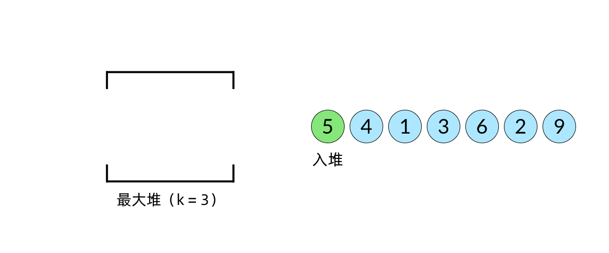

# 绪论
## 01-E3递归与迭代：总和最大区段
[53.最大子数组和](https://leetcode.cn/problems/maximum-subarray/description/) 
````tab
tab: 题目

#中等

描述：给你一个整数数组 `nums` ，请你找出一个具有最大和的连续子数组（子数组最少包含一个元素），返回其最大和。**子数组**是数组中的一个连续部分。

tab: 示例

**示例 1：**

**输入：**nums = [-2,1,-3,4,-1,2,1,-5,4]

**输出：**6

**解释：**连续子数组 [4,-1,2,1] 的和最大，为 6 。

**示例 2：**

**输入：**nums = [1]

**输出：**1

**示例 3：**

**输入：**nums = [5,4,-1,7,8]

**输出：**23

tab: 思路

A = [-2, 1, 4, -6, 3, 0]，记gs为待求的最大和，从前向后/从后向前考虑都可以，PPT上要求存在多个相同结果时，返回最靠后最短的子数组，所以从后向前考虑。现在从前向后进行分析：A[0]<0，所以gs一定不会包含A[0]；A[1]>0，A[2]>0，此时gs=A[1] + A[2] = 5，A[3] = -6，gs + A[3] = -1 < 0，假设数组自A[3]后存在最大子数组，该最大子数组不会再前伸包含\[A[i]~A[3]\](i=0,1,2)，因为前缀中包含A[3]的最大和为-1<0，只会让gs减小，因此，跳过A[3]，从A[4]开始考虑。

严谨证明见PPT71

tab: 代码

```c++
int gs_LS(int A[], int n) {
	int gs = A[0], s = 0, i = n;
	while(0 < i--){
	    s += A[i]; // 记录部分和
	    if (gs < s) gs = s;
	    if (s <= 0) s = 0; // 舍弃已记录的部分和，从新元素开始
	}
	return gs;
}
```
````
## 01-F1动态规划：斐波那契数
[LCR 126. 斐波那契数](https://leetcode.cn/problems/fei-bo-na-qi-shu-lie-lcof/)
````tab
tab:题目

#简单 #dp

**斐波那契数** （通常用 `F(n)` 表示）形成的序列称为 **斐波那契数列** 。该数列由 **0** 和 **1** 开始，后面的每一项数字都是前面两项数字的和。也就是：

F(0) = 0，F(1) = 1
F(n) = F(n - 1) + F(n - 2)，其中 n > 1

给定 `n` ，请计算 `F(n)` 。

答案需要取模 1e9+7(1000000007) ，如计算初始结果为：1000000008，请返回 1。

tab:示例

**示例 1：**

**输入：**n = 2
**输出：**1
**解释：**F(2) = F(1) + F(0) = 1 + 0 = 1

**示例 2：**

**输入：**n = 3
**输出：**2
**解释：**F(3) = F(2) + F(1) = 1 + 1 = 2

**示例 3：**

**输入：**n = 4
**输出：**3
**解释：**F(4) = F(3) + F(2) = 2 + 1 = 3

**提示：**

- `0 <= n <= 100`

tab:思路

1. **暴力递归：**

原理： 把 f(n) 问题的计算拆分成 f(n−1) 和 f(n−2) 两个子问题的计算，并递归，以 f(0) 和 f(1) 为终止条件。

缺点： 大量重复的递归计算，例如 f(n) 和 f(n−1) 两者向下递归需要 各自计算 f(n−2) 的值。

2. **记忆化递归：**

原理： 在递归法的基础上，新建一个长度为 n 的数组，用于在递归时存储 f(0) 至 f(n) 的数字值，重复遇到某数字则直接从数组取用，避免了重复的递归计算。

缺点： 记忆化存储需要使用 O(N) 的额外空间。

3. **动态规划：**

原理： 以斐波那契数列性质 f(n+1)=f(n)+f(n−1) 为转移方程。
从计算效率、空间复杂度上看，动态规划是本题的最佳解法。

tab:代码

```c++
class Solution {
public:
    int fib(int n) {
        int fib_prev_prev = 0; // 初始为fib(0)，此后保存fib(n-2)
        int fib_prev = 1; // 初始为fib(1)，此后保存fib(n-1)
        int sum; // fib(n)
	    if(n==0||n==1)
	        return n;
	    else{
	        while(1<n--){
	            sum = (fib_prev_prev + fib_prev) % 1000000007; // 此时sum = fib(n)
	            fib_prev_prev = fib_prev; // 更新fib(n-2) = fib(n-1)
	            fib_prev = sum; // 更新fib(n-1) = fib(n)
	        }
	        return sum;
	    }
    }
};
```
````
## 01-F2动态规划：最长公共子序列
[LCR 095. 最长公共子序列](https://leetcode.cn/problems/qJnOS7/)
````tab
tab:题目

#中等

给定两个字符串 `text1` 和 `text2`，返回这两个字符串的最长 **公共子序列** 的长度。如果不存在 **公共子序列** ，返回 `0` 。

一个字符串的 **子序列** 是指这样一个新的字符串：它是由原字符串在不改变字符的相对顺序的情况下删除某些字符（也可以不删除任何字符）后组成的新字符串。

- 例如，`"ace"` 是 `"abcde"` 的子序列，但 `"aec"` 不是 `"abcde"` 的子序列。

两个字符串的 **公共子序列** 是这两个字符串所共同拥有的子序列。

tab:示例

**示例 1：**

**输入：**text1 = "abcde", text2 = "ace" 
**输出：**3  
**解释：**最长公共子序列是 "ace" ，它的长度为 3 。

**示例 2：**

**输入：**text1 = "abc", text2 = "abc"
**输出：**3
**解释：**最长公共子序列是 "abc" ，它的长度为 3 。

**示例 3：**

**输入：**text1 = "abc", text2 = "def"
**输出：**0
**解释：**两个字符串没有公共子序列，返回 0 。

**提示：**

- `1 <= text1.length, text2.length <= 1000`
- `text1` 和 `text2` 仅由小写英文字符组成。

tab:思路
当text1或text2长度为0时，显然lcs=0，假设我们已经知道text1[0:i-1]和text2[0:j-1]这两个字符串的最长公共子序列，当text1和text2都增加一个字符时，会产生三种情况：
1. text1[i] == text2[j]，则最长公共子序列增加1
2. text1[i] != text2[j]，则最长公共子序列仍有可能增加1，例如 text1 = "acb,d", text2 = "ace,b"，虽然text1增加的字符是'd'不等于text2增加的字符'b'，但text2[j] = 'b'可能与text1[0:i-1]新增匹配，使得lcs+1

状态转移方程：
$$
d p[i][j]= \begin{cases}d p[i-1][j-1]+1, & \operatorname{text}_1[i-1]=\operatorname{text}_2[j-1] \\ \max (d p[i-1][j], d p[i][j-1]), & \operatorname{text}_1[i-1] \neq \operatorname{text}_2[j-1]\end{cases}
$$

tab:代码
```c++
#include <iostream>
#include <string>
class Solution {
public:
    int longestCommonSubsequence(string text1, string text2) {
        int n = text1.length();
        int m = text2.length();
        vector<vector<int>> dp(n + 1, vector<int>(m + 1));
        for(int i=0;i<n;i++){
            for(int j=0;j<m;j++){
                if(text1[i]==text2[j]){
                    dp[i+1][j+1] = 1+dp[i][j];
                }
                else{
                    dp[i+1][j+1] = max(dp[i+1][j], dp[i][j+1]);
                }
            }
        }
        return dp[n][m];
    }
};
```
````
# 向量
## 无序向量唯一化稳定版本
```c++
#include <algorithm>
#include <iostream>
#include <vector>
using namespace std;
struct Element {
  int value;
  int rank;
};
bool compareByValue(const Element &a, const Element &b) {
  return a.value < b.value;
}

bool compareByRank(const Element &a, const Element &b) {
  return a.rank < b.rank;
}

int main() {
  vector<int> arr = {4, 2, 4, 5, 2, 6, 8, 8, 2, 9, 3, 1, 3, 4};
  vector<Element> elements;
  for (size_t i = 0; i < arr.size(); ++i) {
    elements.push_back({arr[i], i});
  }
  cout << "初始的向量的内容：";
  for (Element ele : elements) {
    cout << ele.value << " ";
  }
  // 第一次排序，按值排序
  sort(elements.begin(), elements.end(), compareByValue);
  cout << endl << "排序后的向量的内容：";
  for (Element ele : elements) {
    cout << ele.value << " ";
  }
  //去重
  int i = 0;
  int j = 0;
  while (j < arr.size()) {
    if (elements[i].value != elements[j].value) {
      elements[++i] = elements[j];
    }
    j++;
  }
  int m = j - i - 1; //要删除的元素的个数
  elements.erase(elements.end() - m, elements.end());
  cout << endl << "排序后的去重后的向量的内容：";
  for (Element ele : elements) {
    cout << ele.value << " ";
  }
  //还原向量原本的相对顺序
  sort(elements.begin(), elements.end(), compareByRank);
  cout << endl << "去重后的还保留原本相对顺序的向量的内容：";
  for (Element ele : elements) {
    cout << ele.value << " ";
  }
  return 0;
}
```
## 向量中逆序对个数
[LCR 170. 交易逆序对的总数](https://leetcode.cn/problems/shu-zu-zhong-de-ni-xu-dui-lcof/)
````tab
tab: 题目

#困难

在股票交易中，如果前一天的股价高于后一天的股价，则可以认为存在一个「交易逆序对」。请设计一个程序，输入一段时间内的股票交易记录 `record`，返回其中存在的「交易逆序对」总数。

tab: 示例

**示例 1:**

**输入：**record = [9, 7, 5, 4, 6]

**输出：**8

**解释：**交易中的逆序对为 (9, 7), (9, 5), (9, 4), (9, 6), (7, 5), (7, 4), (7, 6), (5, 4)。

tab: 思路

考虑归并排序「归并」当中「并」的过程。我们通过一个实例来看看。假设有两个已排序的序列等待合并，分别是 L={8,12,16,22,100} 和 R={9,26,55,64,91}。注意L，R已经有序，此时L，R中的逆序数都是0，现在将它们做merge操作，L[0] < R[0]，逆序对数不增加；L[1] > R[0]，注意L有序，所以后面的L[i]>L\[1\](i>1)，则逆序对数将增加L.size() - index(此时index=1)个

tab: 代码
```c++
class Solution {
public:
    int mergeSort(vector<int>& record, int left, int right) {
        int mid = left + (right - left) / 2, sum = 0;
        if (left >= right)
            return 0;
        // 总逆序数 = [left, mid]的逆序数+[mid+1, right]的逆序数+它们之间的逆序数
        sum += mergeSort(record, left, mid);
        sum += mergeSort(record, mid + 1, right);
        sum += merge(record, left, mid, right);
        return sum;
    }
    int merge(vector<int>& record, int left, int mid, int right) {
        int i = left, j = mid + 1, k = 0, sum = 0;
        vector<int> temp(right - left + 1);
        while (i <= mid && j <= right) {
            if (record[i] > record[j]) {
            // 只有[left, mid], [mid+1, right]有序才有如下结论，所以还是得申请辅助空间，通过合并保证原record数组分段有序
                sum += mid - i + 1;
                // cout << record[i] << " < " << record[j] << endl;
                temp[k++] = record[j++];
            } else {
                temp[k++] = record[i++];
            }
        }
        while (i <= mid)
            temp[k++] = record[i++];
        while (j <= right)
            temp[k++] = record[j++];
        for (k = 0; k < temp.size(); k++)
            record[left + k] = temp[k];
        return sum;
    }
    int reversePairs(vector<int>& record) {
        return mergeSort(record, 0, record.size() - 1);
    }
};
```
````
# 列表
## 03-C3 无序列表：去重
PPT 思路：从后至前，依次删除当前列表元素真前缀中的相同者，时间复杂度 $O(n^2)$
[1836. 从未排序的链表中移除重复元素](https://leetcode.cn/problems/remove-duplicates-from-an-unsorted-linked-list/)
```c++
class Solution {
public:
    ListNode* deleteDuplicatesUnsorted(ListNode* head) {
        // <元素，元素的个数>
        unordered_map<int, int> cnt;
        // 遍历第一遍统计各元素出现次数
        for (ListNode* cur = head; cur; cur = cur->next) {
            cnt[cur->val]++;
        }
        // 增加哨兵节点
        ListNode* dummy = new ListNode(0, head);
        for (ListNode *pre = dummy, *cur = head; cur; cur = cur->next) {
            if (cnt[cur->val] > 1) {
                pre->next = cur->next;
            } else {
                pre = cur;
            }
        }
        return dummy->next;
    }
};
```
采取 hash 表，时间复杂度为 $O(n)$
> [!info]- STL 中 map 和 unordered map
> **map**: map 内部实现了一棵红黑树，内部的所有元素都是有序的，红黑树的每一个节点都代表着map的一个元素，因此，对于map进行的查找，删除，添加等一系列的操作都相当于对红黑树进行操作，红黑树的效率决定了map的效率。
> **unordered map**: unordered map 内部实现了一个哈希表，内部所有的元素排列顺序是无序的，不会按照 key 的大小进行排序
## 03-D1 有序列表：去重
一次顺序遍历即可，下面是变种：
[82. 删除排序链表中的重复元素 II](https://leetcode.cn/problems/remove-duplicates-from-sorted-list-ii/)
````tab
tab: 题目

#中等

给定一个已排序的链表的头 `head` ， _删除原始链表中所有重复数字的节点，只留下不同的数字_ 。返回 _已排序的链表_ 。

tab: 示例
**示例 1：**


**输入：**head = [1,2,3,3,4,4,5]

**输出：**[1,2,5]

**示例 2：**


**输入：**head = [1,1,1,2,3]

**输出：**[2,3]

**提示：**

- 链表中节点数目在范围 `[0, 300]` 内
- `-100 <= Node.val <= 100`
- 题目数据保证链表已经按升序 **排列**
tab: 思路

有序列表中重复的元素出现位置是连续的，一次遍历就可以删除。**由于链表的头节点可能会被删除**，因此需要额外使用一个**哑节点（dummy node）**指向链表的头节点。列表中删除一个节点就是用后继节点替代当前节点，例如删除首节点：dummyNode->next = dummpyNode->next->next;


tab: 代码
```c++
class Solution {
public:
    ListNode* deleteDuplicates(ListNode* head) {
        if (!head) {
            return head;
        }
        
        ListNode* dummy = new ListNode(0, head);

        ListNode* cur = dummy;
        while (cur->next && cur->next->next) {
            if (cur->next->val == cur->next->next->val) {
                int x = cur->next->val;
                // 从重复元素出现的第一个节点开始依次删除
                while (cur->next && cur->next->val == x) {
                    cur->next = cur->next->next;
                }
                // 结束时候从新数值节点开始if判断
            }
            else {
                cur = cur->next;
            }
        }

        return dummy->next;
    }
};
```
````
# 栈
##  04-E 栈混洗
````tab
tab: 1

tab: 2

tab: 3

tab: 4

tab: 5

tab: 6

tab: 7

tab: 8

tab: 9

tab: 10

tab: 11

````
[946. 验证栈序列](https://leetcode.cn/problems/validate-stack-sequences/)
````tab
tab: 题目
#中等

给定 `pushed` 和 `popped` 两个序列，每个序列中的 **值都不重复**，只有当它们可能是在最初空栈上进行的推入 push 和弹出 pop 操作序列的结果时，返回 `true`；否则，返回 `false` 。

tab: 示例

**示例 1：**

**输入：**pushed = [1,2,3,4,5], popped = [4,5,3,2,1]
**输出：**true
**解释：**我们可以按以下顺序执行：
push(1), push(2), push(3), push(4), pop() -> 4,
push(5), pop() -> 5, pop() -> 3, pop() -> 2, pop() -> 1

**示例 2：**

**输入：**pushed = [1,2,3,4,5], popped = [4,3,5,1,2]
**输出：**false
**解释：**1 不能在 2 之前弹出。

**提示：**

- `1 <= pushed.length <= 1000`
- `0 <= pushed[i] <= 1000`
- `pushed` 的所有元素 **互不相同**
- `popped.length == pushed.length`
- `popped` 是 `pushed` 的一个排列

tab: 思路

用一个栈来模拟混洗过程

tab: 代码
```c++
class Solution {
public:
    bool validateStackSequences(vector<int>& pushed, vector<int>& popped) {
        stack<int> stk;
        int i = 0;
        for (int num : pushed) {
            // 每次都直接让元素先入栈
            stk.push(num);
            while (!stk.empty() && stk.top() == popped[i]) { // 循环判断与出栈
                stk.pop();
                i++;
            }
        }
        return stk.empty();
    }
};
```
````
## 04-F 中缀表达式求值/求 RPN
[3302. 表达式求值](https://www.acwing.com/problem/content/description/3305/)
````tab
tab: 题目
#中等

给定一个表达式，其中运算符仅包含 `+,-,*,/`（加 减 乘 整除），可能包含括号，请你求出表达式的最终值。

tab: 示例

**数据范围**

表达式的长度不超过 10^5。

**输入样例: **
(2+2)*(1+1)

**输出样例:**
8

tab: 思路

1.符号栈+数字栈

2.二叉树

tab: 代码
```c++
#include <iostream>
#include <stack>
#include <string>
#include <unordered_map>
using namespace std;
stack<char> op;
stack<int> num;
string rpn; // 中缀表达式求解时候顺带就可以完成RPN转化
void eval() // 求值
{
    int a = num.top(); // 第二个操作数
    num.pop();

    int b = num.top(); // 第一个操作数
    num.pop();

    char p = op.top(); // 运算符
    op.pop();
    // cout << a << p << b << endl;
    rpn += p; // 符号出栈也就是RPN运算符的位置
    rpn += " ";
    int r = 0; // 结果

    // 计算结果
    if (p == '+')
        r = b + a;
    else if (p == '-')
        r = b - a;
    else if (p == '*')
        r = b * a;
    else if (p == '/')
        r = b / a;
    num.push(r); // 结果入栈
}

int main()
{
    unordered_map<char, int> pri{{'+', 1}, {'-', 1}, {'*', 2}, {'/', 2}, {'(', 0}, {')', 0}};
    string bds;
    cin >> bds;
    for (int i = 0; i < bds.size(); i++)
    {
        if (isdigit(bds[i]))
        {
            int temp = bds[i] - '0';
            while (++i < bds.size() && isdigit(bds[i]))
            {
                temp = temp * 10 + bds[i] - '0';
            }
            num.push(temp);
            rpn += to_string(temp); // 遇到数字直接拼接
            rpn += " ";
            i--;
        }
        else if (bds[i] == '(')
            op.push(bds[i]);
        else if (bds[i] == ')')
        {
            while (op.top() != '(')
                eval();
            op.pop();
        }
        else
        {
            while (!op.empty() && pri[bds[i]] <= pri[op.top()])
                eval();
            op.push(bds[i]);
        }
    }
    while (op.size())
        eval();
    cout << "RPN: " << rpn << endl;
    cout << num.top();
    return 0;
}
```
````
## 04-G 逆波兰表达式
[LCR 036. 逆波兰表达式求值](https://leetcode.cn/problems/8Zf90G/)
````tab
tab: 题目
#中等

求解逆波兰表达式的计算结果，有效的算符包括`+`、`-`、`*`、`/`

tab: 示例
**示例 ：**

**输入：**

tokens = ["10","6","9","3","+","-11","\*","\/","\*","17","+","5","+"]

**输出：**22

**解释：**

该算式转化为常见的中缀算术表达式为：
  ((10 \* (6 / ((9 + 3) \* -11))) + 17) + 5

= ((10 \* (6 / (12 * -11))) + 17) + 5

= ((10 \* (6 / -132)) + 17) + 5

= ((10 \* 0) + 17) + 5

= (0 + 17) + 5

= 17 + 5

= 22
tab: 思路

遇到数字则入栈；遇到算符则取出栈顶两个数字进行计算，并将结果压入栈中。

tab: 代码
```c++
class Solution {
public:
    int evalRPN(vector<string>& tokens) {
        stack<int> rpn;
        for (string token : tokens) {
            if (token!="+"&&token!="-"&&token!="*"&&token!="/")
                rpn.push(stoi(token));
            else{
                int b = rpn.top();
                rpn.pop();
                int a = rpn.top();
                rpn.pop();
                if(token=="+")
                    rpn.push(a+b);
                else if(token=="-")
                    rpn.push(a-b);
                else if(token=="*")
                    rpn.push(a*b);
                else if(token=="/")
                    rpn.push(a/b);
            }
        }
        return rpn.top();
    }
};
```
````
## 04-L 直方图内最大矩形
单调栈：一种特殊的栈。在栈的「先进后出」规则基础上，要求栈内元素是有序的

例如插入元素 6，将栈内所有小于 6 的元素都出栈，然后将 6 入栈
单调栈可以在时间复杂度为 $O(n)$ 的情况下，求解出某个元素左边或者右边**第一个**比它大或者小的元素。
简单练手： [496. 下一个更大元素 I](https://leetcode.cn/problems/next-greater-element-i/)
[84. 柱状图中最大的矩形](https://leetcode.cn/problems/largest-rectangle-in-histogram/)

**输入：** `heights = [2,1,5,6,2,3]`
**输出：** 10
**解释：** 最大的矩形为图中红色区域，面积为 10
````tab
tab: 1

tab: 2
**栈为空，直接将元素入栈，栈内保存元素下标**

tab: 3
**当前元素大于等于栈顶元素，直接将当前元素入栈**

tab: 4
**当前元素（5）小于栈顶元素（7），开始计算栈顶元素所在矩形面积，如图，由于我们是用单调栈维护，所以7在栈内的下一个元素（6）一定小于7，而6对应的下标（0）也就是高度为7的矩形的左边界；注意到弹栈操作只会发生在当前元素（5）小于栈顶元素（7），所以可以知道高度为7的矩形的右边界就是当前元素（5）的下标（2），弹出元素7**

tab: 5
**弹出元素7后，栈顶元素变为6，仍大于当前元素5，所以计算6所在矩形面积，同上，矩形的左边界是6在栈内的下一个元素下标（6下一个元素是哨兵-1），矩形的右边界是当前元素5的下标2，弹出元素6**

tab: 6
**压入元素5的下标2**

tab: 7
**当前元素2小于栈顶元素5，计算5所在矩形面积，左边界：5的下一个元素是哨兵-1；右边界：当前元素2下标3**

tab: 8

tab: 9

tab: 10

tab: 11

tab: 12

tab: 13

tab: 14

tab: 15
**此时栈顶元素2小于当前元素3，将3入栈**

tab: 16
**所有元素已入栈，则右边界固定为总元素个数，左边界仍然是当前元素在栈内下一个元素的下标**

tab: 17

tab: 18

````
# 二叉树
## 计算二叉树深度
[LCR 175. 计算二叉树的深度](https://leetcode.cn/problems/er-cha-shu-de-shen-du-lcof/)
```c++
/**
* Definition for a binary tree node.
* struct TreeNode {
*     int val;
*     TreeNode *left;
*     TreeNode *right;
*     TreeNode() : val(0), left(nullptr), right(nullptr) {}
*     TreeNode(int x) : val(x), left(nullptr), right(nullptr) {}
*     TreeNode(int x, TreeNode *left, TreeNode *right) : val(x), left(left),
* right(right) {}
* };
*/
```
````tab
tab: 题目
#简单

某公司架构以二叉树形式记录，请返回该公司的层级数。

tab: 示例

**示例 1：**


**输入：**root = [1, 2, 2, 3, null, null, 5, 4, null, null, 4]

**输出:** 4

**解释:** 上面示例中的二叉树的最大深度是 4，沿着路径 1 -> 2 -> 3 -> 4 或 1 -> 2 -> 5 -> 4 到达叶节点的最长路径上有 4 个节点。

**提示：**

- `节点总数 <= 10000`

tab: 思路

迭代版可以考虑层序遍历计算

tab: 递归版代码
```c++
class Solution {
public:
    int calculateDepth(TreeNode* root) {
        if(root)
            return 1 + max(calculateDepth(root->left), calculateDepth(root->right));
        else
            return 0;
    }
};
```
- **时间复杂度 O(N) ：** N 为树的节点数量，计算树的深度需要遍历所有节点。

- **空间复杂度 O(N) ：** 最差情况下（当树退化为链表时），递归深度可达到 N 。
````
## 05-E2 二叉树的先序遍历
[144. 二叉树的前序遍历](https://leetcode.cn/problems/binary-tree-preorder-traversal/)
````tab
tab: 题目
#简单

给你二叉树的根节点`root`，返回它节点值的**前序**遍历

tab: 示例
**示例 1：**


**输入：**root = [1,null,2,3]
**输出：**[1,2,3]

**示例 2：**

**输入：**root = []
**输出：**[]

**示例 3：**

**输入：**root = [1]
**输出：**[1]

**示例 4：**


**输入：**root = [1,2]
**输出：**[1,2]

**示例 5：**


**输入：**root = [1,null,2]
**输出：**[1,2]

**提示：**

- 树中节点数目在范围 `[0, 100]` 内
- `-100 <= Node.val <= 100`
tab: 思路

略

tab: 递归版代码
```c++
class Solution {
public:
    vector<int> res;
    vector<int> preorderTraversal(TreeNode* root) {
        if (root) {
            res.push_back(root->val);
            preorderTraversal(root->left);
            preorderTraversal(root->right);
        }
        return res;
    }
};
```
时间复杂度：O(n)，其中 n 是二叉树的节点数。每一个节点恰好被遍历一次。

空间复杂度：O(n)，为递归过程中栈的开销，平均情况下为 O(logn)，最坏情况下树呈现链状，为 O(n)。
tab: 迭代版代码
```c++
class Solution {
public:
    vector<int> preorderTraversal(TreeNode* root) {
        stack<TreeNode*> stk;
        vector<int> res;
        TreeNode* node;
        stk.push(root);
        while (!stk.empty()) {
            node = stk.top();
            stk.pop();
            while (node) {
                res.push_back(node->val);
                stk.push(node->right);
                node = node->left;
            }
        }
        return res;
    }
};
```
时间复杂度：O(n)，其中 n 是二叉树的节点数。每一个节点恰好被遍历一次。

空间复杂度：O(n)，为迭代过程中显式栈的开销，平均情况下为 O(logn)，最坏情况下树呈现链状，为 O(n)。

tab: Morris遍历
类似构造线索二叉树，仅用于极端省空间情况，空间复杂度O(1)
````
## 05-F2 二叉树的中序遍历
[94. 二叉树的中序遍历](https://leetcode.cn/problems/binary-tree-inorder-traversal/)
````tab
tab: 题目
#简单

给定一个二叉树的根节点 `root` ，返回它的 **中序** 遍历。

tab: 示例
**示例 1：**


**输入：**root = [1,null,2,3]
**输出：**[1,3,2]

**示例 2：**

**输入：**root = []
**输出：**[]

**示例 3：**

**输入：**root = [1]
**输出：**[1]

**提示：**

- 树中节点数目在范围 `[0, 100]` 内
- `-100 <= Node.val <= 100`
tab: 思路
略
tab: 递归版代码
```c++
class Solution {
public:
    vector<int> res;
    vector<int> inorderTraversal(TreeNode* root) {
        if (root) {
            inorderTraversal(root->left);
            res.push_back(root->val);
            inorderTraversal(root->right);
        }
        return res;
    }
};
```
复杂度分析

时间复杂度：O(n)，其中 n 为二叉树节点的个数。二叉树的遍历中每个节点会被访问一次且只会被访问一次。

空间复杂度：O(n)。空间复杂度取决于递归的栈深度，而栈深度在二叉树为一条链的情况下会达到 O(n) 的级别。
tab: 迭代版代码
```c++
class Solution {
public:
    vector<int> inorderTraversal(TreeNode* root) {
        vector<int> res;
        stack<TreeNode*> stk;
        // 这里while的条件需要注意下，root!=nullptr对应仅有右侧链
        while (root || !stk.empty()) {
            while (root) {
                stk.push(root);
                root = root->left;
            }
            root = stk.top();
            res.push_back(root->val);
            stk.pop();
            root = root->right;
        }
        return res;
    }
};
```
时间复杂度：O(n)，其中 n 为二叉树节点的个数。二叉树的遍历中每个节点会被访问一次且只会被访问一次。

空间复杂度：O(n)。空间复杂度取决于栈深度，而栈深度在二叉树为一条链的情况下会达到 O(n) 的级别。
````
## 05-G2 二叉树的后序遍历
````tab
tab: 题目
#简单

给你一棵二叉树的根节点 `root` ，返回其节点值的 **后序** 遍历 。

tab: 示例
**示例 1：**


**输入：**root = [1,null,2,3]
**输出：**[3,2,1]

**示例 2：**

**输入：**root = []
**输出：**[]

**示例 3：**

**输入：**root = [1]
**输出：**[1]

**提示：**

- 树中节点的数目在范围 `[0, 100]` 内
- `-100 <= Node.val <= 100`
tab: 思路
这里要说明下，PPT上的迭代版利用了TreeNode parent，leetcode树节点无法获知，必须引入prev记录刚访问的节点，此外Leetcode处理的思路很清晰，不需要一轮压入左右孩子两个节点
tab: 递归版代码
```c++
class Solution {
public:
    vector<int> res;
    vector<int> postorderTraversal(TreeNode* root) {
        if (root) {
            postorderTraversal(root->left);
            postorderTraversal(root->right);
            res.push_back(root->val);
        }
        return res;
    }
};
```
tab: 迭代版代码
```c++
class Solution {
public:
    vector<int> postorderTraversal(TreeNode* root) {
        vector<int> res;
        if (!root)
            return res;
        stack<TreeNode*> stk;
        TreeNode* prev = nullptr;
        while (root || !stk.empty()) {
            while (root) {
                stk.push(root);
                root = root->left;
            }
            // 循环结束时，已经确保没有左子树了
            root = stk.top();
            stk.pop();
            // 如果当前节点的右子树为空，或者当前节点的右子树已经遍历完
            if (root->right == nullptr || root->right == prev) {
                // 则此时当前节点的左右子树都已完成遍历，节点入栈
                res.push_back(root->val);
                // prev记录刚刚遍历的节点
                prev = root;
                // root赋空跳过沿左子树下行部分，直接取新的栈顶，也就root的父节点
                root = nullptr;
            } else {
                // 右子树不为空且当前节点右子树尚未遍历，重新将弹出的节点压回栈顶并转到右子树
                stk.push(root);
                root = root->right;
            }
        }
        return res;
    }
};
```
````
## 05-G5 表达式树
[表达式转表达式二叉树](https://www.cnblogs.com/lfri/p/9985993.html)
[3765. 表达式树](https://www.acwing.com/problem/content/description/3768/)
````tab
tab: 题目
#简单

请设计一个算法，将给定的表达式树(二叉树)转换为等价的中缀表达式(通过括号反映操作符的计算次序)并输出。
tab: 示例
例如，当下列两棵表达式树作为算法的输入时：


输出的等价中缀表达式分别为 `(a+b)*(c*(-d))` 和 `(a*b)+(-(c-d))`。

**注意**：

- 树中至少包含一个运算符。
- 当运算符是负号时，左儿子为空，右儿子为需要取反的表达式。
- 树中所有叶节点的值均为非负整数。

**样例：**

```
输入：二叉树[+, 12, *, null, null, 6, 4, null, null, null, null]如下图所示：
    +
   / \
  12  *
     / \
    6   4

输出：12+(6*4)
```

**数据范围**

给定二叉树的非空结点数量保证不超过 1000。

给定二叉树保证能够转化为合法的中缀表达式。
tab: 思路
难点在于括号打印，根节点两侧不需要括号，可以考虑dfs
tab: 代码
```c++
class Solution {
public:
    string dfs(TreeNode* root){
        if(!root)
            return "";
        if(!root->left&&!root->right)
            return root->val;
        return "(" + dfs(root->left) + root->val + dfs(root->right) + ")";
    }
    string expressionTree(TreeNode* root) {
        return dfs(root->left) + root->val + dfs(root->right);
    }
};
```
````
## 05-H5 层序遍历
[102. 二叉树的层序遍历](https://leetcode.cn/problems/binary-tree-level-order-traversal/)
````tab
tab: 题目
#中等

给你二叉树的根节点 `root` ，返回其节点值的 **层序遍历** 。 （即逐层地，从左到右访问所有节点）。
tab: 示例
**示例 1：**


**输入：**root = [3,9,20,null,null,15,7]

**输出：**\[\[3\],\[9,20\],\[15,7\]\]

**示例 2：**

**输入：**root = [1]

**输出：**\[\[1\]\]

**示例 3：**

**输入：**root = \[\]

**输出：**\[\]

**提示：**

- 树中节点数目在范围 `[0, 2000]` 内
- `-1000 <= Node.val <= 1000`
tab: 思路
可以用一种巧妙的方法修改广度优先搜索：
* 首先根元素入队
* 当队列不为空的时候
* * 求当前队列的长度 $s_{i}$
* * 依次从队列中取 $s_{i}$个元素进行拓展，然后进入下一次迭代

它和普通广度优先搜索的区别在于，普通广度优先搜索每次只取一个元素拓展，而这里每次取 $s_{i}$个元素。在上述过程中的第 i 次迭代就得到了二叉树的第 i 层的 $s_{i}$个元素。
tab: 代码
```c++
class Solution {
public:
    vector<vector<int>> levelOrder(TreeNode* root) {
        vector<vector<int>> res;
        if (!root)
            return res;
        queue<TreeNode*> que;
        que.push(root);
        while (!que.empty()) {
            // 队列中仅存在当前层次的所有节点
            int currentLevelSize = que.size();
            res.push_back(vector<int>());
            // 对当前层次的所有节点依次处理
            for (int i = 1; i <= currentLevelSize; ++i) {
                TreeNode* node = que.front();
                que.pop();
                // 每次添加到二维向量的最后一个向量中
                res.back().push_back(node->val);
                if (node->left)
                    que.push(node->left);
                if (node->right)
                    que.push(node->right);
            }
        }
        return res;
    }
};
```
````
## 05-I 先序+中序重构
[LCR 124. 推理二叉树](https://leetcode.cn/problems/zhong-jian-er-cha-shu-lcof/)
````tab
tab: 题目
#中等

某二叉树的先序遍历结果记录于整数数组 `preorder`，它的中序遍历结果记录于整数数组 `inorder`。请根据 `preorder` 和 `inorder` 的提示构造出这棵二叉树并返回其根节点。

注意：`preorder` 和 `inorder` 中均不含重复数字。
tab: 示例
**示例 1：**


**输入:** preorder = [3,9,20,15,7], inorder = [9,3,15,20,7]

**输出:** [3,9,20,null,null,15,7]

**示例 2:**

**输入:** preorder = [-1], inorder = [-1]

**输出:** [-1]

**提示:**

- `1 <= preorder.length <= 3000`
- `inorder.length == preorder.length`
- `-3000 <= preorder[i], inorder[i] <= 3000`
- `inorder` 均出现在 `preorder`
- `preorder` 保证 为二叉树的前序遍历序列
- `inorder` 保证 为二叉树的中序遍历序列
tab: 思路
可以引入HashMap加快查找根节点在中序遍历序列中的下标
tab: 代码
```c++
class Solution {
public:
    TreeNode* divide(vector<int>& preorder, int preStart, int preEnd, vector<int>& inorder, int inStart, int inEnd) {
        if (preStart > preEnd || inStart > inEnd)
            return nullptr;
        TreeNode* root = new TreeNode(preorder[preStart]);
        int i = inStart;
        for (; i <= inEnd; i++) {
            if (inorder[i] == root->val) {
                break;
            }
        }
        // 计算中序遍历左子树长度
        i = i - inStart;
        // preorder = [root(preStart), preStart+1, ..., prestart+i, prestart+i+1, preEnd] 
        // inorder = [inStart, ..., inStart+i-1, root, inStart+i+1, ... , inEnd]
        root->left = divide(preorder, preStart + 1, preStart + i, inorder, inStart, inStart + i - 1);
        root->right = divide(preorder, preStart + i + 1, preEnd, inorder, inStart + i + 1, inEnd);
        return root;
    }
    TreeNode* deduceTree(vector<int>& preorder, vector<int>& inorder) {
        TreeNode* root = divide(preorder, 0, preorder.size() - 1, inorder, 0, inorder.size() - 1);
        return root;
    }
};
```
tab: 引入HashMap
```c++
class Solution {
public:
    TreeNode* deduceTree(vector<int>& preorder, vector<int>& inorder) {
        this->preorder = preorder;
        for(int i = 0; i < inorder.size(); i++)
        // 建立value->下标的映射
            hmap[inorder[i]] = i;
        return recur(0, 0, inorder.size() - 1);
    }
private:
    vector<int> preorder;
    unordered_map<int, int> hmap; // <value, index>
    TreeNode* recur(int root, int left, int right) { 
        if(left > right) return nullptr;// 递归终止
        TreeNode* node = new TreeNode(preorder[root]);// 建立根节点
        int i = hmap[preorder[root]];// 划分根节点、左子树、右子树
        node->left = recur(root + 1, left, i - 1);// 开启左子树递归
        node->right = recur(root + i - left + 1, i + 1, right);// 开启右子树递归
        return node;// 回溯返回根节点
    }
};
```
````
增强序列：将二叉树转为真二叉树，每个空节点用 `*` 表示，则仅通过先序（后序）遍历序列即可还原二叉树
## 05-J Huffman 树
[3531 哈夫曼树](https://www.acwing.com/problem/content/description/3534/)
````tab
tab: 题目
#简单

请你构造哈夫曼树，并输出该树的带权路径长度。
tab: 示例
**输入格式**

第一行包含整数 $N$，表示叶子结点数量。

第二行包含 $N$ 个整数，表示每个叶子结点的权值。

**输出格式**

输出一个整数，表示生成哈夫曼树的带权路径长度。

**数据范围**

$2\leq N \leq1000$,  

叶子结点的权值范围 [1,100]。

**输入样例：**

```
5
1 2 2 5 9
```

**输出样例：**

```
37
```
tab: 思路
参考PPT，注意STL中最小堆的使用
tab: 代码
```c++
#include <vector>
#include <queue>
#include <iostream>
using namespace std;
int main()
{
    // 构造小根堆
    priority_queue<int, vector<int>, greater<int>> heap;
    int n;
    cin >> n;
    while (n--)
    {
        int x;
        cin >> x;
        heap.push(x);
    }
    int res = 0;
    while (heap.size() > 1)
    {
        // 每次取出最小的两树合并
        int a = heap.top();
        heap.pop();
        int b = heap.top();
        heap.pop();
        heap.push(a + b);
        res += a + b;
    }
    cout << res;
    return 0;
}
```
````
# 图
[图论一](https://www.luogu.com.cn/article/amxn9li0)
## 06-B 图的存储
### 数组存边
使用一个数组来存边，数组中的每个元素都包含一条边的起点与终点（带边权的图还包含边权）。（或者使用多个数组分别存起点，终点和边权。）
```c++
struct Edge{
	int u, v;
};
vector<Edge> e;
vector<bool> vis;
// 起点：e[i].u, 终点：e[i].v
```
- 复杂度（n 是顶点数，m 是边数）
查询是否存在某条边：$O(m)$
遍历一个点的所有出边：$O(m)$
遍历整张图：$O(nm)$（n 个点，每个点都去 e 中遍历一次）
空间复杂度：$O(m)$
不用于遍历图，在 kruskal 算法中按边权排序会用到
### 邻接矩阵
使用一个二维数组 adj 来存边，其中 adj\[u\]\[v\] 为 1 表示存在 u 到 v 的边，为 0 表示不存在。如果是带边权的图，可以在 adj\[u\]\[v\] 中存储 u 到 v 的边的边权。
```c++
vector<vector<int> > adj;
vector<bool> vis;

vis.resize(n + 1, false);
adj.resize(n + 1, vector<int>(n + 1, 0));

for (int i = 1; i <= m; ++i) {
  int u, v;
  cin >> u >> v;
  adj[u][v] = 1;
}
```
* 复杂度
查询是否存在某条边：$O(1)$
遍历一个点的所有出边：$O(n)$
遍历整张图：$O(n^2)$
空间复杂度：$O(n^2)$
适用于稠密图
### 邻接表
使用一个支持动态增加元素的数据结构构成的数组，如 `vector<int> adj[n + 1]` 来存边，其中 adj\[u\] 存储的是点 u 的所有出边的相关信息（终点、边权等）。
```c++
vector<vector<int> > adj;
vector<bool> vis;

vis.resize(n + 1, false);
adj.resize(n + 1);

for (int i = 1; i <= m; ++i) {
  int u, v;
  cin >> u >> v;
  adj[u].push_back(v);
}
```
- 复杂度
查询是否存在 u 到 v 的边：$O(d^+(u))$ （$d^+(u)$ 是点 u 的出度）
遍历点 u 的所有出边：$O(d^+(u))$
遍历整张图：$O(n+m)$ （访问 n个节点+每个节点的邻接表 m）
空间复杂度：$O(m)$
## 06-D1 BFS
[1971. 寻找图中是否存在路径](https://leetcode.cn/problems/find-if-path-exists-in-graph/)
````tab
tab: 题目
#简单

有一个具有 `n` 个顶点的 **双向** 图，其中每个顶点标记从 `0` 到 `n - 1`（包含 `0` 和 `n - 1`）。图中的边用一个二维整数数组 `edges` 表示，其中 `edges[i] = [ui, vi]` 表示顶点 `ui` 和顶点 `vi` 之间的双向边。 每个顶点对由 **最多一条** 边连接，并且没有顶点存在与自身相连的边。

请你确定是否存在从顶点 `source` 开始，到顶点 `destination` 结束的 **有效路径** 。

给你数组 `edges` 和整数 `n`、`source` 和 `destination`，如果从 `source` 到 `destination` 存在 **有效路径** ，则返回 `true`，否则返回 `false` 。
tab: 示例
**示例 1：**


**输入：**n = 3, edges = [[0,1],[1,2],[2,0]], source = 0, destination = 2
**输出：**true
**解释：**存在由顶点 0 到顶点 2 的路径:
- 0 → 1 → 2 
- 0 → 2

**示例 2：**


**输入：**n = 6, edges = \[\[0,1\],\[0,2\],\[3,5\],\[5,4\],\[4,3\]\], source = 0, destination = 5
**输出：**false
**解释：**不存在由顶点 0 到顶点 5 的路径.

**提示：**

- `1 <= n <= 2 * 105`
- `0 <= edges.length <= 2 * 105`
- `edges[i].length == 2`
- `0 <= ui, vi <= n - 1`
- `ui != vi`
- `0 <= source, destination <= n - 1`
- 不存在重复边
- 不存在指向顶点自身的边
tab: 思路
使用广度优先搜索判断顶点 source 到顶点 destination 的连通性，需要我们从顶点 source 开始按照层次依次遍历每一层的顶点，检测是否可以到达顶点 destination。
tab: 代码
```c++
class Solution {
public:
    bool validPath(int n, vector<vector<int>>& edges, int source, int destination) {
        vector<vector<int>> adj(n);
        // 无向图构造邻接表
        for (auto &&edge : edges) {
            int x = edge[0], y = edge[1];
            adj[x].emplace_back(y);
            adj[y].emplace_back(x);
        }
        // 记录是否访问
        vector<bool> visited(n, false);
        queue<int> qu;
        qu.emplace(source);
        visited[source] = true;
        while (!qu.empty()) {
            int vertex = qu.front();
            qu.pop();
            if (vertex == destination) {
                break;
            }
            // 从邻接表中依次取出邻接节点入队
            for (int next: adj[vertex]) {
                if (!visited[next]) {
                    qu.emplace(next);
                    visited[next] = true;
                }
            }
        }
        return visited[destination];
    }
};
```
````
## 06-E1 DFS
题目同上
```c++
class Solution {
public:
    bool validPath(int n, vector<vector<int>>& edges, int source,
                   int destination) {
        if (n == 1)
            return source == destination;
        vector<vector<int>> edgesList(n);
        for (vector<int> edge : edges) {
            int x = edge[0];
            int y = edge[1];
            edgesList[x].push_back(y);
            edgesList[y].push_back(x);
        }
        vector<int> nodeState(n, 0);
        stack<int> stk;
        stk.push(source);
        while (!stk.empty()) {
            int node = stk.top();
            stk.pop();
            for (int edge : edgesList[node]) {
                if (edge == destination)
                    return true;
                if (!nodeState[edge]) {
                    stk.push(edge);
                    nodeState[edge] = 1;
                }
            }
        }
        return false;
    }
};
```
## 06-F 拓扑排序
[207. 课程表](https://leetcode.cn/problems/course-schedule/)
````tab
tab: 题目
#中等

你这个学期必须选修 `numCourses` 门课程，记为 `0` 到 `numCourses - 1` 。

在选修某些课程之前需要一些先修课程。 先修课程按数组 `prerequisites` 给出，其中 `prerequisites[i] = [ai, bi]` ，表示如果要学习课程 `ai` 则 **必须** 先学习课程  `bi` 。

- 例如，先修课程对 `[0, 1]` 表示：想要学习课程 `0` ，你需要先完成课程 `1` 。

请你判断是否可能完成所有课程的学习？如果可以，返回 `true` ；否则，返回 `false` 。
tab: 示例
**示例 1：**

**输入：**numCourses = 2, prerequisites = \[\[1,0\]\]
**输出：**true
**解释：**总共有 2 门课程。学习课程 1 之前，你需要完成课程 0 。这是可能的。

**示例 2：**

**输入：**numCourses = 2, prerequisites = \[\[1,0\],\[0,1\]\]
**输出：**false
**解释：**总共有 2 门课程。学习课程 1 之前，你需要先完成​课程 0 ；并且学习课程 0 之前，你还应先完成课程 1 。这是不可能的。

**提示：**

- `1 <= numCourses <= 2000`
- `0 <= prerequisites.length <= 5000`
- `prerequisites[i].length == 2`
- `0 <= ai, bi < numCourses`
- `prerequisites[i]` 中的所有课程对 **互不相同**
tab: 思路
**方法一：深度优先搜索**

==对应0出度算法==

我们可以将深度优先搜索的流程与拓扑排序的求解联系起来，用一个栈来存储所有**已经搜索完成的节点**。

对于图中的任意一个节点，它在搜索的过程中有三种状态，即：

「未搜索」：我们还没有搜索到这个节点；

「搜索中」：我们搜索过这个节点，但还没有回溯到该节点，即该节点还没有入栈，还有相邻的节点没有搜索完成）；

「已完成」：我们搜索过并且回溯过这个节点，即该节点已经入栈，并且所有该节点的相邻节点都出现在栈的更底部的位置，满足拓扑排序的要求。

通过上述的三种状态，我们就可以给出使用深度优先搜索得到拓扑排序的算法流程，在每一轮的搜索搜索开始时，我们任取一个「未搜索」的节点开始进行深度优先搜索。

我们将当前搜索的节点 u 标记为「搜索中」，遍历该节点的每一个相邻节点 v：

如果 v 为「未搜索」，那么我们开始搜索 v，待搜索完成回溯到 u；

如果 v 为「搜索中」，那么我们就找到了图中的一个环，因此是不存在拓扑排序的；

如果 v 为「已完成」，那么说明 v 已经在栈中了，而 u 还不在栈中，因此 u 无论何时入栈都不会影响到 (u,v) 之前的拓扑关系，以及不用进行任何操作。

当 u 的所有相邻节点都为「已完成」时，我们将 u 放入栈中，并将其标记为「已完成」。

在整个深度优先搜索的过程结束后，如果我们没有找到图中的环，那么栈中存储这所有的 n 个节点，从栈顶到栈底的顺序即为一种拓扑排序。

**由于我们只需要判断是否存在一种拓扑排序，而栈的作用仅仅是存放最终的拓扑排序结果，所以可以只记录每个节点状态，省去对应的栈**

**方法二：广度优先搜索**

==对应0入度算法==

考虑拓扑排序中0入度的节点，它们没有任何先修课程的要求，当我们将一个节点加入答案中后，我们就可以移除它的所有出边，代表着它的相邻节点少了一门先修课程的要求。如果某个相邻节点变成了「没有任何入边的节点」，那么就代表着这门课可以开始学习了。按照这样的流程，我们不断地将没有入边的节点加入答案，直到答案中包含所有的节点（得到了一种拓扑排序）或者不存在没有入边的节点（图中包含环）。

使用一个队列来进行广度优先搜索。初始时，所有入度为 0 的节点都被放入队列中，它们就是可以作为拓扑排序最前面的节点，并且它们之间的相对顺序是无关紧要的。

在广度优先搜索的每一步中，我们取出队首的节点 u：

我们将 u 放入答案中；

我们移除 u 的所有出边，也就是将 u 的所有相邻节点的入度减少 1。如果某个相邻节点 v 的入度变为 0，那么我们就将 v 放入队列中。

在广度优先搜索的过程结束后。如果答案中包含了这 n 个节点，那么我们就找到了一种拓扑排序，否则说明图中存在环，也就不存在拓扑排序了。

**同样我们可以省去存放答案的数组，而是只用一个变量记录被放入答案数组的节点个数，BFS结束后，判断变量的值是否等于课程数**
tab: DFS代码
```c++
class Solution {
public:
    // 创建邻接表
    vector<vector<int>> table;
    // 0 表示未访问，1表示在dfs栈中，2表示已经访问出栈
    vector<int> visited;
    // 判断是否有环
    bool hasCircle = false;
    void dfs(int node) {
        // 将当前节点入栈
        visited[node] = 1;
        // 考虑其所有邻接顶点
        for (int neighbor : table[node]) {
            if (visited[neighbor] == 0) {
                dfs(neighbor);
                // 提前结束
                if (hasCircle)
                    return;
            }
            // 前节点已在栈中，成环
            else if (visited[neighbor] == 1) {
                hasCircle = true;
                return;
            }
        }
        // 遍历完成
        visited[node] = 2;
    }
    bool canFinish(int numCourses, vector<vector<int>>& prerequisites) {
        table.resize(numCourses);
        visited.resize(numCourses);
        for (vector<int> prerequisit : prerequisites) {
            table[prerequisit[1]].push_back(prerequisit[0]);
        }
        for (int i = 0; !hasCircle && i < numCourses; i++) {
            if (visited[i] == 0) {
                dfs(i);
            }
        }
        return !hasCircle;
    }
};
```
**时间复杂度**：O(n+m)，其中n是课程数，m是先修课程的要求数，这也是对图进行dfs的时间复杂度(邻接表节点+节点边数)

**空间复杂度**：O(n+m)，邻接表占用空间O(n+m)，递归栈空间O(n)，总空间复杂度是O(n+m)

tab: BFS代码
```c++
class Solution {
public:
    vector<vector<int>> table;
    // 记录各个节点的入度
    vector<int> inDeg;

    bool canFinish(int numCourses, vector<vector<int>>& prerequisites) {
        table.resize(numCourses);
        inDeg.resize(numCourses);
        for (vector<int> prerequisit : prerequisites) {
            table[prerequisit[1]].push_back(prerequisit[0]);
            ++inDeg[prerequisit[0]];
        }
        queue<int> q;
        // 先把所有入度为0的课程全部入队
        for (int i = 0; i < numCourses; i++) {
            if (inDeg[i] == 0)
                q.push(i);
        }
        // 记录完成的课程数
        int visited = 0;
        while (!q.empty()) {
            int node = q.front();
            ++visited;
            q.pop();
            for (int neighbor : table[node]) {
                --inDeg[neighbor];
                if (inDeg[neighbor] == 0)
                    q.push(neighbor);
            }
        }
        return visited == numCourses;
    }
};
```
**时间复杂度**: O(n+m)，其中 n 为课程数，m 为先修课程的要求数。这其实就是对图进行广度优先搜索的时间复杂度。

**空间复杂度**: O(n+m)。存储成邻接表空间复杂度为 O(n+m)。BFS过程中需要最多 O(n) 的队列空间（迭代）进行广度优先搜索。因此总空间复杂度为 O(n+m)。
````
## 07-D 点双连通分量
### 割点/边
> **割点**：对于一个无向图，如果把一个点删除后这个图的极大连通分量数增加，则这个点就是这个图的割点
> **割边(桥)**：无向联通图中，去掉一条边，图中的连通分量数增加，则这条边，称为桥或者割边

下图中顶点C为割点，但和C相连的边都不是桥（割边）。

### Tarjan 算法
也就是PPT 中的思路，如果顶点U的所有孩子顶点可以不通过父顶点U而访问到U的祖先顶点，那么说明此时去掉顶点U不影响图的连通性，U就不是割点。相反，如果顶点U至少存在一个孩子顶点，必须通过父顶点U才能访问到U的祖先顶点，那么去掉顶点U后，顶点U的祖先顶点和孩子顶点就不连通了，说明U是一个割点。

上图是无向图，图中箭头仅代表 DFS 访问顺序
连通区域 1 可以不经过 D够到 C，连通区域 2 不可以，所以 D 对于区域 1 不是割点，对于区域 2 是割点。对于根节点，如果从根节点一次 DFS 就可以遍历所有的顶点，那么根节点就不是割点，如果回溯到根节点还有未被访问的顶点，根节点就是割点。
Tarjan算法的一些细节：
需要定义额外 3 个数组：dfn\[\]，low\[\]，parent\[\]
* dfn 数组也就是 dtime 数组，数组中的值表示该顶点在 DFS 中的遍历时间戳，每访问到一个未访问过的顶点，时间戳加 1，由括号引理知，子顶点的 dfn 值一定比父顶点的 dfn 值大
* low 数组也就是 hca 数组，数组中的值表示 DFS 中**顶点不通过父节点能访问到的最高祖先**，每个顶点初始时的 low 值和 dfn 值一样，DFS 过程中不断更新
* parent 数组，数组中的值表示该顶点的父节点编号，用于在更新 low 数组时排除父节点
````tab
tab: 1

tab: 2

tab: 3

tab: 4

tab: 5

tab: 6

tab: 7

tab: 8

tab: 9

tab: 10

tab: 11

tab: 12

````
**割点**：判断顶点U是否为割点，用U顶点的dfn值和它**所有的孩子**顶点的low值进行比较，如果存在至少一个孩子顶点V满足 $low[v] \geq dfn[u]$，就说明顶点V访问顶点U的祖先顶点，必须通过顶点U，而不存在顶点V到顶点U祖先顶点的其它路径，所以顶点U就是一个割点。对于没有孩子顶点的顶点（叶节点），显然不会是割点。
如图 12，B 的孩子节点是 C；$low[J] = 2 \geq 2 = dfn[B]$，$low[C] = 2 \geq 2 = dfn[B]$，所以 B 节点就是一个割点
C 的孩子节点是 D；$low[D] = 2 < 3 = dfn[C]$，所以 C 节点不是一个割点
E 的孩子节点是 F、K；$low[K] = 11 > 5 = dfn[E]$，$low[F] = 2 < 5 = dfn[E]$，存在一个孩子节点满足条件，所以 E 也是割点
[P3388【模板】割点（割顶）](https://www.luogu.com.cn/problem/P3388)
```c++
void tarjan(int vertex)
{
    // 访问vertex点
    ++dtime;
    // 初始时dfn和low值都是访问时刻
    dfn[vertex] = low[vertex] = dtime;
    int children = 0;                // 统计vertex在最后dfs支撑树中的孩子数量
    for (int neighbor : adj[vertex]) // 依次对所有邻接顶点做dfs
    {
        // 发现未访问的节点，形成树边
        if (visited[neighbor] == 0)
        {
            // 孩子数量加一
            ++children;
            // 记录父子关系
            parent[neighbor] = vertex;
            visited[neighbor] = 1;
            // 转到neighbor节点处理
            tarjan(neighbor);
            // 当neighbor节点递归处理完成后，它的dfn和low已经完成更新
            // 所以现在回到vertex，也就是neighbor的父节点继续进行更新
            low[vertex] = min(low[vertex], low[neighbor]);
            // 判断当前节点不是根节点，根节点的判断需要所有的dfs做完，根据children个数判断
            // 割点判断条件：对于vertex只要有一个孩子够不到比vertex更高的祖先，vertex就是割点
            // 已经因为某个子节点确定是割点，不再统计，避免重复计数
            if (parent[vertex] != vertex && low[neighbor] >= dfn[vertex] && !cutVertex[vertex])
            {
                ++cutNum;
                cutVertex[vertex] = true;
            }
        }
        // 如果发现已经在栈里的点，形成backward edge
        else if (neighbor != parent[vertex])
        {
            // 根据backward edge指向的祖先节点高低，判断是否需要更新
            low[vertex] = min(dfn[neighbor], low[vertex]);
        }
    }
    // 根节点判别比较特殊
    if (parent[vertex] == vertex && children >= 2 && !cutVertex[vertex])
    {
        ++cutNum;
        cutVertex[vertex] = true;
    }
}
```
### 点/边双连通分量
- 点双连通：删掉一个点之后，图仍连通
- 边双连通：删掉一条边之后，图仍连通
点双连通的极大子图称为**点双连通分量**，也就是在子图中任意删除一个点和那些与之相邻的边，每一个点之间仍然连通


上图是对应的无向图和 dfs 搜索树，{3，5，2，4，6}构成了一个点双分量，这是因为节点 6 有一条连向 3 的边，构成了环，这样无论删除环路中的哪个节点都不会影响连通性，而且无法再向里面添加图中剩下的任何点，例如{3，5，2，4，6，7}，一旦我们将点 2 删除，则原图不再连通。
求割点和求点双可以同步进行，在求割点的过程中，我们发现 $low[6] \geq dfn[3]$，得出 3 是一个割点，此时递归调用栈中存储的是 {1，**3，5，2，4，6**}，正好包含点双分量，由此我们可以用栈来保存，一旦发现某个节点是割点，我们就可以将栈弹出到割点位置。注意：根节点只需要像普通节点处理即可、孤立单点也构成一个点双、栈的 `pop()` 过程中需要保留割点，如下图，节点 2 既在点双分量{6，4，2，5，3}中，又在点双分量{7，2}中，节点 7 是节点 2 的孩子，可以按照这个关系 `pop()`

[P8435 【模板】点双连通分量](https://www.luogu.com.cn/problem/P8435)
```cpp
void tarjan(int vertex)
{
    dfn[vertex] = low[vertex] = ++dtime;
    stk.push(vertex);
    int children = 0;
    for (int neighbor : adj[vertex])
    {
        if (visited[neighbor] == 0)
        {
            ++children;
            parent[neighbor] = vertex;
            visited[neighbor] = 1;
            // 每次tarjan就相当于通过dfs标记好dfn和low
            tarjan(neighbor);
            // 递归结束，更新节点的low
            low[vertex] = min(low[vertex], low[neighbor]);
            // 发现割点
            if (parent[vertex] != neighbor && low[neighbor] >= dfn[vertex])
            {
                vector<int> temp;
                // temp中的第一个数记录当前vBcc的节点数
                temp.push_back(0);
                do
                {
                    ++temp[0];
                    temp.push_back(stk.top());
                    stk.pop();
                // 只要pop()出来元素的父节点不是当前节点就继续
                }while (parent[temp.back()] != vertex);
                ++temp[0];
                temp.push_back(vertex);
                vBcc.push_back(temp);
            }
        }
        // 更新low值
        else if (neighbor != parent[vertex])
        {
            low[vertex] = min(dfn[neighbor], low[vertex]);
        }
    }
    // 孤立点
    if (children == 0 && parent[vertex] == vertex)
    {
        vBcc.push_back({1, vertex});
    }
}
```
## 最短路
[图论相关证明合集](https://leetcode.cn/circle/discuss/GV0JrV/)
### 07-C Dijkstra 算法
在**非负权图**中寻找一个节点（称为“源节点”）到所有其它节点的最短路径，生成一个最短路径树。
考虑将一系列节点拉离桌面：
````tab
tab: 1

AB<AC，所以节点B会被先拉起来
tab: 2

节点B是刚刚被拉起来的节点，且AC<AB+BD，所以节点C会被拉起来
tab: 3

AB+BD<AC+CE<AC+CD，所以节点D会被节点B拉起来
````
上述过程中，每次都会将还在桌面且到源点距离最近的节点拉离，拉离瞬间，节点到源点的距离也就是节点到源点的最短路径。


````tab
tab: 伪代码
```c
dijkstra (G, dist[])
初始化: dist[1~v]=+INF, dist[1]=0
for (循环v次)
	// 取点
    t=待定点的集合中dist[t]最小的顶点
    记t已确定
    // 松弛
    for (j : 从t出发能到达的顶点的集合)
        if (以t为中介点到j的距离更短)
            更新dist[j];
```
tab: 暴力枚举
```c++
const int MAXN = 510, INF = 0x3f3f3f3f; // INF代表无穷大
int g[MAXN][MAXN]; // 邻接矩阵存图
int dist[MAXN];    // 最短距离
bool vis[MAXN];    // 访问情况
int v, e;          // v顶点数 e边数

void dijkstra()
{
    memset(dist, 0x3f, sizeof(dist));
    dist[1] = 0;
    for (int i = 1; i <= v; i++)
    {
        /*
        取点
        */
        int t = -1;
        for (int j = 1; j <= v; j++)
            if (!vis[j] && (t == -1 || dist[t] > dist[j]))
                t = j;
        vis[t] = true;
        /*
        松弛
        */
        for (int j = 1; j <= v; j++)
            dist[j] = min(dist[j], dist[t] + g[t][j]);
    }
}
```
时间复杂度：$O(V^2 + E)$
tab: 优先队列
```c++
typedef pair<int, int> PII; // pair(权值, 终点)
const int MAXN = 100010, INF = 0x3f3f3f3f; // INF代表无穷大
int E, V, S; // E边数，V顶点数，S起点
vector<PII> edge[MAXN]; // 储存连接关系
priority_queue<PII, vector<PII>, greater<PII>> pque; // 储存节点，节点距离小的在堆顶
int dist[MAXN]; // 储存节点距离
bool vis[MAXN]; // 是否已经访问过该节点的标志

void dijkstra()
{
    memset(dist, 0x3f, sizeof(dist));
    dist[1] = 0;
    pque.push({dist[1], 1});
    while (!pque.empty())
    {
        /*
        取点
        */
        PII cur = pque.top();
        pque.pop();
        // 忽略上轮循环保存的旧节点
        if (vis[cur.second])
            continue;
        vis[cur.second] = true;
        /*
        松弛
        */
        for (auto next : edge[cur.second])
        {
            if (dist[next.second] > dist[cur.second] + next.first)
            {
                dist[next.second] = dist[cur.second] + next.first;
                if (!vis[next.second])
                    pque.push({dist[next.second], next.second});
            }
        }
    }
}
```
注意：STL库中优先队列作堆，没有更新元素功能，所以用冗余的方法，节点距离更新后直接插入新距离，旧距离仍然储存在堆中。由于堆顶最小，我们可以保证新距离最先取到，之后若发现取到了旧距离，直接忽略即可（参见循环中的 continue 语句）。

时间复杂度：$O((E+V)\log V)$
````
[850. Dijkstra求最短路 II](https://www.acwing.com/problem/content/852/)
## 最小生成树
### 07-B Prim 算法
原理：最小生成树总是会采用联接每一割的最短跨越边


````tab
tab: 伪代码
```c
prim (G, dist[])
	初始化: dist[1~v]=+INF, dist[1]=0, ans=0
	for (循环v次)
	    // 取点
	    t=未选择的点的集合中dist[t]最小的顶点
	    if (t为无穷大)
	        return 图不连通
	    ans加上dist[t]
	    记t已选择
	    // 松弛
	    for (j : 从t出发能到达的顶点的集合)
	        if (若t到j的距离小于j到已选择点的距离)
	            更新dist[j];
	return ans
```
tab: 暴力枚举
```c++
const int MAXN = 510, INF = 0x3f3f3f3f; // INF代表无穷大
int g[MAXN][MAXN]; // 邻接矩阵存图
int dist[MAXN];    // 距离已选择点的最短距离
int vis[MAXN];     // 点是否选择
int v, e;          // v顶点数 e边数

int prim()
{
    int ans = 0;
    memset(dist, 0x3f, sizeof(dist));
    dist[1] = 0;
    for (int i = 0; i < v; i++)
    {
        // 暴力找到最小值点
        for (int j = 1; j <= v; j++)
	        // 记录最小值点位置
	        int t = j;
            if (!vis[j] && (dist[t] > dist[j]))
                t = j;
        // MST不存在
        if (dist[t] == INF)
            return INF;
        ans += dist[t];
        vis[t] = true;
        // 更新新加入点的邻接点
        for (int j = 1; j <= v; j++)
            dist[j] = min(dist[j], g[t][j]);
    }
    return ans;
}
```
时间复杂度：$O(V^2)$
tab: 堆
```c++
typedef pair<int, int> PII; // 第一个int表示距离，第二个表示节点
const int MAXN = 100010, INF = 0x3f3f3f3f; // INF代表无穷大
int E, V; // E边数 V顶点数
vector<PII> edge[MAXN]; // 储存边，二元组为(权值,终点)
priority_queue<PII, vector<PII>, greater<PII>> pque; // 短边在堆顶
int dist[MAXN]; // 储存节点到已选择点的最短距离
bool vis[MAXN]; // 是否已选择该点
int prim()
{
    int ans = 0, cnt = 0;
    memset(dist, 0x3f, sizeof(dist));
    dist[1] = 0;
    pque.push({dist[1], 1});
    while (!pque.empty())
    {
        /*
        取点
        */
        PII cur = pque.top();
        pque.pop();
        if (vis[cur.second])
            continue;
        ans += cur.first;
        cnt++;
        vis[cur.second] = true;
        /*
        松弛
        */
        for (auto next : edge[cur.second])
        {
            if (dist[next.second] > next.first)
            {
                // 更新到已选集合的距离
                dist[next.second] = next.first;
                if (!vis[next.second])
                    pque.push({dist[next.second], next.second});
            }
        }
    }
    return cnt == V ? ans : INF;
}
```
时间复杂度：$O((E+V)\log V)$
````
[858. Prim算法求最小生成树](https://www.acwing.com/problem/content/description/860/)

发现 Dijkstra 算法和 Prim 算法都是两个步骤：取点、松弛。可以用 PFS（优先级搜索）框架统一
# 二叉搜索树
$$左后代\leq任一节点\leq右后代$$
树是BST $\iff$ 树的中序遍历序列单调非降
**旋转操作**

拆解步骤如下：
````tab
tab: 1

tab: 2

tab: 3

tab: 4

tab: 5


**当节点child有右子节点时**
````
经过不超过 $O(n)$ 次旋转，等价的 BST 均可互相转化（习题解析 7-15）
## 中序后继

[面试题 04.06. 后继者](https://leetcode.cn/problems/successor-lcci/)
```c++
TreeNode* inorderSuccessor(TreeNode* root, TreeNode* p) {
	TreeNode *successor = nullptr;
	// 情况1, 当前节点存在右孩子, 直接转到右孩子左分支走到底 
	if (p->right != nullptr) {
		successor = p->right;
		while (successor->left != nullptr) {
			successor = successor->left;
		}
		return successor;
	}
	// 情况2, 当前节点没有右孩子, 沿右侧向上找到第一个“拐点”
	TreeNode *node = root;
	while (node != nullptr) {
	    // 只保留大于p值的节点
		if (node->val > p->val) {
			successor = node;
			node = node->left;
		// 此时p必定是当前节点的右后代, sucessor指向拐点
		} else {
			node = node->right;
		}
	}
	return successor;
}
```
中序前驱与后继正好相反，将上图箭头反向得到前驱的两种情况
## 08-B3 BST-删除
[450. 删除二叉搜索树中的节点](https://leetcode.cn/problems/delete-node-in-a-bst/)
````tab
tab: 题目
#中等

给定一个二叉搜索树的根节点 root 和一个值 key，删除二叉搜索树中的 key 对应的节点，并保证二叉搜索树的性质不变。返回二叉搜索树（有可能被更新）的根节点的引用。

一般来说，删除节点可分为两个步骤：

首先找到需要删除的节点；

如果找到了，删除它。
tab: 示例
**示例 1:**


**输入：**root = [5,3,6,2,4,null,7], key = 3

**输出：**[5,4,6,2,null,null,7]

**解释：**给定需要删除的节点值是 3，所以我们首先找到 3 这个节点，然后删除它。

一个正确的答案是 [5,4,6,2,null,null,7], 如下图所示。

另一个正确答案是 [5,2,6,null,4,null,7]。


**示例 2:**

**输入:** root = [5,3,6,2,4,null,7], key = 0

**输出:** [5,3,6,2,4,null,7]

**解释:** 二叉树不包含值为 0 的节点

**示例 3:**

**输入:** root = [], key = 0

**输出:** []

**提示:**

- 节点数的范围 `[0, 10^4]`.

- `-10^5 <= Node.val <= 10^5`

- 节点值唯一

- `root` 是合法的二叉搜索树

- `-10^5 <= key <= 10^5`
tab: 思路


- 节点只有左/右子树，直接用唯一的子树替代

- 节点左右子树都存在，找到其直接后继，并替代节点
tab: 代码
```c++
class Solution {
public:
    TreeNode* deleteNode(TreeNode* root, int key) {
        TreeNode *cur = root, *curParent = nullptr;
        // 首先找到待删除的点
        while (cur && cur->val != key) {
            curParent = cur;
            cur = cur->val > key ? cur->left : cur->right;
        }
        /*
        单子树情况
        */
        // 空树或删除的值不存在直接返回
        if (!cur)
            return root;
        // 无子节点，直接删除
        if (!cur->left && !cur->right)
            cur = nullptr;
        // 只有左子树
        else if (!cur->right)
            cur = cur->left;
        // 只有右子树
        else if (!cur->left)
            cur = cur->right;
        /*===============================*/
        // 左右子树都存在
        else {
            // 因为左右子树都存在，所以直接后继必定是右子树的最左节点
            TreeNode *successor = cur->right, *successorParent = cur;
            while (successor->left) {
                successorParent = successor;
                successor = successor->left;
            }
            // 确定successor是successorParent左/右孩子
            // 将successor单独“摘”出来
            if (successorParent->right == successor)
                successorParent->right = successor->right;
            else
                successorParent->left = successor->right;
            // 用successor取代待删除节点cur
            successor->right = cur->right;
            successor->left = cur->left;
            cur = successor;
        }
        // 当待删除节点是根节点时，cur就是新的根节点
        if (!curParent)
            return cur;
        else {
            // 将要替换的节点和此前的父节点重新连接，用val和key来判断
            if (curParent->left && curParent->left->val == key) {
                curParent->left = cur;
            } else
                curParent->right = cur;
            return root;
        }
    }
};
```
````
## 08-D1 AVL 树~Fib 树
高度为 h 的 AVL 树，**至少**包含 $S(h) = fib(h+3)-1$ 个节点
Fibonaccian 树：高度为 h，规模恰为 $S(h) = fib(h+3)-1$ 的 AVL 树
[AVL Tree可视化](https://www.cs.usfca.edu/~galles/visualization/AVLtree.html)
[LCR 176. 判断是否为平衡二叉树](https://leetcode.cn/problems/ping-heng-er-cha-shu-lcof/)
````tab
tab: 题目
#简单

输入一棵二叉树的根节点，判断该树是不是平衡二叉树。如果某二叉树中任意节点的左右子树的深度相差不超过1，那么它就是一棵平衡二叉树。
tab: 示例
**示例 1:**

**输入：**root = [3,9,20,null,null,15,7]

**输出：**true 

**解释：**如下图

  
  
**示例 2:**

**输入：**root = [1,2,2,3,3,null,null,4,4]

**输出：**false

**解释：**如下图


**提示：**

- `0 <= 树的结点个数 <= 10000`
tab: 思路
存在重复节点，如果用stack模拟迭代版后序遍历，各节点高度不方便保存

自底向上递归的做法类似于后序遍历，对于当前遍历到的节点，**先递归地判断其左右子树是否平衡，再判断以当前节点为根的子树是否平衡**。如果一棵子树是平衡的，则返回其高度（高度一定是非负整数），否则返回 −1。如果存在一棵子树不平衡，则整个二叉树一定不平衡。

tab: 代码
```c++
class Solution {
public:
    int height(TreeNode* root) {
        if (root == NULL) {
            return 0;
        }
        int leftHeight = height(root->left);
        int rightHeight = height(root->right);
        // 如果 左子树/右子树/当前节点 失衡，返回-1
        if (leftHeight == -1 || rightHeight == -1 || abs(leftHeight - rightHeight) > 1) {
            return -1;
        // 否则返回正常的高度
        } else {
            return max(leftHeight, rightHeight) + 1;
        }
    }

    bool isBalanced(TreeNode* root) {
        return height(root) >= 0;
    }
};
```
复杂度分析：

- 时间复杂度：O(n)，其中 n 是二叉树中的节点个数。使用自底向上的递归，每个节点的计算高度和判断是否平衡都只需要处理一次，最坏情况下需要遍历二叉树中的所有节点，因此时间复杂度是 O(n)。

- 空间复杂度：O(n)，其中 n 是二叉树中的节点个数。空间复杂度主要取决于递归调用的层数，递归调用的层数不会超过 n。
````
## 08-D3 AVL 树插入
插入节点导致失衡的四种原因：
````tab
tab: 1

**LL**：情况1、2最小失衡子树的根节点（A）的是新插入节点的父节点（D）的祖父节点；情况3最小失衡子树的根节点（A）的是新插入节点（N）的祖父节点


1. 找到插入新节点（N）后失衡的最小子树根节点（A）

2. A、B、D(N)做3+4重构

**注意：**调整前后树高不变，一次调整即可恢复平衡
tab: 2
**RR**


tab: 3
**RL**


tab: 4
**LR**


````
[1616. 判断完全 AVL 树](https://www.acwing.com/file_system/file/content/whole/index/content/4184551/)
## 详细视频讲解

## 10-A1 伸展树
对 AVL 连续的 m 次查找（m>>n），共需要 $O(m\log n)$
## B 树
## 10-C 红黑树
### 插入

# 优先级队列
## 12-B 完全二叉堆
堆性质：父亲的权值 $\geq$ 儿子的权值（大根堆）

对下标为 index 的元素，其父亲下标为(index - 1)>>2，其左孩子（如果有）下标为 index<<2+1，其右孩子（如果有）下标为 index<<2+2
### 12-B2 插入（逐层上滤）
因为存储使用 vector ，所以直接在 vector 最后位置插入元素，并逐层上滤

```c++
// 对节点进行上滤操作
void up(int x)
{
	// x是下标
    while (x >= 1 && BinHeap[x] > BinHeap[(x - 1) / 2])
    {
        swap(BinHeap[x], BinHeap[(x - 1) / 2]);
        x = (x - 1) / 2;
    }
}

void insert(int x)
{
	// x是插入元素的值
    BinHeap.push_back(x);
    // 记录插入元素位置
    int cur = BinHeap.size() - 1;
	up(cur);
}
```
### 12-B3 删除（逐层下滤）
将根节点和最后一个节点交换，然后删除最后一个节点，并调整新的根节点
```c++
void down(int x)
{
    while (x < BinHeap.size())
    {
        // 找到三者最大的
        int max = x;
        if (x * 2 + 1 < BinHeap.size() && BinHeap[max] < BinHeap[x * 2 + 1])
            max = x * 2 + 1;
        if (x * 2 + 2 < BinHeap.size() && BinHeap[max] < BinHeap[x * 2 + 2])
            max = x * 2 + 2;
        // 停止下滤
        if (max == x)
            break;
        swap(BinHeap[x], BinHeap[max]);
        x = max;
    }
}

void delMax()
{
	// 交换
    BinHeap[0] = BinHeap[BinHeap.size() - 1];
    BinHeap.pop_back();
    int cur = 0;
    down(cur);
}
```
[P3378 【模板】堆](https://www.luogu.com.cn/problem/P3378)
### 12-B4 批量建堆
````tab
tab: 自上而下的上滤
思路：从根节点开始，自上而下，自左而右，逐一对每个元素做上滤
```c++
void heapify()
{
    for (int i = 0; i < BinHeap.size(); i++)
        up(i);
}
```
时间复杂度：$\Theta(n\log n)$
tab: 自下而上的下滤
思路：从第一个非叶节点（叶节点无需调整）开始(size/2-1)，自下而上，自右而左，逐一下滤（层序遍历反向）
```c++
void floydHeapify()
{
	for (int i = BinHeap.size() / 2 - 1; i >= 0; i--)
        down(i);
}
```
时间复杂度：$O(n)$
````
## 12-F 左式堆
左式堆的精髓在于**合并**

左式堆基于树而不是像完全二叉堆基于向量
定义：$npl(NULL) = 0$
$npl(x) = 1 + \min\{npl(x\to lc),npl(x\to rc)\}$，也就是节点 x 到外部节点的**最近距离** / 以 x 为根的**最大满子树高度**
图中 npl(1) = 3，是因为沿箭头路径长度为 3
左式堆：对堆中任意节点 x ，都满足 $npl(x\to lc)\geq npl(x\to rc)$，所以左式堆中 $npl(x) = 1 + npl(x\to rc)$
### 12-F3 合并
左偏树的合并代码可以分为 3 部分（这里以大根堆为例）
1. 把**根结点权值大**的堆（根为 x）作为基础，它的所有左儿子不做出改变，而把另一个堆（根为 y）和 x 的右儿子继续递归合并。（**注意，这里可以保证堆序性保持**）
2. 递归到 x,y 中的一个为空结点时结束，返回不为空的结点编号
3. 更新 npl 值，并把不满足左偏性质的左右儿子互换。
````tab
tab: 1

tab: 2

tab: 3

tab: 4

tab: 5

tab: 6

tab: 7

tab: 8

tab: 9

````
实现
```c++
node *HeapMerge(node *A, node *B)
{
	// 当递归到空指针
    if (!A)
        return B;
    if (!B)
        return A;
    // 保证A > B
    if (A->value < B->value)
        swap(A, B);
    // 递归完成，连回A
    A->rchild = HeapMerge(A->rchild, B);
    A->rchild->parent = A;
    // npl不满足，需要交换
    if (!A->lchild || A->lchild->npl < A->rchild->npl)
        swap(A->lchild, A->rchild);
    // 更新npl值
    A->npl = A->rchild ? A->rchild->npl + 1 : 1;
    return A;
}
```
时间复杂度：$O(\log n)$ （每次都在右侧链上进行）
### 12-F4 插入和删除
插入：等价于新节点和当前堆合并
删除：等价于左右子堆合并
```c++
node *HeapInsert(int value, node *A)
{
    node *B = new node(value);
    return HeapMerge(A, B);
}
node *HeapDelete(node *A)
{
    return HeapMerge(A->rchild, A->lchild);
}
```
时间复杂度同合并操作：$O(\log n)$
[P3377 【模板】左偏树/可并堆](https://www.luogu.com.cn/problem/P3377)
# 串
## 13-C KMP
### 未改进
构造 `next[]` 表：
`next[j]` 表示在模式串 `p[0,j)` （不包含 p\[j\]）中，最大自匹配的真前缀和真后缀长度
````tab
tab: 1
**next表项的前两项总是初始化为-1和0**

tab: 2
**next[2]，模式串[0,1]是M,A，没有匹配的真前缀和真后缀**

tab: 3
**next[3]，模式串[0,2]是M,A,M，M和M匹配**

tab: 4
**next[4]，模式串[0,3]是M,A,M,A，MA和MA匹配**

tab: 5
**next[5]，模式串[0,4]是M,A,M,A,M，MAM和MAM匹配**

tab: 6
**next[6]，模式串[0,5]是M,A,M,A,M,M，M和M匹配**

tab: 7
**next[7]，模式串[0,6]是M,A,M,A,M,M,I，没有匹配的真前缀和真后缀**

````

如图所示，假设 cur+1 指向模式串当前位置，cur 指向刚刚计算完的位置，当 `p[next[cur]] == p[cur]`，则 `next[cur+1] = next[cur]+1`

当 $p[next[cur]] \neq p[cur]$ 时，转到 $p[next[next[cur]]]$ 进行比较，注意，图中青色四个位置的字符串都是一定匹配的

以计算 I 的 next 值为例，由于我们已经知道 I 前一个字符 M 的 next 值为 3，说明在 `[0, 5)` 子串中，最大自匹配前后缀长度为 3（"MAM"），此时我们比较 `p[next[cur]] = p[3] = "A"` 是否和 `p[cur] = "M"` 相同，发现不相同，所以我们要找"MAM"子串中最大自匹配前后缀，也就是 `p[next[next[cur]]] = p[next[3]] = p[1] = "A"` 如此迭代比较
```c++
vector<int> buildNext(string pattern)
{
    vector<int> next;
    next.resize(pattern.length());
    next[0] = -1;
    // prefix:上一位置最大自匹配前后缀的长度
    int cur = 0, prefix = -1;
    while (cur < pattern.length())
    {
        if (prefix < 0 || pattern[cur] == pattern[prefix])
        // cur+1：当前求next值的位置
            next[++cur] = ++prefix;
        else
            prefix = next[prefix];
    }
    return next;
}
```
完整 KMP 算法

```c++
int kmp(string s, string pattern)
{
    vector<int> next = buildNext(pattern);
    int n = s.length(), i = 0;
    int m = pattern.length(), j = 0;
    while (j < m && i < n)
    {
        if (j < 0 || s[i] == pattern[j])
        {
            ++i;
            ++j;
        }
        else
        {
        // 每次失配i不变，j跳到next[j]继续比较
        // 相当于模式串前移
            j = next[j];
        }
    }
    if (i - j > n - m)
        return -1;
    else
        return i - j;
}
```
[28. 找出字符串中第一个匹配项的下标](https://leetcode.cn/problems/find-the-index-of-the-first-occurrence-in-a-string/)
时间复杂度：$O(n+m)$
### 改进

思路在于当 A 与 B 失配时，如果前缀的下一个字符和后缀的下一个字符一样，则下一次比对仍必定失败

注意，next 表值表示：当前字符的真前缀中最大自匹配前后缀长度，且自匹配的前后缀下一个值不能相同。如下图，当 cur = 5 -> "M"，`改进next[cur]=3=prefix`，$pattern[prefix] = pattern[3] = A \neq M = pattern[cur] = pattern[5]$

cur+1 是当前位置，cur 是刚刚计算出 next 值的位置，由于 next 计算方法知：`pattern[prefix]!=pattern[cur]`，也就是图中 C 不可能和 B 相等，所以一定有 `next[cur+1]!=next[cur]+1`

我们会转到 `next[prefix]` 进行比较，而 `pattern[prefix']` 只是不和 C 相同，却有可能和 B 相同

当 `pattern[cur] == pattern[prefix]` 时，且 `pattern[cur+1] == pattern[prefix+1]`，我们知道必有 $pattern[next[prefix+1]]\neq pattern[cur+1]$，如下图，匹配成功的后一个字符必定不匹配 $next[cur+1] = next[prefix+1]$

```c++
vector<int> buildNext(string pattern)
{
    vector<int> next;
    next.resize(pattern.length());
    next[0] = -1;
    int cur = 0, prefix = -1;
    while (cur < pattern.length())
    {
        if (prefix < 0 || pattern[cur] == pattern[prefix])
        {
            ++cur;
            ++prefix;
            if (pattern[cur] != pattern[prefix])
                next[cur] = prefix;
            else
                next[cur] = next[prefix];
        }
        else
            prefix = next[prefix];
    }
    return next;
}
```
## 13-D BM
### 13-D2 BC 策略

"字符串"与"模式串"头部对齐，**从尾部开始比较**。这是由于字符集数量很大时，匹配成功的概率远小于匹配失败的概率。"S"和"E"匹配失败，且"S"不在模式串中，那么我们可以直接将整个模式串移动到"S"后：

具体移动距离分情况：

如上图，"X"和"Y"发生失配，应该让模式串后移到最后一个"X"与字符串中"X"对齐

如果最后一个"X"位置过于靠后，导致如果对齐整个模式串向前移动，直接将模式串后移一位（这也是 BC 策略的最坏情况，只能向后移动一位），注意前缀中哪怕存在合适的"X"我们却无法将"X"移动对齐，这是由于我们采用了画家算法制表，对于字符"X"，我们只保留了它在模式串中最靠后的位置

此时我们可以直接跳到"X"后面（BC 策略的最好情况）
构造 bc 表：
```c++
vector<int> buildBC(string pattern)
{
    // 假设只有整个字符串最多256个字符
    vector<int> bc(256, -1);
    // 记录模式串中出现的字符在模式串中最后的位置
    for (int i = 0; i < pattern.length(); i++)
        bc[pattern[i]] = i;
    return bc;
}
```
仅含 bc 策略的 bm 算法

```c++
int bm_BC(string s, string pattern) {
    vector<int> bc = buildBC(pattern);
    int n = s.length(), i = 0;
    int m = pattern.length(), j = m - 1;
    while (j >= 0 && i <= n - m) {
        if (s[i + j] == pattern[j])
            --j;
        else {
            int shift = j - bc[s[i + j]];
            if (shift > 0)
                i += shift;
            else
                ++i;
            j = m - 1;
        }
    }
    if (j < 0)
        return i;
    else
        return -1;
}
```
### 13-E1 GS 策略

假设我们采用 BC 策略自后向前比较时失败于红色位置，此时 `P(j,m]==S(i+j,i+m]`，所以我们可以考虑将模式串前缀中对应的匹配串与字符串匹配位置对齐，极端情况是前缀中对应的匹配串长度不足 m-j+1，如下图

对任意整数 $j\in [0,m)$，在 `P[0,j]` 的所有后缀中，记与 P 的后缀最长者匹配者为 `MS[j]`，并将 `MS[j]` 的长度记作 `ss[j]`，当 `MS[j]` 不存在时，`ss[j]=0`

由此可知: $ss[j] = \max{\{s:0\leq s \leq j+1 \mid P(j-s,j] = P[m-s,m) \}}$，当 j=m-1 时（模式串最后一个元素）`ss[j]=m`，此时 `P(-1, m-1] = P[0, m)` ，匹配部分就是整个模式串
````tab
tab: 1
**初始时，最后一个元素的ss值就是串长**


tab: 2
**对于字符C，发现P[x, 13] $0\leq x\leq 13$中不存在与模式串后缀匹配部分**

tab: 3

tab: 4

tab: 5

````
构造 ss 表，我们需要使用 DP 的思想，借助此前已知的 ss 值得到新的 ss 值
从后向前扫描，动态记录当前的**极长**匹配后缀

如图，红色部分是我们此时记录的极长匹配后缀，也就是 `P(lo, hi] = P[m-hi+lo, m)`，所以 `P[j] = P[m-hi+j-1]` 
先考虑情况一，此时 ` MS[m-hi+j-1]` 长度没有超过红框，也就是 $ss[m-hi+j-1]\leq j -lo$，j 处可能的最长匹配前缀必定和 m-hi+j-1 完全相同（图中橙色框所示）所以 `ss[j] = ss[m-hi+j-1]`
情况二，此时 `MS[m-hi+j-1]` 长度过长，超过了粉框， $j-lo<ss[m-hi+j-1]$
但是我们可以确定蓝色部分（在粉框内）一定是匹配的：`P(lo, j] = P[m-hi+lo, m-hi+j)`，接下来只需比较玫红色部分和青色部分

首先令 hi=j，然后判断 $P[lo] == P[m-hi+lo-1]$，并更新极长匹配后缀范围（红框所示）

极端情况下，j < lo，此时 m-hi+lo-1 = m-1，相当于整个极长匹配后缀前移 hi-lo，并从新开始重新计算
```c++
vector<int> buildSS(string pattern)
{
    int m = pattern.length();
    vector<int> ss(m);
    // 初始时，最后一个字符的ss值就是串长
    ss[m - 1] = m;
    // 从倒数第二个字符起，自右向左扫描模式串
    for (int lo = m - 1, hi = m - 1, j = lo - 1; j >= 0; j--)
    {
        // 情况一
        if ((lo < j) && (ss[m - hi + j - 1] <= j - lo))
            ss[j] = ss[m - hi + j - 1];
        // 情况二
        else
        {
            hi = j;
            lo = min(lo, hi);
            while ((0 <= lo) && (pattern[lo] == pattern[m - hi + lo - 1]))
                lo--;
            ss[j] = hi - lo;
        }
    }
    return ss;
}
```
时间复杂度：$O(m)$
之所以要构造 ss 表，是因为通过 ss 表，我们可以得到需要的 gs 表
````tab
tab: 1
**gs[14] = 15**: 当在"E"处失配时，将字符串后移一位继续匹配

tab: 2
**gs[13] = 15**: 当在"C"处失配时，意味着后缀"E"匹配成功，我们需要在前缀中找到"(!C)E"，但前缀只有"CE"，所以整个字符串直接跳过

tab: 3
**gs[11] = 12**: 发现前缀中"ICE"和后缀"ICE"匹配成功，且"ICE"前面不是字母"R"

tab: 4
**gs[10] = 6**: 发现前缀中" RICE"和后缀"RICE"匹配成功，且" "和"P"不同

tab: 5
**gs[9] = 12**: 注意前缀中"ICE"和已匹配的后缀"PRICE"一部分重合

tab: 6

tab: 7
**gs[2] = 12**: 在E处失配，仍然是移动最前面的"ICE"与后缀"ICE"匹配

tab: 8

````
借助 ss 表，分两种情况讨论
情况一：例如 `gs[2]~gs[9] = 12`

该位置 j 满足 `ss[j-1] = j`，对于 `P[m-j]` 左侧的每个字符（绿框所示），==可能==的位移都是 `m-j`
情况二：例如 `gs[10] = 6`

该位置 j 满足 $ss[j-1]\leq j$，所以 `gs[m-ss[j-1]-1] 可能等于 m-j` ，综合情况 1，2 每个点的 gs 值应该取所有可能位移的最小值
```c++
vector<int> buildGS(string pattern)
{
    vector<int> ss = buildSS(pattern);
    int m = pattern.length();
    // 初始化gs表项值为m
    vector<int> gs(m, m);
    for (int i = 0, j = m - 1; j >= 0; j--)
        // 情况一
        if (ss[j] == j + 1)
            while (i < m - j - 1)
                gs[i++] = m - j - 1;
    // 情况二
    for (int j = 0; j < m - 1; j++)
        // 正向扫描, 画家算法, gs[j]值会不断更新为更小的值
        gs[m - ss[j] - 1] = m - j - 1;
    return gs;
}
```
综合 BC 和 GS 策略
我们可以得到最终的 BM 算法：
```c++
int bm_BC_GS(string s, string pattern)
{
    vector<int> bc = buildBC(pattern);
    vector<int> gs = buildGS(pattern);
    int n = s.length(), i = 0;
    int m = pattern.length(), j = m - 1;
    while (j >= 0 && i <= n - m)
    {
        if (s[i + j] == pattern[j])
            --j;
        else
        {
            i += max(gs[j], j - bc[s[i + j]]);
            j = m - 1;
        }
    }
    if (j < 0)
        return i;
    else
        return -1;
}
```
## 13-F Karp-Rabin
**Rabin Karp 算法思想**：对于给定文本串 T 与模式串 p，通过**滚动哈希算法**快速筛选出与模式串 p 不匹配的文本位置，然后在其余位置继续检查匹配项。
实现 RK 算法中一个重要步骤是 **滚动哈希算法（Rolling  Hash）**，通过滚动哈希算法，将每次计算子串哈希值的复杂度从 $O(m)$ 降到了 $O(1)$
假设给定的字符串的字符集中只包含 d 种字符，那么我们就可以用一个 d 进制数表示子串的哈希值。
例如：假设字符串只包含 a~z 这 26 个小写字母，可以用 26 进制数来表示一个字符串，a 表示 0，b 表示 1，以此类推
$Hash(cat) = c \times 26^2 + a \times 26^1 + t \times 26^0 = 2 \times 26^2 + 0 \times 26^1 + 19 \times 26^0 = 1371$
在计算相邻子串时，可以利用上一个子串的哈希值。例如：cate，我们已知 Hash(cat) = 1371, $Hash(ate)​=(Hash(cat)−c×26^2)×26+e×26^0=(1371−2×26^2)×26+4×26^0=498​$，这样每次计算子串 hash 值，时间复杂度为 O(1)
[1044. 最长重复子串](https://leetcode.cn/problems/longest-duplicate-substring/)
# 排序
## 02-E 向量-冒泡排序
```c++
// 跳跃版冒泡排序
#include <iostream>
class Solution {
public:
    vector<int> sortArray(vector<int>& nums) {
    // last用来记录每轮进行交换的最后一个下标
        int high = nums.size() - 1, last;
        // 当一轮结束，数组[last, high]已经全部有序，问题规模缩小为[0, last)
        for (; 0 < high; high = last) {
        // 每轮开始时，last从头开始记录
            for (int i = last = 0; i < high; i++) {
                if (nums[i] > nums[i + 1]) {
                    int temp = nums[i + 1];
                    nums[i + 1] = nums[i];
                    nums[i] = temp;
                    last = i;
                }
            }
        }
        return nums;
    }
};
```
冒泡排序稳定，时间效率 $O(n) \sim O(n^2)$，空间复杂度为 $O(1)$ 
## 02-F1 向量-归并排序
```c++
/* 归并排序 */
void mergeSort(vector<int> &nums, int left, int right) {
    // 终止条件
    if (left >= right)
        return; // 当子数组长度为 1 时终止递归
    // 划分阶段
    int mid = left + (right - left) / 2;    // 计算中点
    mergeSort(nums, left, mid);      // 递归左子数组
    mergeSort(nums, mid + 1, right); // 递归右子数组
    // 合并阶段
    merge(nums, left, mid, right);
}

/* 合并左子数组和右子数组 */
void merge(vector<int> &nums, int left, int mid, int right) {
    // 左子数组区间为 [left, mid], 右子数组区间为 [mid+1, right]
    // 创建一个临时数组 tmp ，用于存放合并后的结果
    vector<int> tmp(right - left + 1);
    // 初始化左子数组, 右子数组, 临时数组的起始索引
    int i = left, j = mid + 1, k = 0;
    // 当左右子数组都还有元素时，进行比较并将较小的元素复制到临时数组中
    while (i <= mid && j <= right) {
        if (nums[i] <= nums[j])
            tmp[k++] = nums[i++];
        else
            tmp[k++] = nums[j++];
    }
    // 将左子数组和右子数组的剩余元素复制到临时数组中
    while (i <= mid) {
        tmp[k++] = nums[i++];
    }
    while (j <= right) {
        tmp[k++] = nums[j++];
    }
    // 将临时数组 tmp 中的元素复制回原数组 nums 的对应区间
    for (k = 0; k < tmp.size(); k++) {
        nums[left + k] = tmp[k];
    }
}
```
归并排序稳定，时间复杂度为 $\Theta(n\log n)$，空间复杂度为 $O(n)$
## 03-E 列表-选择排序
````tab
tab: 1

tab: 2

tab: 3

tab: 4

tab: 5

tab: 6

tab: 7

tab: 8

tab: 9

tab: 10

tab: 11

````
[148. 排序链表](https://leetcode.cn/problems/sort-list/)
````tab
tab: 题目

#中等

给你链表的头结点 `head` ，请将其按 **升序** 排列并返回 **排序后的链表** 。

tab: 示例

**示例 1：**


**输入：**head = [4,2,1,3]
**输出：**[1,2,3,4]

**示例 2：**


**输入：**head = [-1,5,3,4,0]
**输出：**[-1,0,3,4,5]

**示例 3：**

**输入：**head = []
**输出：**[]

**提示：**

- 链表中节点的数目在范围 `[0, 5 * 10^4]` 内
- `-10^5 <= Node.val <= 10^5`

tab: 思路

挑选最小节点可以优化

tab: 代码
```c++
/**
 * Definition for singly-linked list.
 * struct ListNode {
 *     int val;
 *     ListNode *next;
 *     ListNode() : val(0), next(nullptr) {}
 *     ListNode(int x) : val(x), next(nullptr) {}
 *     ListNode(int x, ListNode *next) : val(x), next(next) {}
 * };
 */
class Solution {
public:
    ListNode* sortList(ListNode* head) {
        //保证[0, sorted]有序，min记录后缀中最小值的位置
        ListNode *cur = head, *sorted = head, *min = head;
        int temp;
        while (sorted) {
            // 找到最小
            while (cur) {
                if (cur->val < min->val) {
                    min = cur;
                }
                cur = cur->next;
            }
            temp = min->val;
            min->val = sorted->val;
            sorted->val = temp;
            // 有序区间增长
            sorted = sorted->next;
            // 下次从新区间开始元素扫描
            min = cur = sorted;
        }
        return head;
    }
};
```
````
选择排序不稳定（除非是采取平移法移动最大元素，见 PPT 254），时间复杂度为 $\Theta(n^2)$，空间复杂度为 $O(1)$
## 03-G 列表-插入排序

[147. 对链表进行插入排序](https://leetcode.cn/problems/insertion-sort-list/)
````tab
tab: 题目
#中等

给定单个链表的头 `head` ，使用 **插入排序** 对链表进行排序，并返回 _排序后链表的头_ 。

tab: 示例

**示例 1：**


**输入:** head = [4,2,1,3]
**输出:** [1,2,3,4]

**示例 2：**


**输入:** head = [-1,5,3,4,0]
**输出:** [-1,0,3,4,5]

**提示：**

- 列表中的节点数在 `[1, 5000]`范围内
- `-5000 <= Node.val <= 5000`

tab: 思路

饮入dummy节点，逐个元素确认插入位置

tab: 代码
```c++
/**
 * Definition for singly-linked list.
 * struct ListNode {
 *     int val;
 *     ListNode *next;
 *     ListNode() : val(0), next(nullptr) {}
 *     ListNode(int x) : val(x), next(nullptr) {}
 *     ListNode(int x, ListNode *next) : val(x), next(next) {}
 * };
 */
class Solution {
public:
    ListNode* insertionSortList(ListNode* head) {
        if (!head || !head->next)
            return head;
        // 假定[0, sorted]有序
        ListNode* dummy = new ListNode(-1, head);
        ListNode *sorted, *cur = dummy, *unsort;
        sorted = head;
        unsort = sorted->next;
        // dummy->[head, sorted][unsort, end]
        while (unsort) {
            if (unsort->val > sorted->val) {
                sorted = sorted->next;
                unsort = sorted->next;
            } else {
                // 这里要注意cur移动范围是[0, sorted]
                while (unsort->val > cur->next->val && cur != sorted) {
                    cur = cur->next;
                }
                sorted->next = unsort->next;
                unsort->next = cur->next;
                cur->next = unsort;
                unsort = sorted->next;
                cur = dummy;
            }
        }
        return dummy->next;
    }
};
```
````
插入排序稳定，时间复杂度 $O(n)\sim O(n^2)$，空间复杂度 $O(1)$，且具有输入敏感性（输入有序时会提前终止）
## 03-H 列表-归并排序
[148. 排序链表](https://leetcode.cn/problems/sort-list/)
````tab
tab: 题目
#中等

给你链表的头结点 `head` ，请将其按 **升序** 排列并返回 **排序后的链表** 。

tab: 示例

**示例 1：**


**输入：**head = [4,2,1,3]
**输出：**[1,2,3,4]

**示例 2：**


**输入：**head = [-1,5,3,4,0]
**输出：**[-1,0,3,4,5]

**示例 3：**

**输入：**head = []
**输出：**[]

**提示：**

- 链表中节点的数目在范围 `[0, 5 * 10^4]` 内
- `-10^5 <= Node.val <= 10^5`

tab: 思路

递归法：[归并排序+获取链表中间节点+合并两个有序链表：链表的综合操作](https://leetcode.cn/problems/sort-list/solutions/2602280/javapython3cgui-bing-pai-xu-huo-qu-lian-lakrs/)

tab: 代码
```c++
class Solution {
public:
    ListNode* sortList(ListNode* head) { 
        return mergeSort(head);
    }

    /**
     * 对给定的链表进行归并排序
    */
    ListNode* mergeSort(ListNode* head){
        // 如果链表为空或只有一个节点，无需排序直接返回
        if(!head || !head->next){
            return head;    
        }
        // 获取链表的中间节点，分别对左右子链表进行排序
        ListNode* mid = getMid(head);
        ListNode* rightSorted = mergeSort(mid->next);   // 排序右子链表
        if(mid)mid->next = nullptr;                     // 断开两段子链表
        ListNode* leftSorted = mergeSort(head);         // 排序左子链表
        return mergeTwoLists(leftSorted, rightSorted);  // 两个子链表必然有序，合并两个有序的链表
    }

    /**
     * 获取以head为头节点的链表中间节点
     * 如果链表长度为奇数，返回最中间的那个节点
     * 如果链表长度为偶数，返回中间靠左的那个节点
    */
    ListNode* getMid(ListNode* head){
        if(!head)return head;   
        ListNode* slow = head, *fast = head->next;          // 快慢指针，慢指针初始为
        while(fast != nullptr && fast->next != nullptr)     
        {
            fast = fast->next->next;    // 快指针每次移动两个节点
            slow = slow->next;          // 慢指针每次移动一个节点
        }
        return slow;    // 快指针到达链表尾部时，慢指针即指向中间节点
    }

    /**
     * 合并两个有序链表list1和list2
    */
    ListNode* mergeTwoLists(ListNode* list1, ListNode* list2) {
        ListNode* dummy = new ListNode();   // 伪头节点，用于定位合并链表的头节点
        ListNode* node = dummy;             // 新链表当前的最后一个节点，初始为伪头节点
        // 直到两个链表都遍历完了，合并结束
        while(list1 != nullptr || list2 != nullptr){
            int val1 = list1 == nullptr ? 50001 : list1 -> val;   // 如果链表1已经遍历完，val1取最大值，保证链表2的节点被选择到       
            int val2 = list2 == nullptr ? 50001 : list2 -> val;   // 如果链表2已经遍历完，val2取最大值，保证链表1的节点被选择到 
            if(val1 < val2){
                // 链表1的节点值更小，加入到合并链表，并更新链表1指向的节点
                node -> next = list1;
                list1 = list1 -> next;
            }else{
                // 链表2的节点值更小，加入到合并链表，并更新链表2指向的节点
                node -> next = list2;
                list2 = list2 -> next;
            }
            node = node -> next;    // 更新合并链表当前的最后一个节点指向
        }
        return dummy -> next;       // 伪头节点的下一个节点即为合并链表的头节点
    }
};
```
````
列表的归并排序，时间复杂度 $\Theta(n\log n)$，空间复杂度 $O(\log n)$（主要取决于递归调用的栈空间）。采用自底向上的归并排序，空间复杂度 $O(1)$
## 11-D 桶排序
桶排序（bucket sort）是分治策略的一个典型应用。它通过设置一些具有大小顺序的桶，每个桶对应一个数据范围，将数据平均分配到各个桶中；然后，在每个桶内部分别执行排序；最终按照桶的顺序将所有数据合并。

桶排序适用于处理体量很大的数据。例如，输入数据包含 100 万个元素，由于空间限制，系统内存无法一次性加载所有数据。此时，可以将数据分成 1000 个桶，然后分别对每个桶进行排序，最后将结果合并。
桶排序属于"非比较排序算法"，关键在于如何将元素均匀分配，例如创建一棵递归树，目标是让叶节点的值尽可能平均：

**时间复杂度为 O(n+k)** ：假设元素在各个桶内平均分布，那么每个桶内的元素数量为 $\frac{n}{k}$ 。假设排序单个桶使用 $O\left( \frac{n}{k}log⁡ \frac{n}{k} \right)$ 时间，则排序所有桶使用 $O\left( nlog⁡ \frac{n}{k} \right)$ 时间。**当桶数量 $k\to n$ 时 $\log \frac{n}{k} \to 0$，时间复杂度则趋向于 O(1)** 。合并结果时需要遍历所有桶和元素，花费 $O(n+k)$ 时间。在最差情况下，所有数据被分配到一个桶中，且排序该桶使用 $O(n^2)$ 时间。
**空间复杂度为 O(n+k)、非原地排序**：需要借助 k 个桶和总共 n 个元素的额外空间。
**稳定性**：桶排序是否稳定取决于排序桶内元素的算法是否稳定。

## 12-C 堆排序

向量选择排序，选择最大/最小时借用堆
1. 对向量进行建堆，完成后，最大元素位于堆顶。
2. 将堆顶元素（第一个元素）与堆底元素（最后一个元素）交换并调整堆。完成交换后，堆的长度减 1 ，已排序元素数量加 1 。
```c++
void heapSort()
{
	// 建堆O(n)
    floydHeapify(0, BinHeap.size());
    for (int i = BinHeap.size() - 1; i >= 0; i--)
    {
        // 取最大元素O(1)
        swap(BinHeap[0], BinHeap[i]);
        // 调整堆O(logn)
        down(0, 0, i);
    }
}
```
时间复杂度：$\Theta(n\log n)$
空间复杂度：$O(1)$
[稳定性](https://juejin.cn/post/7081627745578385439#heading-4)：同选择排序一样，由于其交换位置的操作，所以不稳定
## 14-A 快速排序
轴点（pivot）：轴点左侧的元素 $\leq$ 轴点 $\leq$ 轴点右侧的元素
数组有序 $\iff$ 数组中的每个元素都是轴点
### LUG 划分
L：不大于轴点的部分
U：待划分的部分
G：不小于轴点的部分
````tab
tab: 1

tab: 2

tab: 3

tab: 4

tab: 5

tab: 6

tab: 7

tab: 8

tab: 9

tab: 10

tab: 11

tab: 12

tab: 13

tab: 14

tab: 15

````
```c++
int partitionLUG(vector<int> &nums, int low, int high)
{
    int pivot = nums[low];
    // L: [0, low-1]
    // U: [low, high]
    // G: [high+1, size-1]
    while (low < high)
    {
        // G 不断扩张
        while (low < high && nums[high] >= pivot)
            --high;
        nums[low] = nums[high];
        // L 不断扩张
        while (low < high && nums[low] <= pivot)
            ++low;
        nums[high] = nums[low];
    }
    // 放回
    nums[low] = pivot;
    return low;
}
```
### LGU 划分
优势在于无需保存轴点，但需要交换操作
````tab
tab: 1

tab: 2

tab: 3

tab: 4

tab: 5

tab: 6

tab: 7

tab: 8

tab: 9

tab: 10

tab: 11

````
```c++
int partitionLGU(vector<int> &nums, int low, int high)
{
    // L: [1, mid]
    // G: [mid+1, high]
    // U: [high+1, size-1]
    int pivot = nums[low], mid = low;
    for (int k = low + 1; k < high; k++)
        if (nums[k] <= pivot)
            // mid分开L和G
            swap(nums[k], nums[++mid]);
    swap(nums[low], nums[mid]);
    return mid;
}
```
时间复杂度：快速排序的最优时间复杂度和平均时间复杂度为 $O(n\log n)$，最坏时间复杂度为 $O(n^2)$。对于最优情况，每一次选择的分界值都是序列的中位数，对于最坏情况，每一次选择的分界值都是序列的最值。
空间复杂度：使用[尾递归](https://chinalhr.github.io/post/tail-recursion/)可以优化到 $O(\log n)$
稳定性：不稳定
快排常见的优化思路有以下三种
- 通过 **三数取中（即选取第一个、最后一个以及中间的元素中的中位数）** 的方法来选择两个子序列的分界元素（即比较基准）。这样可以避免极端数据（如升序序列或降序序列）带来的退化
- 当序列较短时，使用 **插入排序** 的效率更高
- 每趟排序后，**将与分界元素相等的元素聚集在分界元素周围**，这样可以避免极端数据（如序列中大部分元素都相等）带来的退化。
## 14-B 选取特定数
### 众数
在无序向量中，若有==超过一半==的元素同为 m，则称 m 为众数
在{3，5，2，3，3}中，众数为 3；在{3，5，2，3，3，0}中，没有众数
Boyer-Moore 投票算法
**推论一：** 若记 **众数** 的票数为 +1 ，**非众数** 的票数为 −1 ，则一定有所有数字的 **票数和 >0** 。
**推论二：** 若数组的前 k 个数字的 **票数和 =0** ，则数组剩余 (n−k) 个数字的 **票数和一定仍 >0** ，即后 (n−a) 个数字的 **众数仍为 m** 。

```c++
class Solution {
public:
    int majorityElement(vector<int>& nums) {
        int cout = 1, major = nums[0];
        for (int i = 1; i < nums.size() - 1; i++) {
            if (nums[i] == major)
                cout++;
            else
                cout--;
            if (cout == 0)
                major = nums[i + 1];
        }
        return major;
    }
};
```
[169. 多数元素](https://leetcode.cn/problems/majority-element/)
时间复杂度：$O(n)$；空间复杂度：$O(1$)
### 归并向量的中位数
中位数：在长度为 n 的有序序列中，位置为 $\lfloor n\rfloor$ 的元素
在{2,3,5,8,13}中，中位数是 5，在{2,3,5,8,13,21}中，中位数是 8
Q：任给**有序向量** $S_{1}$ 和 $S_{2}$，找到它们归并后所得有序向量 $S = S_{1} \cup S_{2}$ 的中位数
- 先考虑两向量等长情况：

如图，有序向量 $s_{1}，s_{2}$ 长度相等且为奇数
当 $m_{1} = m_{2}$ 时，因为 $L_{1} \leq m_{1}, L_{2} \leq m_{2},m_{1} \leq R_{1}, m_{2} \leq R_{2}$ 归并后的有序向量必然是：$\{\{L_{1} \cup L_{2}\},m_{1},m_{2},\{R_{1}\cup R_{2}\}\}$，所以此时 $m_{1}(m_{2})$ 就是归并后的中位数
当 $m_{1} < m_{2}$ 时，我们无法判断 $L_{2}$ 和 $m_{1}$ 的大小关系，也无法判断 $R_{1}$ 和 $m_{2}$ 的大小关系，我们能确定的是 $L_{1}\leq m_{1} < m_{2} \leq R_{2}$，中位数必定不会在 $L_{1},R_{2}$ 中，且 $L_{1}$ 和 $R_{2}$ 等长，同时删去不影响中位数位置，这样就可以将问题规模大致减小一半
当 $m_{1} > m_{2}$ 时，同上

如图，有序向量 $s_{1}，s_{2}$ 长度相等且为偶数，$m_{1}$ 是 $s_{1}$ 的中位数，$m_{2}$ 是 $s_{2}$ 的逆向中位数
当 $m_{1} = m_{2}$ 时，同上，可知此时 $m_{1}(m_{2})$ 就是归并后的中位数
当 $m_{1} < m_{2}$ 时，删去 $L_{1}、R_{2}$，问题规模减小一半
当 $m_{1} > m_{2}$ 时，删去 $L_{2}、R_{1}$，问题规模减小一半
```c++
int median(vector<int> &s1, int low1, vector<int> &s2, int low2, int n)
{
    // if (n < 3)
    //     可以考虑暴力求解，直接将两个向量合并，然后返回中位数
    // s1: [low1, low1+n)
    // s2: [low2, low2+n)
    // mid: 中位数
    int mid1 = low1 + n / 2;
    // mid2: 逆向中位数
    int mid2 = low2 + (n - 1) / 2;
    if (s1[mid1] == s2[mid2])
        return s1[mid1];
    else if (s1[mid1] < s2[mid2])
        return median(s1, mid1, s2, low2, n + low1 - mid1);
    else
        return median(s1, low1, s2, mid2, n + low2 - mid2);
}
```
时间复杂度：$O(\log n)$
- 将上述两向量长度相等情况推广至不等的一般情况

蛮力算法：直接将两个有序向量合并，并返回归并向量中间值
```c++
int BFMedian(vector<int> &s1, int low1, int n1, vector<int> &s2, int low2, int n2)
{
    int high1 = low1 + n1, high2 = low2 + n2;
    vector<int> s;
    // 做归并
    while ((low1 < high1) && (low2 < high2))
    {
        while ((low1 < high1) && s1[low1] <= s2[low2])
            s.push_back(s1[low1++]);
        while ((low1 < high1) && (low2 < high2) && s2[low2] <= s1[low1])
            s.push_back(s2[low2++]);
    }
    while (low1 < high1)
        s.push_back(s1[low1++]);
    while (low2 < high2)
        s.push_back(s2[low2++]);
    return s[(n1 + n2) / 2];
}
```
时间复杂度：$O(n_{1}+n_{2})$
先看一种极端情况，如上图，$s_{2}>2*s_{1}$，此时，我们可以直接删除 $s_{2}$ 两侧冗余部分

图中是一种极端情况，即 $s_{1}$ 所有元素都小于 $s_{2}$，但红色部分不可能包含中位数
更一般的情况：

蓝色和橙色都有可能包含中位数，但红色部分一定不可能含有中位数
注意在 $s_{2}$ 中，$左红色\leq 橙色 \leq 右红色$，假设左红色部分含有中位数，存在矛盾：

现在我们知道 $s_{2}$ 和 $s_{1}$ 长度差距不会过大，如下我们分三种情况进行分治

情况 1：$s_{1}[mid_{1}] < s_{2}[mid_{a}]$，有 $s_{1}[L_{1}]\leq s_{1}[mid_{1}]<s_{2}[mid_{a}]\leq s_{2}[R_{2}]$，但是我们删除时必须保证左右删除长度相同（否则可能删除掉中位数），所以我们只能选择 $R_{2}$ 后缀中与 $L_{1}$ 等长的部分删除

情况 2：$s_{1}[mid_{1}] > s_{2}[mid_{b}]$，有 $s_{1}[R_{1}]\geq s_{1}[mid_{1}]>s_{2}[mid_{b}]\geq s_{2}[L_{2}]$，删除 $R_{1}$ 和 $L_{2}$ 前缀中与 $R_{1}$ 等长的部分

情况 3：$s_{2}[mid_{a}]\leq s_{1}[mid_{1}]\leq s_{2}[mid_{b}]$ 时，类似上述极端情况，删除 $L_{2}$ 和 $R_{2}$ 即可
```c++
int median(vector<int> &s1, int low1, int n1, vector<int> &s2, int low2, int n2)
{
    if (n1 > n2)
        // 确保n1<=n2
        return median(s2, low2, n2, s1, low1, n1);
    if (n2 < 6) // 1<=n1<=n2<=5
        return BFMedian(s1, low1, n1, s2, low2, n2);
    if (2 * n1 < n2)
        return median(s1, low1, n1, s2, low2 + (n2 - n1 - 1) / 2, n1 + 2 - (n2 - n1) % 2);
    int mid1 = low1 + n1 / 2;
    int mida = low2 + (n1 - 1) / 2;
    int midb = low2 + n2 - 1 - n1 / 2;
    if (s1[mid1] > s2[midb]) // 取s1左，s2右
        return median(s1, low1, n1 / 2 + 1, s2, mida, n2 - (n1 - 1) / 2);
    else if (s1[mid1] < s2[mida]) // 取s1右，s2左
        return median(s1, mid1, (n1 + 1) / 2, s2, low2, n2 - n1 / 2);
    else
        return median(s1, low1, n1, s2, mida, n2 - (n1 - 1) / 2 * 2);
}
```
时间复杂度：$O(\log(\min\{{n_{1},n_{2}}\}))$
[4. 寻找两个正序数组的中位数](https://leetcode.cn/problems/median-of-two-sorted-arrays/) [官方题解](https://www.bilibili.com/video/BV1Xv411z76J/?spm_id_from=333.337.search-card.all.click&vd_source=b404977d131639c9b47b18fe2cc16c2c)给了另一种 $O(\log(\min\{{n_{1},n_{2}}\}))$ 的算法
### 第 K 大元素选择算法
对于在一个**无序**的数组中找出第K小（大）的元素，目前有很多种方法：
1. 直接将数组排序，然后返回排序后的第 k 个数，时间复杂度为 $O(n\log n)$
2. 将 1 中的排序方法改为线性时间排序算法（基数排序或计数排序），时间复杂度为 $O(n)$。但线性时间排序算法使用限制较多
3. 维护一个k个元素的大根堆，存储当前遇到的最小的k个数，时间复杂度为 $O(n\log k)$

4. 部分的选择排序，即把最小的放在第1位，第二小的放在第2位，直到第k位为止，时间复杂度为$O(kn)$
5. 部分的快速排序（快速选择算法），每次划分之后判断第k个数在左右哪个部分，然后递归对应的部分。平均时间复杂度为$O(n)$。但最坏情况下复杂度为$O(n^2)$
	假设经过一次 partition 操作，pivot位于下标 m，此时 pivot 的左侧是原数组中最小的 m 个数。那么：
	若 k=m，我们就找到了最小的 k 个数，就是 pivot 左侧的数组
	若 k<m ，则最小的 k 个数一定都在左侧数组中，只需要对左侧数组递归地partition 即可
	若 k>m，则左侧数组中的 m 个数是最小的 k 个数，还需要在右侧数组中寻找最小的 k−m 个数，对右侧数组递归地 partition 即可
6. BFPRT算法（Linear Select），修改快速选择算法的主元选取规则，使用中位数的中位数的作为主元，最坏情况下时间复杂度为O(n)
BFPRT 算法步骤如下：
	1. 将序列中所有元素按 Q 个元素一组进行划分，最后一组可能少于 Q 个元素，对每一组元素进行**插入排序**选出中间的元素(中位数) $O\left(Q^2* \frac{Q}{n} \right)$
	2. 对 1 中选出的所有中位数重复步骤 1，即对中位数进行分组，求得它们的中位数；重复此步骤，直到只有一个中位数 M，这个中位数是中位数的中位数，也就是所有元素的中位数 $T\left( \frac{n}{Q} \right)$
	3. 以该中位数 M 作为pivot，对序列进行Partition，原序列将被分为 L/E/G三个部分 O(n)：
	4. 当 k 落在 E 部分，直接返回 M，当 K 落在 L 部分，问题转化为在长度为 L 的序列中找到第 k 大的元素，当 K 落在 G 部分，问题转化为在长度为 G 的序列中找到第 $k-|L|-|E|$ 大的元素
步骤 4 的时间复杂度分析：步骤 1 后得到 $\left\lfloor  \frac{n}{Q} \right\rfloor$ 个中位数，M 是这些中位数的中位数，所以 M 大于其中 $\frac{1}{2} * \left\lfloor  \frac{n}{Q} \right\rfloor$ 个中位数，而每个中位数在其本来的含 $Q$ 个元素数组中大于 $\frac{Q}{2}$ 个元素，因此每次至少能将问题规模减小 $\frac{1}{2}* \frac{n}{Q}* \frac{Q}{2} = \frac{n}{4}$
总时间复杂度 $T(n) = c*n + T\left( \frac{n}{Q} \right) + T\left( \frac{3n}{4} \right)$，取 $Q=5$，$T(n) = O(20c*n) = O(n)$ 常系数很大
```c++
#include <iostream>
using namespace std;

// 插入排序
void insertSort(int R[], int low, int high)
{
    int i, j, tmp;
    for (i = low + 1; i <= high; ++i)
    {
        tmp = R[i];
        j = i - 1;
        while (j >= low && R[j] > tmp)
        {
            R[j + 1] = R[j];
            --j;
        }
        R[j + 1] = tmp;
    }
}

// 递归寻找中位数的中位数
int FindMid(int R[], int low, int high)
{
    // 只有一个元素
    if (low == high)
        return R[low];
    int i, k;
    // 将序列划分为5个元素一组，分别求取中位数
    for (i = low; i + 4 <= high; i += 5)
    {
        insertSort(R, i, i + 4);
        k = i - low;
        // 将中位数交换到前面
        swap(R[low + k / 5], R[i + 2]);
    }
    int n = high - i + 1;
    // 最后一组不足5个元素
    if (n > 0)
    {
        insertSort(R, i, high);
        k = i - low;
        swap(R[low + k / 5], R[i + n / 2]);
    }
    k = k / 5;
    // 只有一个中位数
    if (k == 0)
    {
        return R[low];
    }
    // 所有中位数都在前k个
    return FindMid(R, low, low + k);
}

// 寻找中位数的所在位置
int FindId(int R[], int low, int high, int median)
{
    for (int i = low; i <= high; ++i)
    {
        if (median == R[i])
        {
            return i;
        }
    }
    return -1;
}

// 进行划分过程
int Partion(int R[], int low, int high, int index)
{
    if (low <= high)
    {
        // 将中位数与第1个元素交换
        swap(R[index], R[low]);
        int tmp = R[low];
        int i = low, j = high;
        // 将小于中位数的元素交换到中位数的左边，大于中位数的元素交换到中位数的右边
        while (i != j)
        {
            while (j > i && R[j] >= tmp)
            {
                --j;
            }
            R[i] = R[j];
            while (i < j && R[i] <= tmp)
            {
                ++i;
            }
            R[j] = R[i];
        }
        R[i] = tmp;
        return i;
    }
    return -1;
}

int BFPTR(int R[], int low, int high, int K)
{
    // 中位数
    int median = FindMid(R, low, high);
    // 中位数下标
    int index = FindId(R, low, high, median);
    // 划分，得到中位数新的下标
    int newIndex = Partion(R, low, high, index);
    // 中位数在当前序列[low..high]中的位置
    int rank = newIndex - low + 1;
    if (rank == K)
    {
        // 中位数是第K小元素
        // 左边的K个元素（包括中位数）为Top-K
        // 返回中位数下标
        return newIndex;
    }
    else if (rank > K)
    {
        return BFPTR(R, low, newIndex - 1, K);
    }
    return BFPTR(R, newIndex + 1, high, K - rank);
}
```
[215. 数组中的第K个最大元素](https://leetcode.cn/problems/kth-largest-element-in-an-array/)
## 14-C 希尔排序

时间复杂度：平均时间复杂度和最坏时间复杂度与间距序列的选取有关
空间复杂度：$O(1)$
**排序稳定性**：在一次插入排序是稳定的，不会改变相等元素的相对顺序，但是在不同的插入排序中，相等元素可能在各自的插入排序中移动。**不稳定**